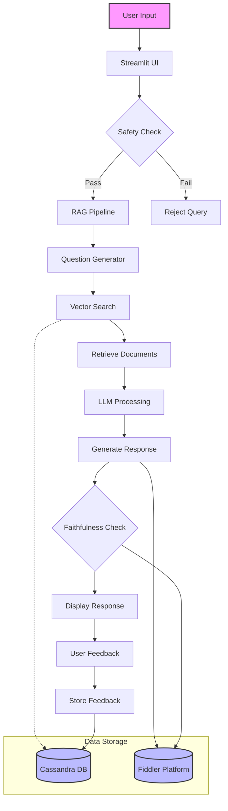
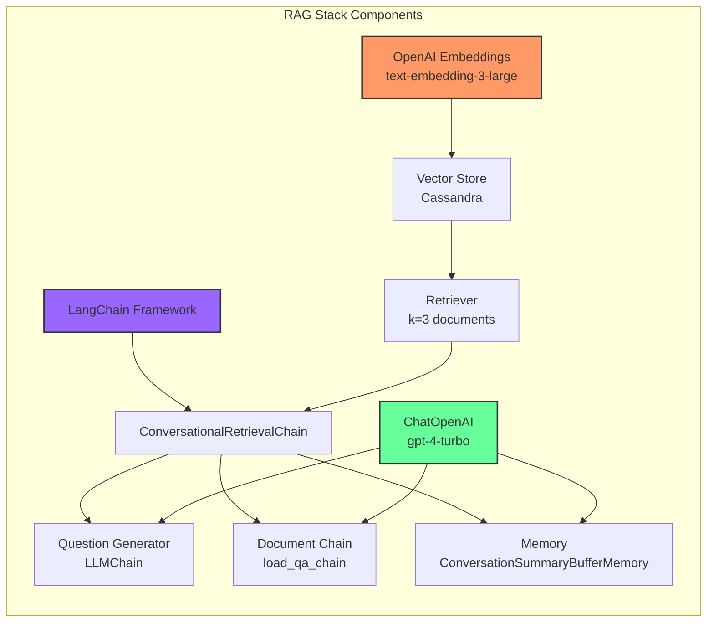
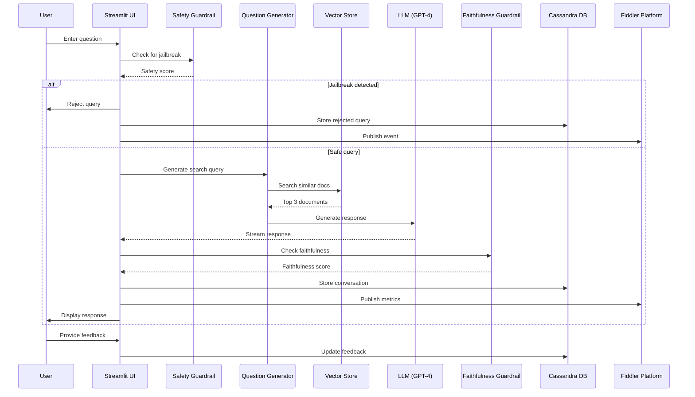
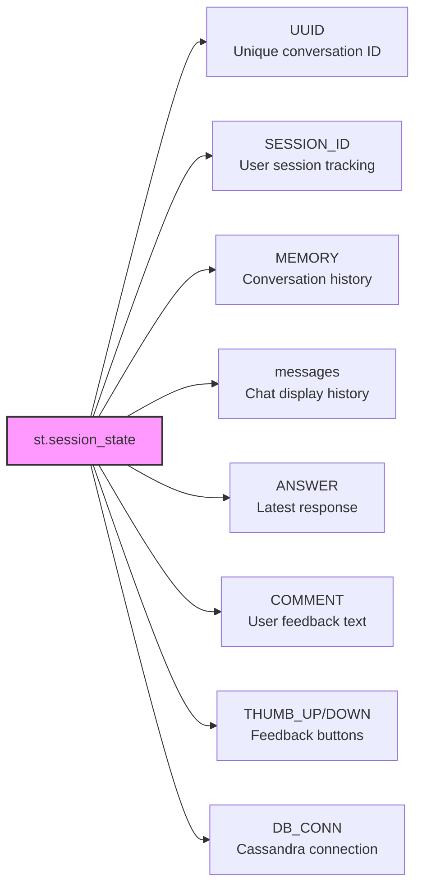
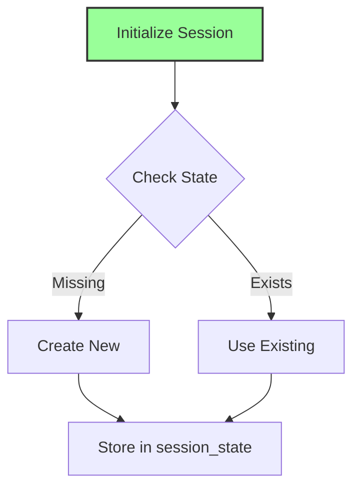

# Fiddler Chatbot Diagrams

## Fiddler Chatbot System Architecture



---

## System Components



---

## Sequence Diagram



---

## Session State Managment : Attributes



---

## Data Flow



---

## Areas of Responsibility

```mermaid
graph LR
        A[main<br/>Entry point & UI orchestration]
        
        B[get_safety_guardrail_results<br/>Jailbreak detection]
        C[get_faithfulness_guardrail_results<br/>Response validation]
        
        D[publish_and_store<br/>Data persistence & monitoring]
        
        E[store_feedback<br/>User feedback handling]
        F[store_comment<br/>Comment storage]
        G[erase_history<br/>Session cleanup]
        
        H[StreamHandler<br/>Real-time response streaming]
    
    A --> B
    A --> C
    A --> D
    A --> E
    A --> F
    A --> G
    A --> H
    
    subgraph "External Services"
        I[Fiddler API<br/>Guardrails & Monitoring]
        J[OpenAI API<br/>LLM & Embeddings]
        K[Cassandra<br/>Vector Store & Ledger]
    end
    
    B --> I
    C --> I
    D --> I
    D --> K
    E --> K
    F --> K
    
style A fill:#f96,stroke:#333,stroke-width:2px
style I fill:#bbf,stroke:#333,stroke-width:2px
style J fill:#bbf,stroke:#333,stroke-width:2px
style K fill:#bbf,stroke:#333,stroke-width:2px
``
