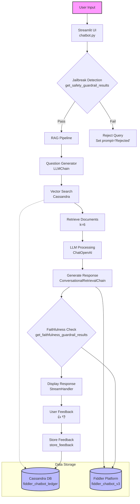
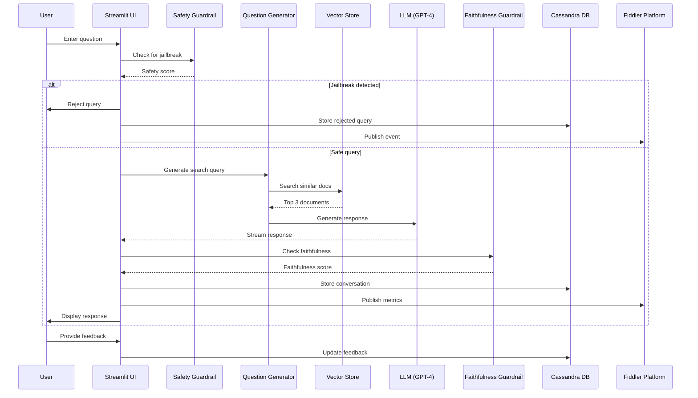
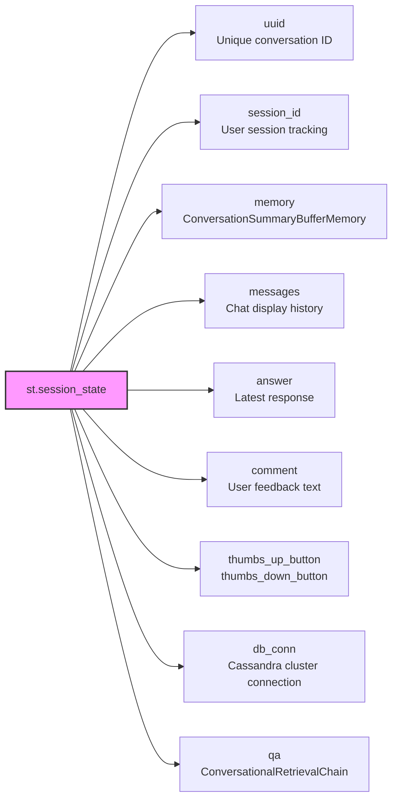
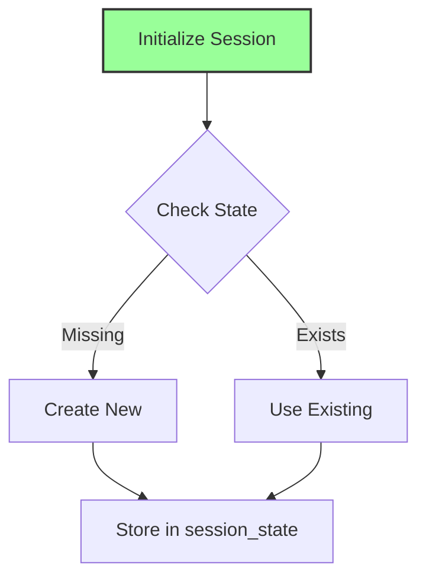
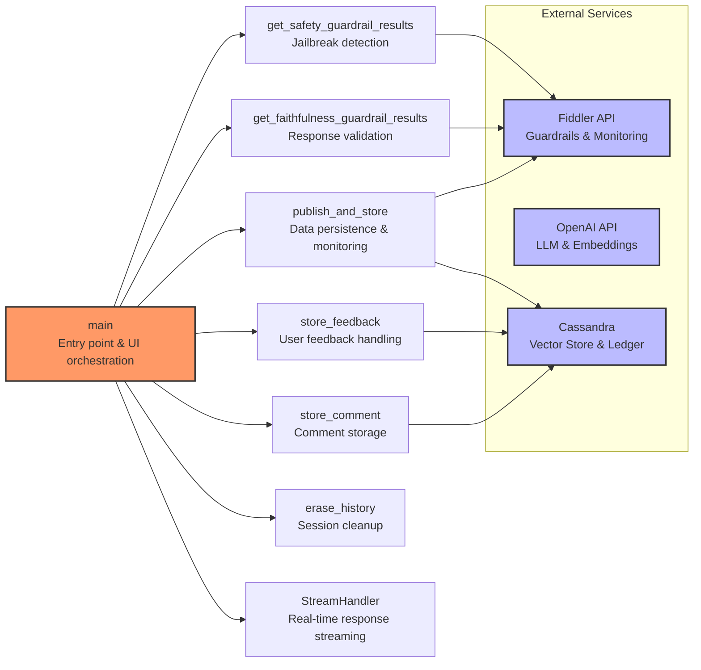

# Fiddler Chatbot Diagrams

**Note**: This document describes the Streamlit-based chatbot implementation (`chatbot.py`). For the newer LangGraph-based implementation, see `chatbot_agentic.md`.

## Fiddler Chatbot System Architecture (Streamlit Version)



---

## System Components

```mermaid
graph LR
    subgraph "RAG Stack Components"
        A[OpenAI Embeddings<br/>text-embedding-3-large<br/>dimensions=1536] --> B[Vector Store<br/>Cassandra<br/>fiddler_doc_snippets_openai]
        C[LangChain Framework] --> D[ConversationalRetrievalChain]
        D --> E[Question Generator<br/>LLMChain<br/>CONDENSE_QUESTION_PROMPT]
        D --> F[Document Chain<br/>load_qa_chain<br/>QA_CHAIN_PROMPT]
        D --> G[Memory<br/>ConversationSummaryBufferMemory<br/>max_token_limit=50]
        H[ChatOpenAI<br/>gpt-4-turbo<br/>temperature=0] --> E
        H --> F
        H --> G
        B --> I[Retriever<br/>k=6 documents<br/>as_retriever()]
        I --> D
    end
    
style A fill:#f96,stroke:#333,stroke-width:2px
style H fill:#6f9,stroke:#333,stroke-width:2px
style C fill:#96f,stroke:#333,stroke-width:2px
```

---

## Sequence Diagram



---

## Session State Management : Attributes



---

## Data Flow



---

## Areas of Responsibility


