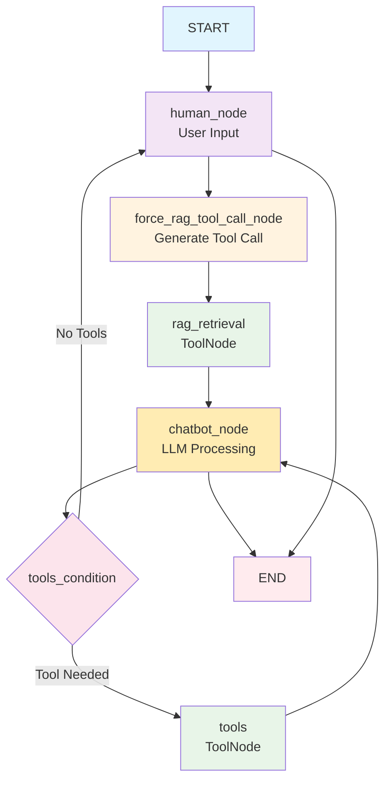
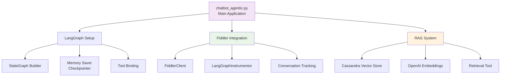

# Chatbot Agentic - LangGraph Implementation

## Current Architecture Overview

The agentic chatbot uses LangGraph to create a stateful conversation flow with integrated RAG (Retrieval-Augmented Generation) capabilities and Fiddler monitoring.

## Main Workflow Flow



## Node Descriptions

- **human_node**: Handles user input (CLI or automated messages)
- **force_rag_tool_call_node**: Creates AIMessage with RAG tool call for retrieval
- **rag_retrieval**: ToolNode that executes Cassandra vector search
- **chatbot_node**: Processes conversation state and generates LLM response
- **tools**: Additional tools like get_system_time
- **tools_condition**: Conditional edge that checks if tools are needed

## State Management

```mermaid
graph LR
    A[ChatbotState] --> B[messages<br/>Annotated[Sequence[BaseMessage], add_messages]]
    
    C[Message Types] --> D[HumanMessage]
    C --> E[AIMessage]
    C --> F[ToolMessage]
    C --> G[SystemMessage]
    
    style A fill:#e1f5fe
    style B fill:#fff3e0
```

## Key Components


