# Fiddler Monitoring Architecture Diagrams

## Code to Web UI Mapping - LangGraph Implementation

## Code to Web UI Mapping - Streamlit Implementation

## Session Flow Architecture - LangGraph Implementation

```mermaid
sequenceDiagram
    participant User as User Input
    participant App as chatbot_agentic.py
    participant LG as LangGraph
    participant HN as human_node
    participant FRT as force_rag_tool_call_node
    participant RAG as rag_retrieval ToolNode
    participant CB as chatbot_node
    participant OpenAI as ChatOpenAI
    participant Cass as Cassandra
    participant Fiddler as Fiddler Platform
    
    User->>App: CLI Input or Automated Message
    App->>App: Generate thread_id: datetime + uuid4()
    App->>LG: set_conversation_id(session_id)
    
    App->>LG: chatbot_graph.stream(state, thread_config)
    LG->>HN: Execute human_node
    HN-->>LG: HumanMessage
    
    LG->>FRT: force_rag_tool_call_node
    FRT-->>LG: AIMessage with tool_call
    
    LG->>RAG: Execute rag_retrieval
    RAG->>Cass: similarity_search(query, k=6)
    Cass-->>RAG: Retrieved documents
    RAG-->>LG: ToolMessage with documents
    
    LG->>CB: chatbot_node(state)
    CB->>CB: Build context from messages + tool outputs
    CB->>CB: set_llm_context() for monitoring
    CB->>OpenAI: llm.invoke(messages + system_prompt)
    OpenAI-->>CB: AI Response
    CB-->>LG: AIMessage
    
    LG->>Fiddler: Auto-instrumented spans
    Fiddler-->>User: Display response
    
    App->>User: "🤖 Assistant: [Response]"
```

## Web UI Components Breakdown

## Data Flow Architecture

```mermaid
flowchart TD
    subgraph "Application Layer"
        A["`**User Input**
        CLI Interface / Automated Args`"]
        B["`**Thread Config**
        Session ID: datetime + uuid4()`"]
        C["`**State Management**
        ChatbotState with Messages`"]
    end
    
    subgraph "LangGraph Workflow"
        D["`**StateGraph Builder**
        workflow_builder.compile()`"]
        E["`**Node Chain**
        human→force_rag→retrieval→chatbot`"]
        F["`**Conditional Edges**
        tools_condition`"]
        G["`**Memory Checkpointer**
        MemorySaver`"]
    end
    
    subgraph "RAG System"
        H["`**Retrieval Tool**
        make_cassandra_rag_retriever_tool()`"]
        I["`**Vector Search**
        CassandraVectorStore`"]
        J["`**OpenAI Embeddings**
        text-embedding-3-large`"]
    end
    
    subgraph "Fiddler Instrumentation"
        K["`**LangGraphInstrumentor**
        Auto-instrumentation`"]
        L["`**Context Tracking**
        set_llm_context()`"]
        M["`**Conversation ID**
        set_conversation_id()`"]
    end
    
    subgraph "External Services"
        N["`**Cassandra DB**
        fiddler_doc_snippets_openai`"]
        O["`**OpenAI API**
        gpt-4o-mini`"]
        P["`**Fiddler Platform**
        preprod.cloud.fiddler.ai`"]
    end
    
    A --> B
    B --> C
    C --> D
    D --> E
    E --> F
    D --> G
    
    E --> H
    H --> I
    I --> J
    I --> N
    
    K --> L
    L --> M
    D --> K
    
    E --> O
    K --> P
    
    style A fill:#e3f2fd
    style H fill:#fff3e0
    style K fill:#e8f5e8
    style N fill:#fce4ec
```

## Environment Configuration Mapping

---

*These diagrams illustrate the complete flow from code implementation to Web UI visualization in the Fiddler monitoring system.*
