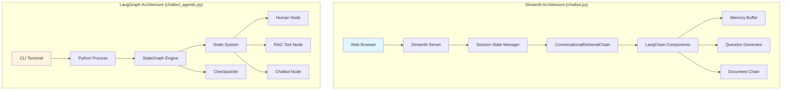
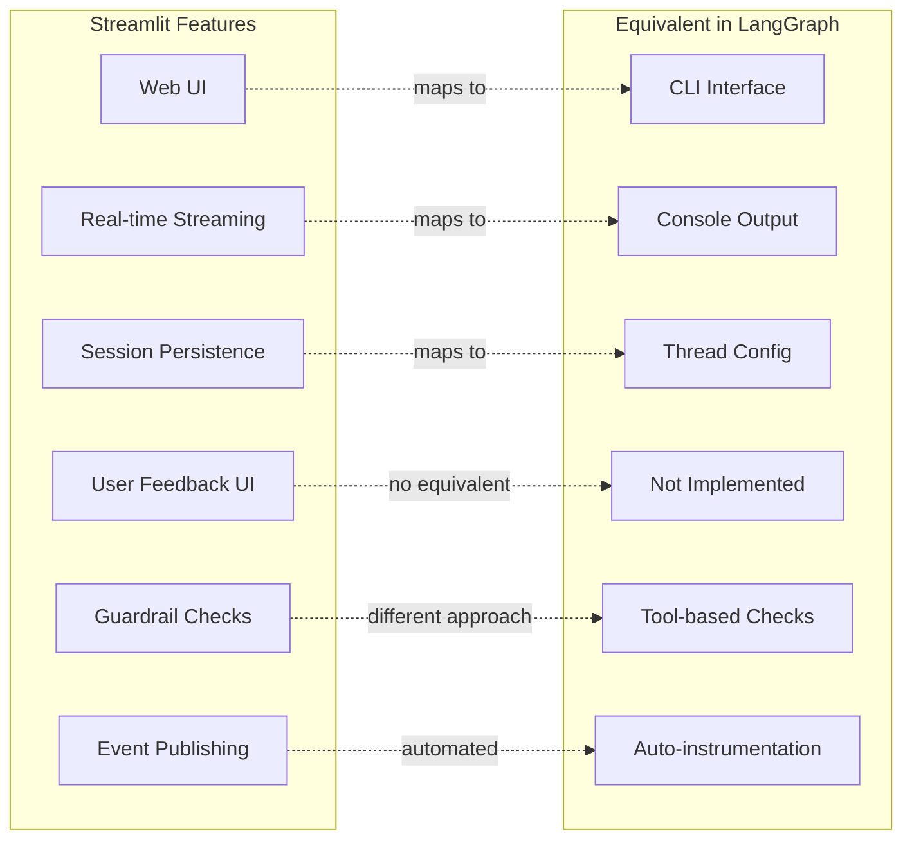
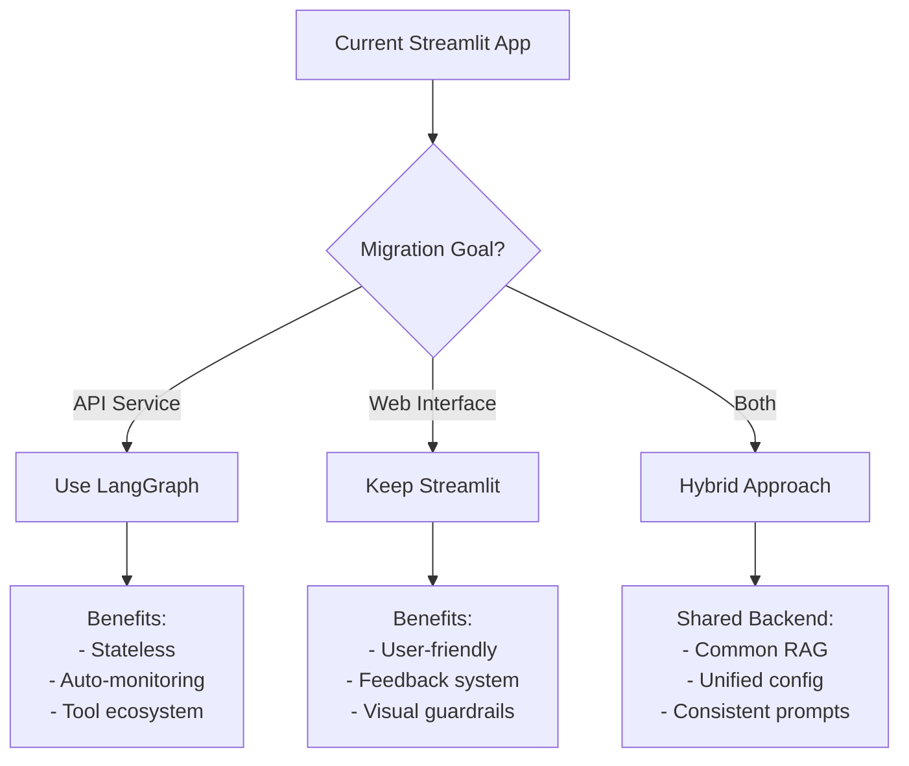
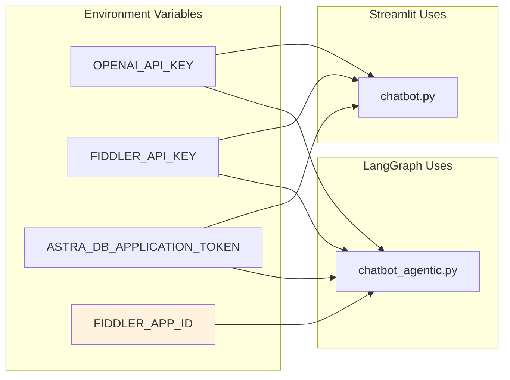
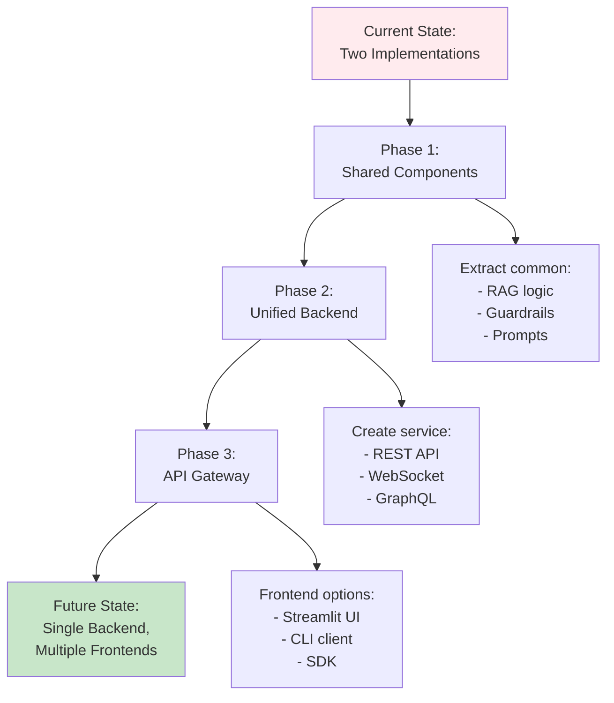

# Implementation Comparison Guide

This guide provides a detailed comparison between the Streamlit and LangGraph implementations of the Fiddler Chatbot.

## LangGraph Workflow Generation

The `chatbot_agentic.py` implementation automatically generates a visual representation of its workflow graph when executed. This diagram is saved as `workflow_graph.png` in the project root.

```mermaid
graph LR
    A[build_chatbot_graph()] --> B[StateGraph(ChatbotState)]
    B --> C[Add Nodes]
    C --> D[Add Edges]
    D --> E[workflow_builder.compile()]
    E --> F[visualize_chatbot_graph()]
    F --> G[chatbot_graph.get_graph().draw_mermaid_png()]
    G --> H[workflow_graph.png]
    
    style A fill:#e1f5fe
    style E fill:#c8e6c9
    style H fill:#fff3e0
```

## Architecture Comparison



## Feature Mapping



## Migration Considerations



## Configuration Differences



## Future Convergence Path


