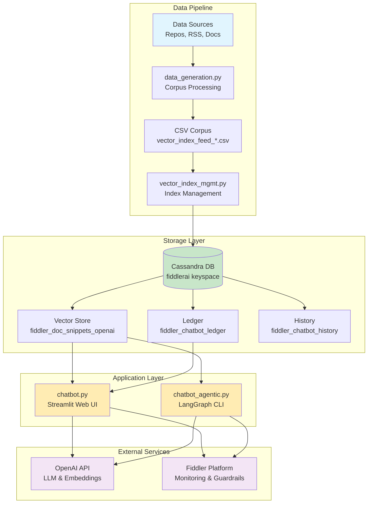
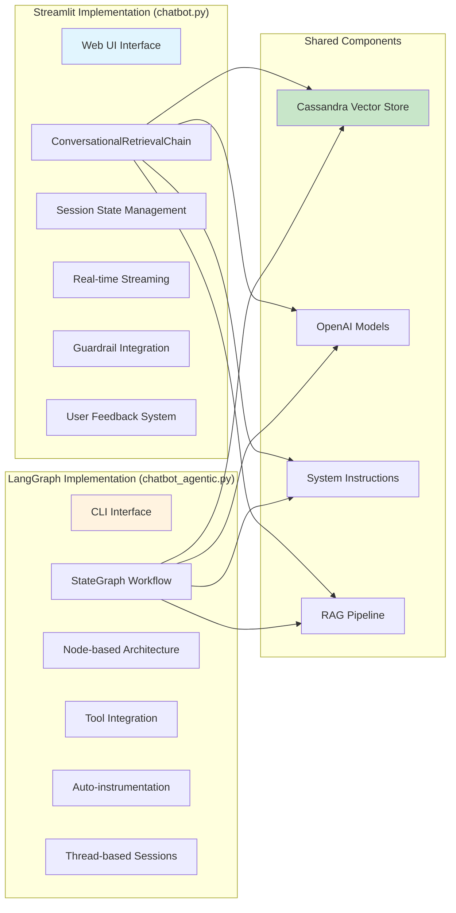
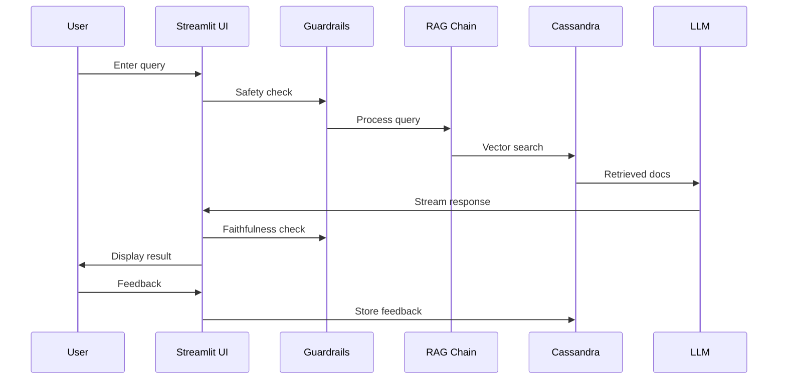
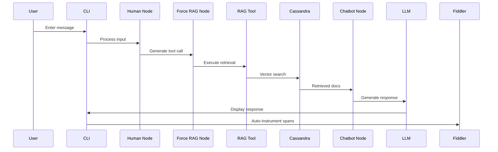

# Fiddler Chatbot System Architecture Overview

This document provides a comprehensive view of the entire Fiddler Chatbot system, including both implementations and all supporting components.

## High-Level System Architecture

## Comparison of Chatbot Implementations

## Key Differences

| Feature | Streamlit (chatbot.py) | LangGraph (chatbot_agentic.py) |
|---------|------------------------|--------------------------------|
| **Interface** | Web UI (Streamlit) | CLI |
| **Architecture** | Traditional chain-based | Graph-based with nodes |
| **LLM Model** | gpt-4-turbo | gpt-4o-mini |
| **Temperature** | 0 (deterministic) | 0.7 (creative) |
| **Monitoring** | Manual event publishing | Auto-instrumentation |
| **Session Management** | Streamlit session state | Thread-based config |
| **RAG Integration** | ConversationalRetrievalChain | Tool-based approach |
| **Guardrails** | Pre/post safety checks | Tool-based validation |
| **Feedback** | Built-in UI buttons | Not implemented |
| **Streaming** | StreamHandler callback | Console output |

## Data Flow Patterns

### Streamlit Flow

### LangGraph Flow

