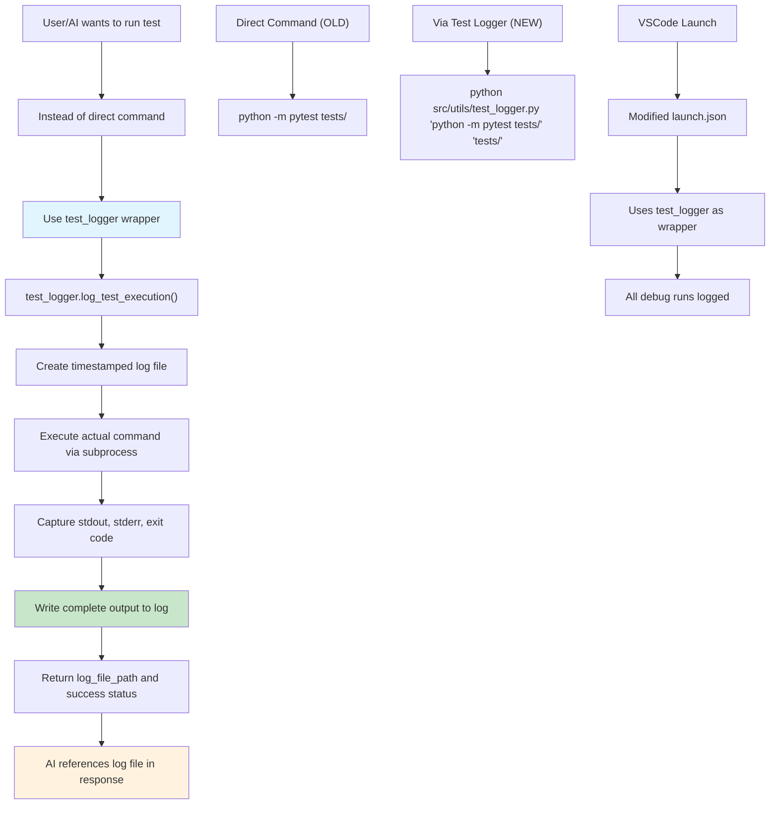

# Test Logger Diagram

```mermaid
flowchart TD
    A["User/AI wants to run test"] --> B["Instead of direct command"]
    B --> C["Use test_logger wrapper"]
    C --> D["test_logger.log_test_execution()"]
    D --> E["Create timestamped log file"]
    E --> F["Execute actual command via subprocess"]
    F --> G["Capture stdout, stderr, exit code"]
    G --> H["Write complete output to log"]
    H --> I["Return log_file_path and success status"]
    I --> J["AI references log file in response"]
    
    K["Direct Command (OLD)"] --> L["python -m pytest tests/"]
    M["Via Test Logger (NEW)"] --> N["python src/utils/test_logger.py 'python -m pytest tests/' 'tests/'"]
    
    O["VSCode Launch"] --> P["Modified launch.json"]
    P --> Q["Uses test_logger as wrapper"]
    Q --> R["All debug runs logged"]
    
    style C fill:#e1f5fe
    style H fill:#c8e6c9
    style J fill:#fff3e0
```
