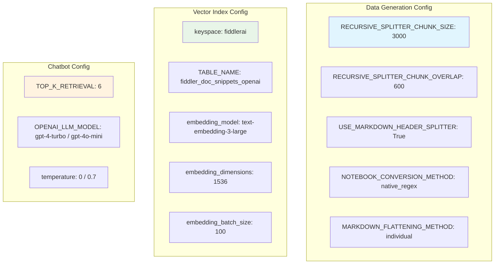

# Vector Index Process

## Data Generation and Vector Index Pipeline

```mermaid
graph TD
    subgraph "Data Sources"
        A1[Fiddler Main Repo<br/>Docs & Code]
        A2[Fiddler Examples Repo<br/>Notebooks]
        A3[Blog RSS Feed<br/>blog/rss.xml]
        A4[Resources RSS Feed<br/>resources/rss.xml]
    end
    
    subgraph "Data Processing"
        B[data_generation.py<br/>Corpus Generator]
        B1[process_docs()<br/>Markdown Flattening]
        B2[process_notebooks()<br/>Notebook Conversion]
        B3[crawl_rss_feeds()<br/>Web Scraping]
        B4[generate_corpus_from_sources()<br/>Text Splitting]
    end
    
    subgraph "Output"
        C[CSV File<br/>vector_index_feed_TIMESTAMP.csv]
    end
    
    subgraph "Vector Index Management"
        D[vector_index_mgmt.py<br/>Index Loader]
        D1[validate_and_load_documentation_data()]
        D2[populate_vector_store_safely()]
        D3[safe_truncate_table()]
    end
    
    subgraph "DataStax Cassandra"
        E[fiddlerai keyspace]
        F[fiddler_doc_snippets_openai<br/>Vector Store Table]
        G[fiddler_chatbot_ledger<br/>History Table]
        H[fiddler_chatbot_history<br/>Legacy Table]
    end
    
    subgraph "Applications"
        I[chatbot.py<br/>Streamlit App]
        J[chatbot_agentic.py<br/>LangGraph CLI App]
    end
    
    subgraph "External Services"
        K[OpenAI API<br/>Embeddings & LLM]
    end
    
    A1 --> B1
    A2 --> B2
    A3 --> B3
    A4 --> B3
    B1 --> B4
    B2 --> B4
    B3 --> B4
    B4 --> C
    
    C --> D1
    D1 --> D2
    D2 --> F
    D3 --> F
    
    D --> E
    E --> F
    E --> G
    E --> H
    
    F --> I
    F --> J
    G --> I
    
    K --> D2
    K --> I
    K --> J
    
    style A1 fill:#e1f5fe
    style A2 fill:#e1f5fe
    style A3 fill:#e1f5fe
    style A4 fill:#e1f5fe
    style C fill:#fff3e0
    style F fill:#c8e6c9
    style G fill:#c8e6c9
    style I fill:#ffecb3
    style J fill:#ffecb3
    style K fill:#f3e5f5
```

## Text Processing Pipeline

```mermaid
graph LR
    subgraph "Markdown Processing"
        A[Raw Markdown Files] --> B{Flattening Method}
        B -->|individual| C[flatten_all_files_individually()]
        B -->|concatenated| D[concatenate_files_in_leaf_folders()]
    end
    
    subgraph "Text Splitting"
        E[Combined Corpus] --> F{Splitter Type}
        F -->|Markdown Headers| G[MarkdownHeaderTextSplitter<br/>Headers: #]
        F -->|Recursive| H[RecursiveCharacterTextSplitter<br/>Chunk: 3000, Overlap: 600]
        G --> I[Header-aware Chunks]
        H --> J[Fixed-size Chunks]
    end
    
    C --> E
    D --> E
    I --> K[Final Chunks<br/>with Context]
    J --> K
    
    style A fill:#e1f5fe
    style E fill:#fff3e0
    style K fill:#c8e6c9
```

## Configuration Settings


