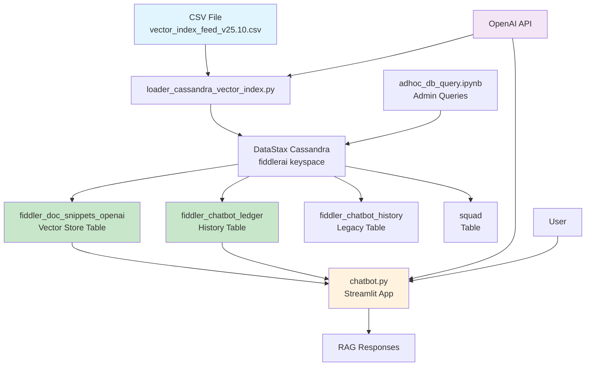

```mermaid
graph TD
    A[CSV File<br/>vector_index_feed_v25.10.csv] --> B[loader_cassandra_vector_index.py]
    B --> C[DataStax Cassandra<br/>fiddlerai keyspace]
    C --> D[fiddler_doc_snippets_openai<br/>Vector Store Table]
    C --> E[fiddler_chatbot_ledger<br/>History Table]
    C --> F[fiddler_chatbot_history<br/>Legacy Table]
    C --> G[squad<br/>Table]
    
    D --> H[chatbot.py<br/>Streamlit App]
    E --> H
    
    I[adhoc_db_query.ipynb<br/>Admin Queries] --> C
    
    J[OpenAI API] --> B
    J --> H
    
    K[User] --> H
    H --> L[RAG Responses]
    
    style A fill:#e1f5fe
    style D fill:#c8e6c9
    style E fill:#c8e6c9
    style H fill:#fff3e0
    style J fill:#f3e5f5
```