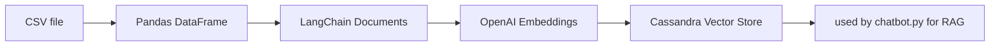

# Vector Index Loader to Cassandra

This document provides a comprehensive overview of `src/vector_index_mgmt.py` which is responsible for creating and managing vector indices in DataStax Cassandra for the Fiddler chatbot's RAG (Retrieval-Augmented Generation) system.

Database: DataStax Astra (Cassandra as a Service)
Keyspace: `fiddlerai`
Main Table: `fiddler_doc_snippets_openai`
Embedding Model: `text-embedding-3-large` (1536 dimensions)
Input Data: `documentation_data/vector_index_feed_v25.10.csv`

---

## Open Issues

- No Error Handling: No try-catch blocks for database operations
- Automation Considerations
  - Dry-run option
  - Implement retry logic for failed operations

- **No error handling** - Database operations can fail silently
- **Duplicate code** - Table inspection code appears twice
- **No progress tracking** - Silent operation on large datasets
- **Maintainability**: Clear module boundaries, unit testable
- **Flexibility**: Configurable for different environments

---

## ARCHIVE : Cassandra Vector Loader Cleanup

This cleanup initiative aims to transform the Fiddler chatbot's vector indexing system from
manual, notebook-based process into an automated, production-ready application.

We plan to refactor `loader_cassandra_vector_index.ipynb` from a monolithic notebook into
well-structured, modular Python code while preserving all existing functionality.
