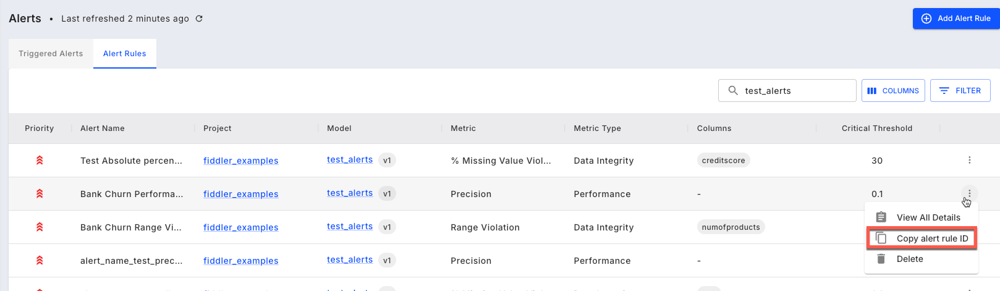

# Alerts with Fiddler Client

In addition to using the Fiddler UI, users have the flexibility to set up alert rules using the Fiddler API client to enable the following workflows:

* Add alert rule(s)
* Delete alert rule(s)
* Get the list of all alert rule(s)
* Get the list of triggered alert(s)

> 📘 The user guide for setting up alert rules in the Fiddler UI is [here](../UI\_Guide/monitoring-ui/alerts-with-fiddler-ui.md).

### Add an Alert Rule

The Fiddler client can be used to create a variety of alert rules types including **Data Drift**, **Performance**, **Data Integrity**, and **Service Metrics**.

#### Example 1: Data Integrity Alert Rule to Compare Against a Raw Percentage Value

Using the [fdl.AlertRule.create()](../Python\_Client\_3-x/api-methods-30.md#create) API method, let's set up a Data Integrity alert for the **age** column that triggers a warning email notification when published events exceed 5% null values in a 1 day bin and a critical email notification when exceeding 10% null values in a 1 day bin. Notice the comparison type `compare_to=fdl.CompareTo.RAW_VALUE` which considers only the calculated metric value for the given `bin_size` and threshold values.

```python
import fiddler as fdl

MODEL_ID = '299c7b40-b87c-4dad-bb94-251dbcd3cbdf'

alert_rule = fdl.AlertRule(
    name='Banke Churn Missing Values Percent',
    model_id=MODEL_ID,
    metric_id='null_violation_percentage',
    priority=fdl.Priority.HIGH,
    compare_to=fdl.CompareTo.RAW_VALUE,
    condition=fdl.AlertCondition.GREATER,
    bin_size=fdl.BinSize.DAY,
    critical_threshold=0.1,
    warning_threshold=0.05,
    columns=['age'],
).create()

notifications = alert_rule.set_notification_config(
    emails=['abc@xyz.com', 'admin@xyz.com'],
)
```

#### Example 2: Performance Alert Rule to Compare Against a Previous Time Window

This example of a Performance alert rule uses comparison type `compare_to=fdl.CompareTo.TIME_PERIOD`, also known as a relative alert, which considers the calculated metric value for the given `bin_size` and threshold values with respect to the same bin in a previous time period. In this case the `compare_bin_delta=1` parameter indicates the alert rule should compare the _precision_ metric for the previous day with the _precision_ metric for the current day. To compare the day's metric to the day's metric from 7 days ago, set `compare_bin_delta=7`.

```python
import fiddler as fdl

MODEL_ID='4531bfd9-2ca2-4a7b-bb5a-136c8da09ca2'
alert_rule = fdl.AlertRule(
  name='Bank Churn Precision Relative',
  model_id=MODEL_ID,
  metric_id='precision',
  priority=fdl.Priority.HIGH,
  compare_to=fdl.CompareTo.TIME_PERIOD,
  compare_bin_delta=1,
  condition=fdl.AlertCondition.GREATER,
  bin_size=fdl.BinSize.DAY,
  critical_threshold=0.1,
  warning_threshold=0.05,
).create()

notifications = alert_rule.set_notification_config(
  emails=['abc@xyz.com', 'admin@xyz.com'],
)
```

> 🚧 Please note, the possible values for compare\_bin\_delta vs bin\_size are:

| Bin Size      | Allowed Compare bin delta             |
| ------------- | ------------------------------------- |
| BinSize.Hour  | \[1, 24, 24 \* 7, 24 \* 30, 24 \* 90] |
| BinSize.Day   | \[1, 7, 30, 90]                       |
| BinSize.Week  | \[1]                                  |
| BinSize.Month | \[1]                                  |

### Retrieving Alert Rules

The [fdl.AlertRule.list()](../Python\_Client\_3-x/api-methods-30.md#list) API method is used to get a list of all alert rules with respect to the filtering parameters, returning a Python Iterator of matching alert rules. Note that all parameters are optional.

```python
import fiddler as fdl

MODEL_ID='4531bfd9-2ca2-4a7b-bb5a-136c8da09ca2'
alert_rules = fdl.AlertRule.list(
  model_id=MODEL_ID,# Optional parameter
  metric_id='jsd', # Optional parameter
  columns=['age'], # Optional parameter
  ordering=['critical_threshold'], # Add **-** prefix for descending sort ['-critical_threshold']
)
```

### Delete an Alert Rule

Alert rules can be deleted by calling the [delete()](../Python\_Client\_3-x/api-methods-30.md#delete) function on an instantiated fdl.AlertRule object. An alert rule can be retrieved by either the [fdl.AlertRule.list()](../Python\_Client\_3-x/api-methods-30.md#list) API method using filters or [fdl.AlertRule.get()](../Python\_Client\_3-x/api-methods-30.md#get) API method using the unique identifier which is found in the Alert Rule tab of the Fiddler Alerts page.



```python
# Delete from a list of alerts
MODEL_ID='4531bfd9-2ca2-4a7b-bb5a-136c8da09ca2'
alert_rules = fdl.AlertRule.list(
  model_id=MODEL_ID
)

for alert_rule in alert_rules: 
    if alert_rule.name == 'Bank Churn Precision Relative': 
        alert_rule.delete()
        break

# Delete using the alert rule's unique identifier
ALERT_RULE_ID = '6da9c3c0-a9fa-4ab6-8b64-8d07b0736e77'
rule = fdl.AlertRule.get(id_=ALERT_RULE_ID)
rule.delete()
```

### Get Triggered Alerts

Use the [fdl.AlertRecord.list()](../Python\_Client\_3-x/api-methods-30.md#list-1) API method to get the triggered alerts for a given alert rule. Note the alert rule unique identifier is required. The time range and sort order parameters are optional.

```python
from datetime import datetime

triggered_alerts = fdl.AlertRecord.list(
  alert_rule_id=ALERT_RULE_ID,
  start_time=datetime(2024, 9, 1), # optional
  end_time=datetime(2024, 9, 24), # optional 
  ordering = ['alert_time_bucket'], # ['-alert_time_bucket'] for descending, optional.
)
```

#### Notifications

After creating a new alert rule, assign the notification method for Fiddler to use when the alert rule is triggered. Currently Fiddler supports email, PagerDuty, Slack webhooks, and custom webhooks for notification types. You can specify 1 or more notification types and each type supports 1 or more recipients. Note that PagerDuty, Slack webhooks, and custom webhooks must be defined in advance by your Fiddler administrator.

The following example creates a notification configuration using email addresses, PagerDuty services, and a Slack webhook:

```python
ALERT_RULE_ID = '72e8835b-cde2-4dd2-a435-a35d4b51196b'
rule = fdl.AlertRule.get(id_=ALERT_RULE_ID)

rule.set_notification_config(
  emails=['abc@xyz.com', 'admin@xyz.com'],
  webhooks=['8b403d99-530a-4c5a-a519-89688d65ddc1'], # Webhook UUID 
  pagerduty_services = ['pagerduty_service_1','pagerduty_service_2'], # PagerDuty service names
  pagerduty_severity = 'critical' # Only applies to PagerDuty, ignored otherwise 
)
```



