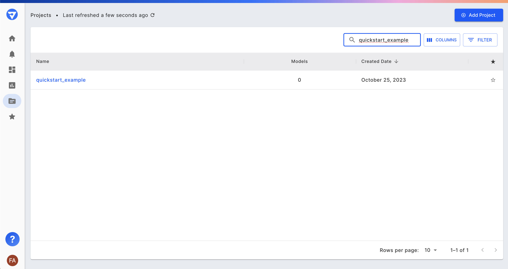

# Create a Project and Onboard a Model for Observation

### What is a Project?

A project helps organize models under observation and serves as the authorization unit to manage access to your models. To onboard a model to Fiddler, you need to have a project to associate it with. Once Fiddler's Python client is connected to your environment, you can either create a new project or use an existing one to onboard your model.

### Create a Project

Using the Python client, you can create a project by calling the Project object's create function after setting the desired project name.

```python
# Please be mindful that the Project name must be unique and should not have spaces or special characters.

PROJECT_NAME = 'quickstart_example'

## Create the Project
project = fdl.Project(name=PROJECT_NAME)
project.create()
print(f'New project created with id = {project.id}')

```

You should now see the newly created project on the Projects page in the Fiddler UI.



### List All Projects

Using an existing project, you may list all the projects that you are authorized to view.

```python
for project in fdl.Project.list():
    print(f'Project: {project.id} - {project.name}')

## This will print ALL project IDs and Names that you have access to.
```

### Onboarding a Model

To onboard a model you need to define a **ModelSpec** and optionally a **Model Task**. If you do not specify a model task during Model creation it can be set later or left unset.

#### Define the ModelSpec

A **ModelSpec object** defines what role each column of your inference data serves in your model.

Fiddler supports five column roles:

1. Inputs (features),
2. Outputs (predictions),
3. Targets (ground truth labels),
4. Metadata (additional information passed along with the inference)
5. Custom features (additional information that Fiddler should generate like embeddings or enrichments)

```python
model_spec = fdl.ModelSpec(
    inputs=['CreditScore', 'Geography', 'Gender', 'Age', 'Tenure', 'Balance', 'NumOfProducts', 'HasCrCard', 'IsActiveMember', 'EstimatedSalary'],
    outputs=['probability_churned'],
    targets=['Churned'],
    decisions=[],
    metadata=[],
    custom_features=[],
)
```

#### Define the Model Task

Fiddler supports a variety of model tasks. Create a `ModelTask` object and an additional `ModelTaskParams` object to specify the ordering of labels. For a detailed breakdown of all supported model tasks, [click here](../Python\_Client\_3-x/api-methods-30.md#modeltask).

```python
model_task = fdl.ModelTask.BINARY_CLASSIFICATION
task_params = fdl.ModelTaskParams(target_class_order=['no', 'yes'])
```

#### Infer the Model Schema

Onboard the model schema to Fiddler by passing in:

1. the data sample dataframe, called `sample_df` below
2. the `ModelSpec` object
3. the `ModelTask` and `ModelTaskParams` objects
4. the event/inference ID column and event/inference timestamp columns

```python
MODEL_NAME = 'my_model'

model = fdl.Model.from_data(
    name=MODEL_NAME,
    project_id=fdl.Project.from_name(PROJECT_NAME).id,
    source=sample_df,
    spec=model_spec,
    task=model_task,
    task_params=task_params,
    event_id_col=id_column,
    event_ts_col=timestamp_column
)
```

Depending on the input size this step might take a moment to complete. It is not a local operation, but requires uploading the sample dataframe to the Fiddler HTTP API.

#### Review and Edit the Schema

Schema inference is just a helping hand. The resulting schema needs human review and potentially some edits, as documented in the section titled [Customizing your Model Schema](customizing-your-model-schema.md).

#### Onboard the Model

After making sure the schema looks good, the model can be onboarded with the following API call:

```python
model.create()
```



