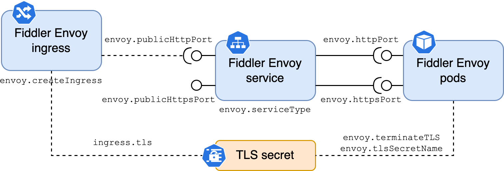

# Routing To Fiddler On-prem

Fiddler supports a wide range of strategies for routing HTTP traffic from end users to the Fiddler system. A typical on-prem Fiddler deployment includes an HTTP reverse proxy (Envoy) that can be configured as needed to meet your routing needs.



The diagram above shows some of the deployment configuration options related to routing and TLS, described below. Once Fiddler is installed in your on-prem environment, you may need to take additional steps to route TCP traffic to the Fiddler Envoy service.

## TLS termination

By default, Fiddler does not perform TLS termination. We find that our customers generally have excellent opinions about how TLS should be terminated, and generally prefer to perform TLS termination using their own network machinery.

### Terminate TLS outside of Fiddler

In a typical production environment, TLS termination will occur outside of Fiddler. Clear HTTP traffic should then be routed to the Fiddler Envoy service at the port specified by `envoy.publicHttpPort`.

```
envoy:
  terminateTLS: false
  publicHttpPort: "80"
```

### Terminate TLS within Fiddler

Fiddler can be configured to perform TLS termination using an X509 server certificate and corresponding PKCS #8 private key. The TLS certificate must be valid for the FQDN via which end-users will access the Fiddler platform. Both the server certificate and private key must be available in DER format, and should be placed in a `Secret` within the namespace where Fiddler will be deployed prior to installation. For example:

```
kubectl create secret tls my-tls-secret \
    --cert=path/to/the/cert.pem \
    --key=path/to/the/cert.key
```

The Fiddler Helm chart should be configured to reflect the `Secret` containing the server cert and key. TCP traffic should be routed to the port specified by `envoy.publicHttpsPort`.

```yaml
envoy:
  terminateTLS: true
  tlsSecretName: my-tls-secret
  serverCertKey: tls.crt
  privateKeyKey: tls.key
  publicHttpsPort: "443"
```

### TLS with Ingress

Kubernetes `Ingress` [supports](https://kubernetes.io/docs/concepts/services-networking/ingress/#tls) specifying a TLS secret on a per-ingress basis. If using an `Ingress` to route traffic to Fiddler, create a `Secret` containing the DER-formatted X509 server certificate and PKCS #8 private key in the namespace where Fiddler will be deployed:

```
kubectl create secret tls my-tls-secret \
    --cert=path/to/the/cert.pem \
    --key=path/to/the/cert.key
```

The Fiddler Helm chart should be configured to enable Ingress with TLS. For example:

```
envoy:
  createIngress: true

ingress:
  tls:
    hosts:
      # The FQDN where Fiddler is accessed by end users.
      - fiddler.acme.com
    secretName: my-tls-secret
```

## Ingress

If the cluster where Fiddler is installed supports `Ingress`, the Fiddler Helm chart can be configured to create an `Ingress` resource that points to its HTTP reverse proxy.

For example, a configuration for use with the Kubernetes NGINX ingress controller might look like:

```yaml
envoy:
  createIngress: true

ingress:
  class: nginx
  annotations:
    nginx.ingress.kubernetes.io/ssl-redirect: "false"
    nginx.ingress.kubernetes.io/proxy-body-size: "10240m"
    nginx.ingress.kubernetes.io/proxy-read-timeout: "3600"
    nginx.ingress.kubernetes.io/proxy-send-timeout: "3600"
```

## ClusterIP service

By default, the Fiddler HTTP reverse proxy (Envoy) is exposed as a `ClusterIP` service within the namespace where Fiddler is installed.

To control the port(s) on the `Service` where traffic is handled, set `envoy.publicHttpPort` and/or `envoy.publicHttpsPort` in the Fiddler Helm configuration. For example:

```yaml
envoy:
  serviceType: ClusterIP
  publicHttpPort: "8080"
  publicHttpsPort: "8443"
```

## LoadBalancer service

Fiddler can be exposed direcly outside the cluster via a `LoadBalancer` service, if supported. In AWS EKS, for example, this would result in the creation of a Network Load Balancer. See above for details on TLS termination within Fiddler.

```yaml
envoy:
  serviceType: LoadBalancer
  publicHttpPort: "80"
  publicHttpsPort: "443"
```

## Headless service

In cases where a more advanced service mesh or service discovery mechanism is used, it may be desirable to expose Fiddler via a headless service. For example:

```yaml
envoy:
  headlessService: true
```



