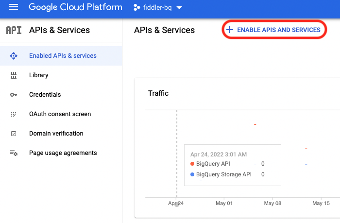
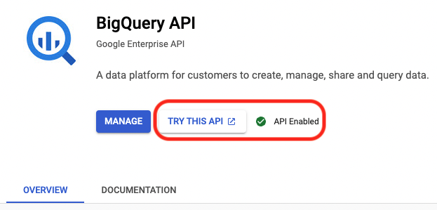
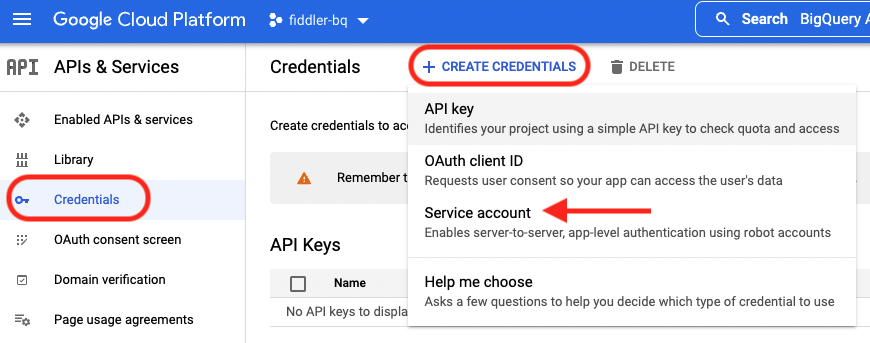
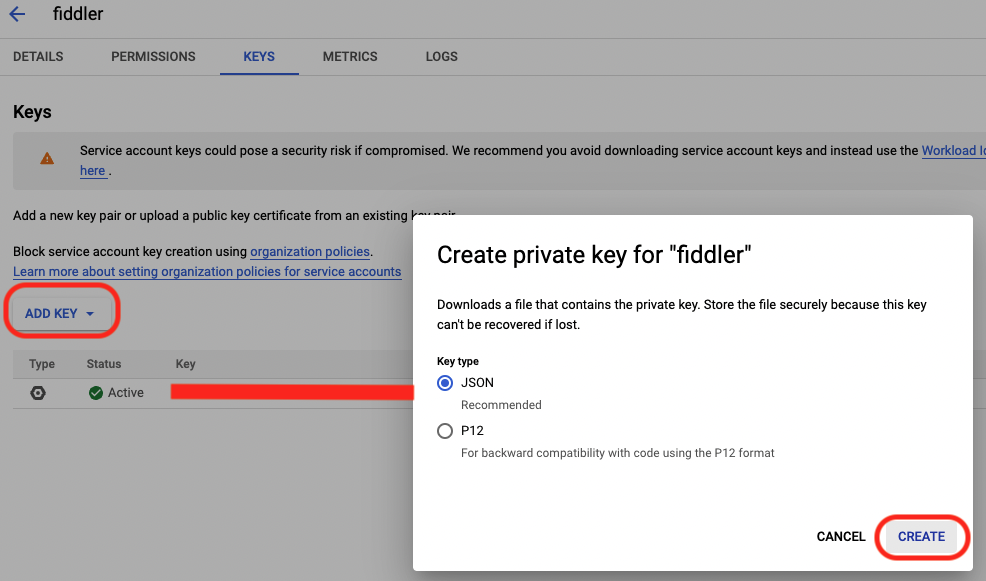

## Using Fiddler on your ML data stored in BigQuery

In this article, we will be looking at loading data from BigQuery tables and using the data for the following tasks-

1. Uploading baseline data to Fiddler
2. Onboarding a model to Fiddler and creating a surrogate
3. Publishing production data to Fiddler

## Step 1 - Enable BigQuery API

Before looking at how to import data from BigQuery to Fiddler, we will first see how to enable BigQuery API. This can be done as follows - 

1. In the GCP platform, Go to the navigation menu -> click APIs & Services. Once you are there, click + Enable APIs and Services (Highlighted below). In the search bar, enter BigQuery API and click Enable.





2. In order to make a request to the API enabled in Step#1, you need to create a service account and get an authentication file for your Jupyter Notebook. To do so, navigate to the Credentials tab under APIs and Services console and click Create Credentials tab, and then Service account under dropdown.



3. Enter the Service account name and description. You can use the BigQuery Admin role under Grant this service account access to the project. Click Done. You can now see the new service account under the Credentials screen. Click the pencil icon beside the new service account you have created and click Add Key to add auth key. Please choose JSON and click CREATE. It will download the JSON file with auth key info. (Download path will be used to authenticate)



## Step 2 - Import data from BigQuery

We will now use the generated key to connect to BigQuery tables from Jupyter Notebook. 

1. Install the following libraries in the python environment and load them to jupyter-

- Google-cloud
- Google-cloud-bigquery[pandas]
- Google-cloud-storage

2. Set the environment variable using the key that was generated in Step 1

```python
#Set environment variables for your notebook
import os
os.environ['GOOGLE_APPLICATION_CREDENTIALS'] = '<path to json file>'
```

3. Import Google cloud client and initiate BigQuery service

```python
#Imports google cloud client library and initiates BQ service
from google.cloud import bigquery
bigquery_client = bigquery.Client()
```

4. Specify the query which will be used to import the data from BigQuery

```python
#Write Query on BQ
QUERY = """
SELECT * FROM `fiddler-bq.fiddler_test.churn_prediction_baseline` 
  """
```

5. Read the data using the query and write the data to a pandas dataframe

```python
#Run the query and write result to a pandas data frame
Query_Results = bigquery_client.query(QUERY)
baseline_df = Query_Results.to_dataframe()
```

Now that we have data imported from BigQuery to a dataframe, we can refer to the following pages to

1. [Upload baseline data and onboard a model ](../../Client_Guide/creating-a-baseline-dataset.md)
2. [Publish production events ](../../Client_Guide/publishing-production-data/publishing-batches-of-events.md)
