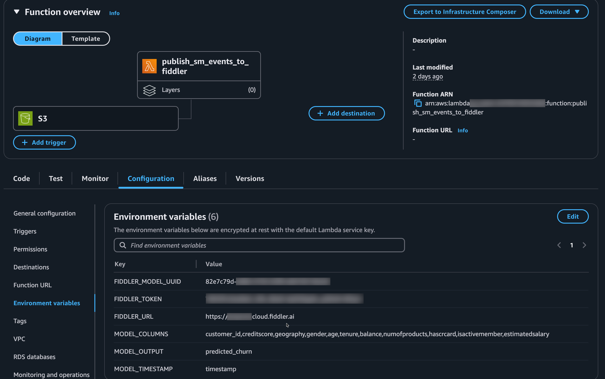
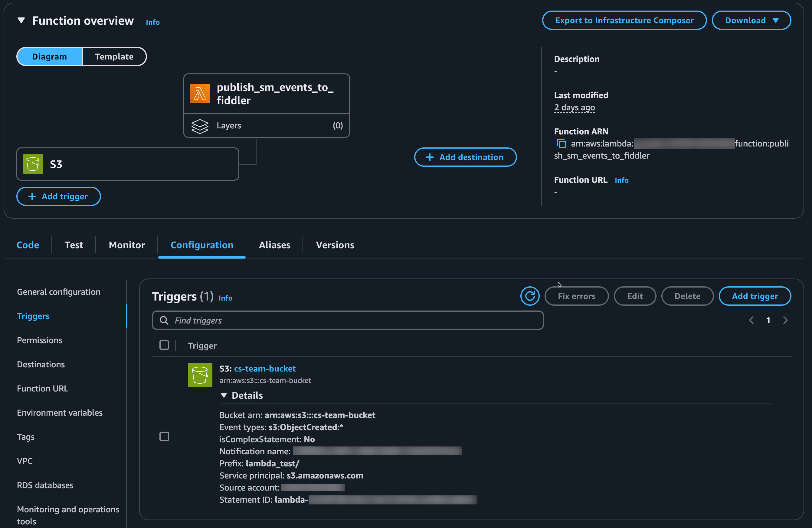
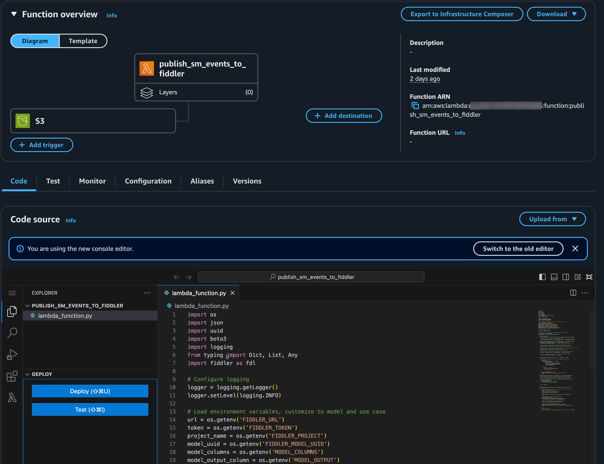

## Introduction

Integrating AWS SageMaker with Fiddler allows you to monitor your deployed models easily.
This guide shows you how to use an AWS Lambda function leveraging the Fiddler Python client to read SageMaker inference logs from an Amazon S3 bucket and send those inferences to your Fiddler instance.
This setup provides real-time visibility, simplifies how you monitor your models, and gives essential insights into how your SageMaker models perform and behave.



The Fiddler AI Observability Platform is now available within Amazon SageMaker AI, a part of SageMaker Unified Studio. 
This native integration enables SageMaker customers to use Fiddler to monitor ML models privately and securely, all without leaving Amazon SageMaker AI.

Learn more about the new Amazon SageMaker AI with Fiddler native integration offering [here](https://www.fiddler.ai/blog/fiddler-delivers-native-enterprise-grade-ai-observability-to-amazon-sagemaker-ai-customers).



## Prerequisites

* An actively served SageMaker model with
  * Data capture enabled
  * Inference logs persisted to S3 in JSONL format
* Access to a Fiddler environment
  * Your SageMaker model onboarded to Fiddler.
  Check out our ML Monitoring - Simple Quick Start Guide for onboarding your models.

## Setup Overview

1. Configure SageMaker for data capture
2. Onboard your SageMaker model to Fiddler 
3. Create an AWS Lambda function for data integration between SageMaker and Fiddler
4. Monitor and analyze your model in Fiddler

### Detailed Steps

This guide assumes that your SageMaker model is set up and onboarded to Fiddler, as noted in the prerequisites.

* Create a new AWS Lambda function

  * Begin by creating a new AWS Lambda function.

* Set Up Environment Variables

  * In your Lambda function, create the following environment variables
    * FIDDLER_URL - The URL of your Fiddler environment (including https:// e.g. 'https://your_company_name.fiddler.ai').
    * FIDDLER_TOKEN - Your Fiddler authorization token (see [here] for more details on connecting to Fiddler with our Python client).
    * FIDDLER_MODEL_UUID - The unique identifier of your Fiddler model which can be found in the UI on the model card page or `model.id` if you have a reference to this model in your notebook using the Fiddler Python client.
    * FIDDLER_MODEL_COLUMNS - Your Fiddler model's input columns. These should align with the values to expect from the SageMaker event's JSONL "inputs" data. These need to be in the same order as sent in the event.
    * FIDDLER_MODEL_OUTPUT_COLUMN - The name of the model output column in Fiddler. The value is from the SageMaker event's JSONL "outputs" data.
    * FIDDLER_TIMESTAMP_COLUMN - Optionally, the name of the timestamp column in Fiddler. This is optionally pre-defined when you onboard your model to Fiddler and it tells Fiddler to look for this column in your inferences for the datetime the event occurred. The alternative is to not included a timestamp and let Fiddler insert the current datetime as soon as your inference is uploaded: this works well for streaming real-time and near-time inferences.



If you have provisioned Fiddler via the [SageMaker AI marketplace](https://docs.aws.amazon.com/sagemaker/latest/dg/partner-apps.html), you will also need to set these 3 environment variables for the Fiddler Python client to properly authenticate.

* AWS_PARTNER_APP_AUTH - Set to **True** to allow authentication via SageMaker AI.
* AWS_PARTNER_APP_ARN - The **ARN** of your SakeMaker AI provisioned Fiddler app instance.
* AWS_PARTNER_APP_URL - The **URL** of your SakeMaker AI provisioned Fiddler app instance.





* Set Up Trigger for Lambda Function

  * Ensure that you configure a trigger for your Lambda function so that it is invoked upon “Object creation” events in the S3 bucket associated with your model.
  


* Add Code to Your Lambda Function

  * Paste the example script into your new Lambda function function.



* Customize

  * The output of your SageMaker model's endpoint may be different than this example which would at the least require adjusting the dictionary keys used to extract the inference values in the `process_jsonl_content` function.
  * This example is not a complete production solution. You may wish to consider validation, logging, and other requirements expected by your organization's standards.


### Python Script for Lambda Function

```py
import os 
import json
import uuid
import boto3
import logging
from typing import Dict, List, Any
import fiddler as fdl

# Configure logging
logger = logging.getLogger()
logger.setLevel(logging.INFO)

# Load environment variables, customize to model and use case
url = os.getenv('FIDDLER_URL')
token = os.getenv('FIDDLER_TOKEN')
model_uuid = os.getenv('FIDDLER_MODEL_UUID')
model_columns = os.getenv('FIDDLER_MODEL_COLUMNS')
model_output_column = os.getenv('FIDDLER_MODEL_OUTPUT_COLUMN')
timestamp_column = os.getenv('FIDDLER_TIMESTAMP_COLUMN')

# Initialize AWS clients
s3_client = boto3.client('s3')

# Initialize Fiddler connection and the Fiddler Model receiving events
fdl.init(url=url, token=token)
fiddler_model = fdl.Model.get(id_=model_uuid)

def get_all_columns() -> List[str]:
    # The types of columns needed when publishing depend on use case. Typically,
    # you would expect to pass at least your model inputs and output(s) and often
    # metadata such as IDs, dates, data segments, etc.
    return model_columns.split(',') + [timestamp_column] + [model_output_column]

def process_jsonl_content(event_data: str, column_names: str) -> Dict[str, Any]:
    input_data = event_data['captureData']['endpointInput']['data']
    input_values = input_data.split(',')  # Split the CSV string into a list
    
    # Extract the model prediction from 'captureData/endpointOutput/data'
    model_prediction = event_data['captureData']['endpointOutput']['data']

    # Optionally, you can set your own timestamp value on the inference occurrence time,
    # or let Fiddler default it to the time of publish.
    timestamp_value = event_data['eventMetadata']['inferenceTime']
  
    # Combine inputs and any metadata values with the output into a single row
    all_values = input_values + [timestamp_value] + [model_prediction]

    # Create dictionary using zip to pair column names with their values
    return dict(zip(get_all_columns(), all_values))


def parse_sagemaker_log(log_file_path: str) -> List[Dict[str, Any]]:
    try:
        # Collect all events in a List, 1 event per JSON-line in the file
        event_rows = []
        with open(log_file_path, 'r') as file:
            for line in file:
                event = json.loads(line.strip())
                row = process_jsonl_content(event)
                event_rows.append(row)
        
        return event_rows
        
    except json.JSONDecodeError as e:
        logger.error(f'Error parsing JSONL content: {str(e)}')
        raise

def publish_to_fiddler(inferences: List[Dict[str, Any]], model: fdl.Model):
    # There are multiple options for publishing data to Fiddler, check
    # the online documentation for batch, streaming, and REST API options.
    event_ids = model.publish(
        source=inferences,
        environment=fdl.EnvType.PRODUCTION
    )

    return event_ids 


def lambda_handler(event: Dict[str, Any], context: Any) -> Dict[str, Any]:
    
    # Process each record in the event, streaming to Fiddler in batches
    for record in event['Records']:
        # Extract bucket and key information
        bucket = record['s3']['bucket']['name']
        key = record['s3']['object']['key']

        logger.info(f'Processing new file: {key} from bucket: {bucket}')

        # Persist log file to a temporary location 
        tmp_key = key.replace('/', '')
        download_path = f'/tmp/{uuid.uuid4()}{tmp_key}'
        s3_client.download_file(bucket, key, download_path)

        # Retrieve the inference event(s) from the log file
        results = parse_sagemaker_log(download_path)

        # Push the inference events to Fiddler
        event_ids = publish_to_fiddler(results, fiddler_model)
        logger.info(f'Published events to Fiddler with ID(s): {event_ids}')

    return {
        'statusCode': 200,
        'body': {'message': 'Successfully processed events', 'results': results},
    }
```
