# Customer Churn Prediction

Churn prediction is a common task for machine learning models. Companies use churn models to determine the likelihood of customer's “leaving”. Identifying if and when customers are may churn is extremely valuable. Having a robust and accurate churn prediction model helps businesses to take action to prevent customers from leaving the company. However, like any ML model, if left unattended, these models can degrade over time leading to customer loss.

The Fiddler AI Observability platform provides a variety of tools that can be used to monitor, explain, analyze, and improve the performance of your ML model.

In this article, we will illustrate how Fiddler allows us to detect and diagnose problems using an example churn model.

> 👍 Refer to this [quickstart guide](../QuickStart\_Notebooks/quick-start.md) to learn how to
>
> 1. Onboard this model to the Fiddler platform
> 2. Publish events on the Fiddler platform

### Example - Model Performance Degradation due to Data Integrity Issues

In this example, we will illustrate how Fiddler's model monitoring features will help us identify the root cause of model performance issues.

#### Step 1 - Monitor Drift

When we check out our model's default dashboard, we notice a drop in the predicted churn value and a rise in the predicted churn drift value. Our next step is to check if this has resulted in a drop in performance.

#### Step 2 - Monitor Performance Metrics

To further our analysis, we can simply add performance metrics to this chart -- like **precision**, **recall** and **F1** -- to determine if the drift has an impact on model performance. We’re choosing these metrics as they are suited for classification problems and help us in identifying the number of false positives and false negatives.

We notice that although the precision has remained constant, there is a drop in the F1-score and recall, which means that there are a few customers who are likely to churn but the model is not able to predict their outcome correctly.

> 📘 There could be a number of reasons for drop in performance:
>
> 1. Cases of extreme events (Outliers)
> 2. Data distribution changes / Drift
> 3. Model/Concept drift
> 4. Pipeline health issues

#### Step 3 - Check the cause of drift

Our next step would be to go back to the **Data Drift** chart to conduct some root cause analysis. The drift is calculated using **Jensen Shannon Divergence**, which compares the distributions of the two data sets being compared.

We can select the bin, March 22nd, where we see an increase in output drift. In the table below, we can see that the `numofproducts` feature is drifting too and since it is an impactful feature, it is contributing the most to the resulting output drift we already identified.

We can also see there is a difference in the distribution of the baseline and production data which leads to a drift.

The logical next step is to determin if the change in distribution is occurring for all inferences or for a particular model segment/cohort. It could also be due to other factors like time (seasonality etc.), fault in data reporting (sensor data), change in the unit in which the metric is reported etc.

Seasonality could be observed by plotting the data across time (provided we have enough data), a fault in data reporting would mean missing values, and change in unit of data would mean change in values for all subsections of data.

In order to investigate if the change was only for a segment of data, we will go to the **Analyze** tab. We can do this by clicking the \[Analyze] button seen in the image above.

#### Step 4 - Root Cause Analysis

Within the Analyze tab of Root Cause Analysis (Public Preview), performance analytics charts can be examined across various segments. Here, an array of analytics charts is displayed. Modifying the source segment aids in investigation and root cause analysis.

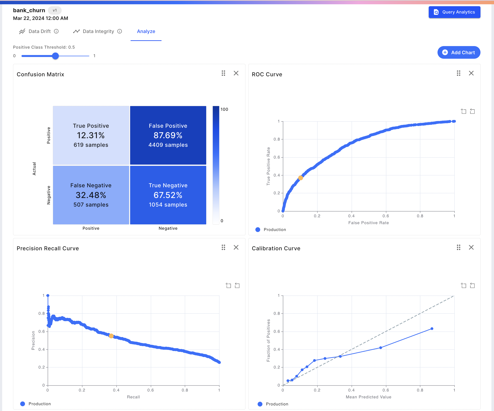

By selecting Query Analytics, the analyze page will have an auto-generated SQL query based on our date selection in our drift chart. From here, we can further customize the SQL queries to investigate the data as we see fit.

We check the distribution of the field `numofproducts` for our selection. We can do this by selecting **Chart Type - Feature Distribution** on the right-hand side of the tab.

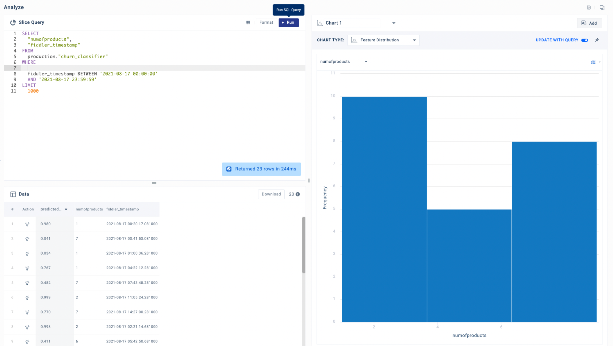

Root Cause Analysis - 1

We further check the performance of the model for our selection by selecting the **Chart Type - Slice Evaluation**.

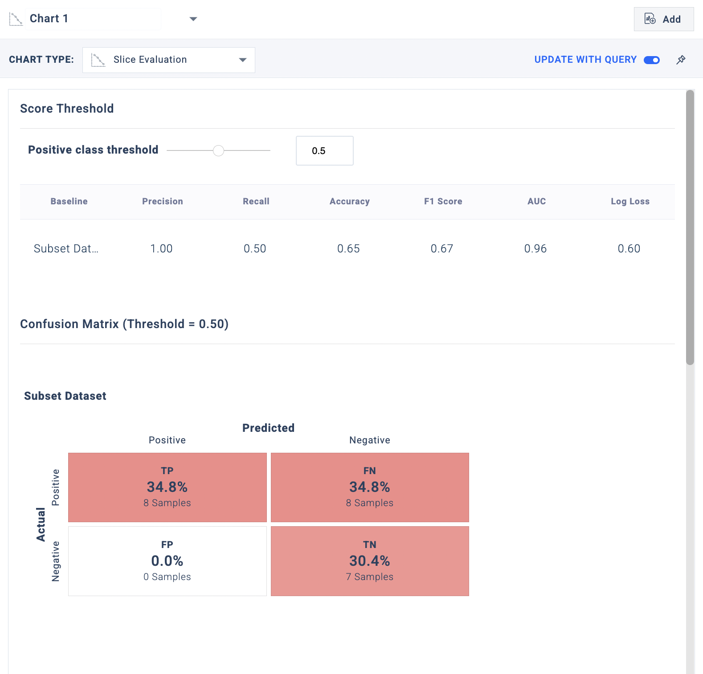

Root Cause Analysis - 2

In order to check if the change in the range violation has occurred for a subsection of data, we can plot it against the categorical variable. In our case, we can check distribution of `numofproducts` against `age` and `geography`. For this we can plot a feature correlation plot for two features by querying data and selecting **Chart type - Feature Correlation**.

On plotting the feature correlation plot of `gender` vs `numofprodcuts`, we observe the distribution to be similar.

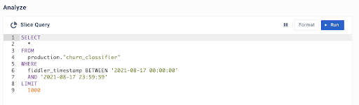

Root Cause Analysis - 3

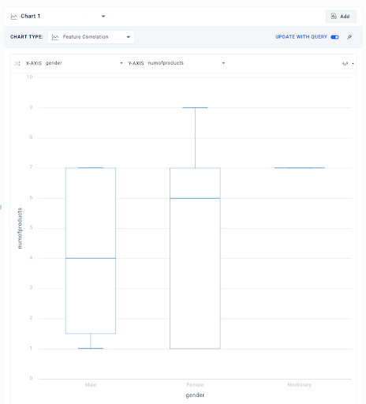

Root Cause Analysis - 4

For the sake of this example, let’s say that state of Hawaii (which is a value in the `geography` field in the data) announced that it has eased restrictions on number of loans, since loans is one of products, our hypothesis is the `numofproducts` would be higher for the state. To test this we will check the feature correlation between `geography` and `numofproducts`.

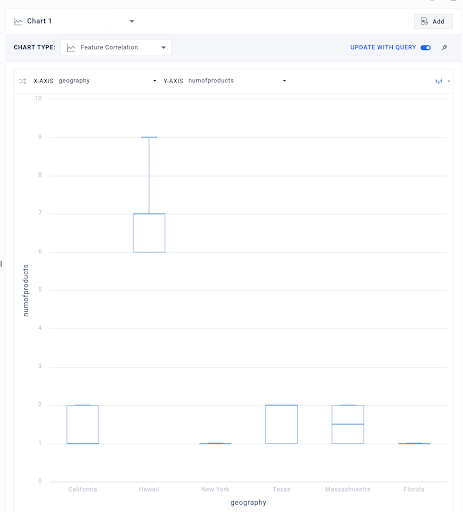

Root Cause Analysis - 5

We do see higher values for the state of Hawaii as compared to other states. We can further check distribution for the field `numofproducts` just for the state of Hawaii.

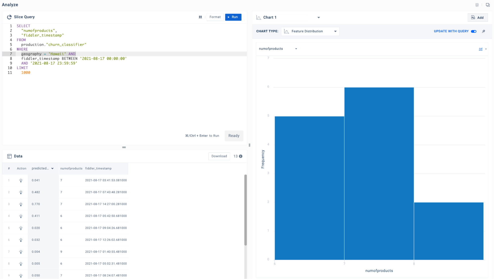

Root Cause Analysis - 6

On checking performance for the subset of Hawaii, we see a huge performance drop.

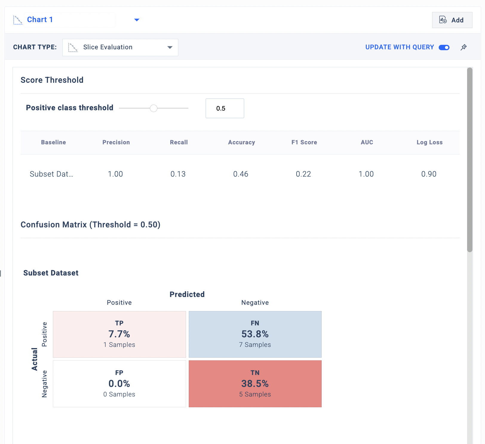

Root Cause Analysis - 7

On the contrary, we see a good performance for the subset of data without the ‘Hawaii’.

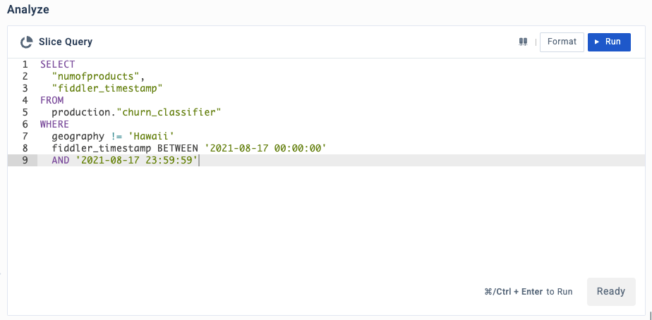

Root Cause Analysis - 8

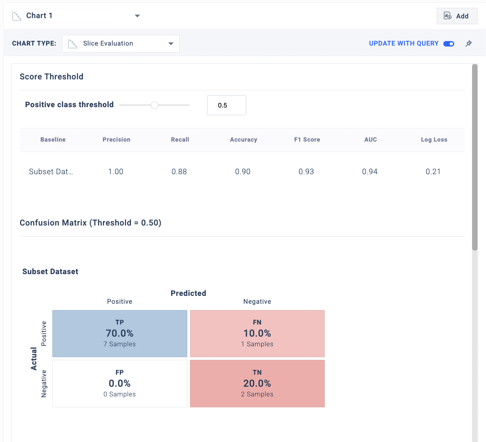

Root Cause Analysis - 9

#### Step 5 - Measuring the impact of the ‘numofproducts’ feature

We notice the "Hawaii" cohort exhibits poor decisions of the model in the form of false negatives. After further refining our SQL query, we can hone in directly on the false negatives within our underperforming "Hawaii" cohort. Fiddler will now allow us to "explain" these false negatives by clicking the \[lightbulb] action.

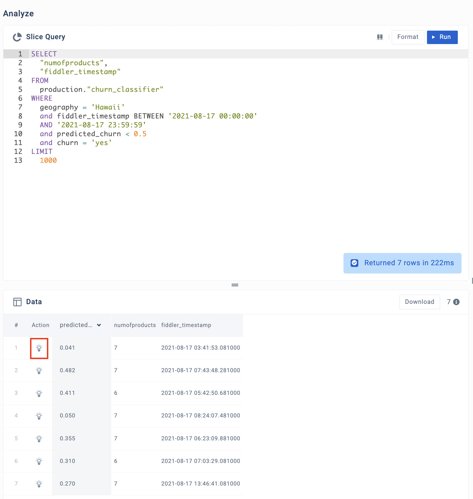

Explaining our False Negatives

We see that the feature `numofproducts` attributes significantly towards the data point being predicted not to churn.

A local explanation for a false negative inference

We have seen that the performance of the churn model drops due to data drift in a particular cohort for one particular feature. We can improve the performance by retraining the model with new data but before that we must perform mitigation actions which would help us in preemptively detecting the model performance degradation and inform our retraining frequency.

#### Step 6 - Mitigation Actions

1. **Add alerts**\
   We can alert users to make sure we are notified the next time there is a performance degradation. For instance, in this example, there was a performance degradation due to feature drift within a segment. To mitigate this, we can define a segment and set up an alert which would notify us in the case of input drift on our problematic feature. Check out this [link](../UI\_Guide/monitoring-ui/alerts-with-fiddler-ui.md) to learn how to set up alerts on Fiddler platform.



