# Fraud Detection

Fraud detection models have proven to be more effective than humans when it comes to detecting fraud. However, if left unattended, the performance of fraud detection models can degrade over time leading to big losses for the company and dissatisfied customers.

The **Fiddler AI Observability** platform provides a variety of tools that can be used to monitor, explain, analyze, and improve the performance of your fraud detection model.

### Monitoring

There are several metrics that organizations should measure on an ongoing basis to ensure their fraud detection models are performing as expected. The metrics below highlight some of the key metrics that every organization should monitor to ensure model health.

#### Drift Detection

* **Drift with class-imbalance** - Fraud detection models suffer from highly imbalanced data between the minority class (fraud) and the majority class (not fraud). With Fiddler, users can specify class weights on a global or event level to improve drift detection within the minority class. Please see more information in [Class-Imbalanced Data](../product-guide/monitoring-platform/class-imbalanced-data.md).
* **Feature Impact** - Tells us the contribution of features to the model's prediction, averaged over the baseline dataset. The contribution is calculated using [random ablation feature impact](https://arxiv.org/pdf/1910.00174.pdf).
* **Feature/Input Drift** - Tells us how much a feature is drifting away from the baseline dataset for the time period of interest. For more information on how drift metrics are calculated, see [Data Drift](../product-guide/monitoring-platform/data-drift-platform.md).
* **Prediction/Output Drift Impact** - A heuristic calculated by taking the product of Feature Impact and Feature Drift. The higher the score the more this feature contributed to the prediction value drift.

#### Performance Metrics

Accuracy might not be a good measure of model performance in the case of fraud detection as most of the cases are non-fraud. Therefore, we use monitor metrics like:

1. **Recall** - How many of the non-fraudulent cases were actually detected as fraud? A low recall value might lead to an increased number of cases for review even though all the fraud cases were predicted correctly.
2. **False Positive Rate** - Non-Fraud cases labeled as fraud, high FPR rate leads to dissatisfied customers.

#### Data Integrity

* **Range Violations** - This metric shows the percentage of data in the selected production data that has violated the range specified in the baseline data.
* **Missing Value Violations** - This metric shows the percentage of missing data for a feature in the selected production data.
* **Type Violations** - This metric shows the percentage of data in the selected production data that has violated the type specified in the baseline data.

### Explanability

When fraud detection models infer false positives or false negatives, there is a real cost to the organization. Local explanations are a very powerful way to identify what inputs and values influenced the model's incorrect decisions.

#### Point Overview

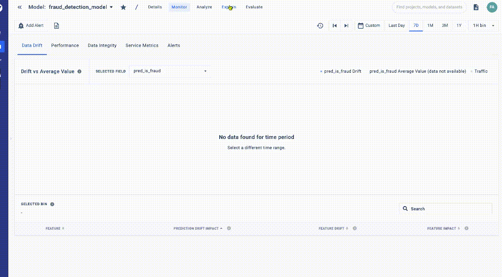

Point Overview

Explanations in the Fiddler AI Observability platform gives an inference-level overview for the inference selected. These explanations unveil which inputs had the strongest positive and negative feature attributions which led to the prediction output. We can choose from the explanation types. In the case of fraud detection, we can choose from SHAP, Fiddler SHAP, Mean-reset feature impact, Permutation Feature Impact.

In this example, ‘category’ has the highest positive attribution (35.1%), pushing the prediction value towards fraud, and ‘amt’ has the highest negative attribution(-45.8%), pushing the prediction value towards non-fraud.

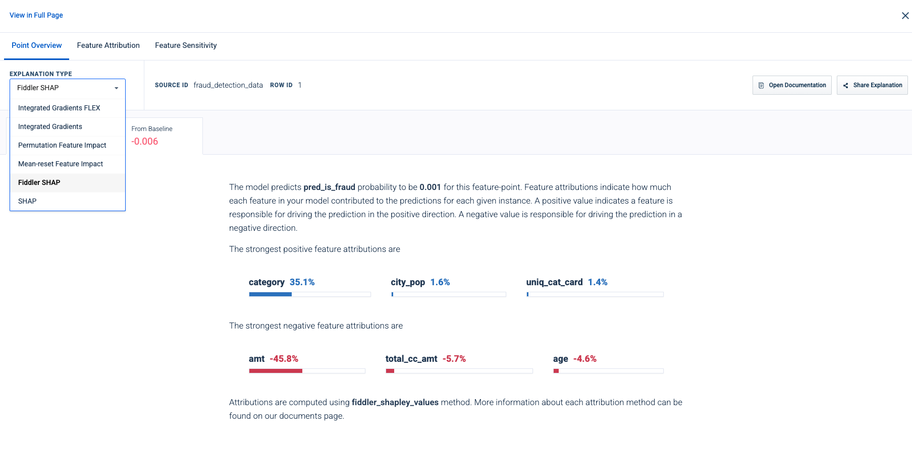

Explanation Type

#### Feature Attribution

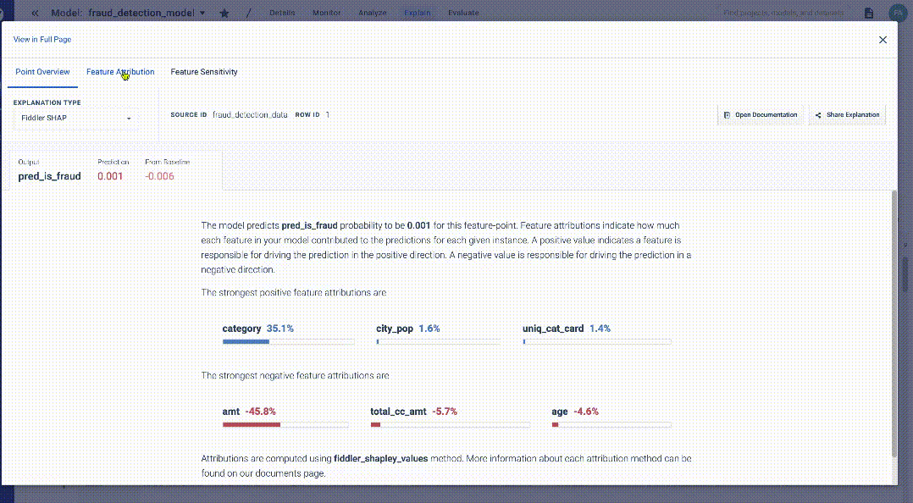

Feature Attribution

The Feature Attribution tab gives us information about how much each feature can be attributed to the prediction value based on the Explanation Type chosen. We can also change the value of a particular feature to measure how much the prediction value changes.\
In the example below we can see that on changing the value of feature ‘amt’ from 110 to 10k the prediction value changes from 0.001 to 0.577 (not fraud to fraud).

### Maximize the performance of your Fraud Detection Models with Fiddler!

Please refer to our [ML Monitoring - Class Imbalance Quick Start Guide](../QuickStart\_Notebooks/class-imbalance-monitoring-example.md) for a walkthrough on how to get started with using Fiddler for your fraud detection use case and an interactive demo on usability.

#### Overview

It is inevitable that a model’s performance will degrade over time. We can use the Fiddler AI Observability platform to monitor the model’s performance in production, look at various metrics, and also provide explanations to predictions on various data points.

In this walkthrough, we will look at a few scenarios common to a fraud model when monitoring for performance. We will show how you can:

1. Get baseline and production data onto the Fiddler Platform
2. Monitor drift for various features
3. Monitor performance metrics associated with fraud detection like recall, false-positive rate
4. Monitor data integrity Issues like range violations
5. Provide point explanations to the mislabelled points
6. Get to the root cause of the issues

#### Example - Model Performance Degradation due to Data Integrity Issues

**Step 1 - Setting up baseline and publishing production events**

Please refer to our [ML - Simple Monitoring Quickstart Guide](../QuickStart\_Notebooks/quick-start.md) for a step-by-step walkthrough of how to upload baseline and production data to the Fiddler platform.

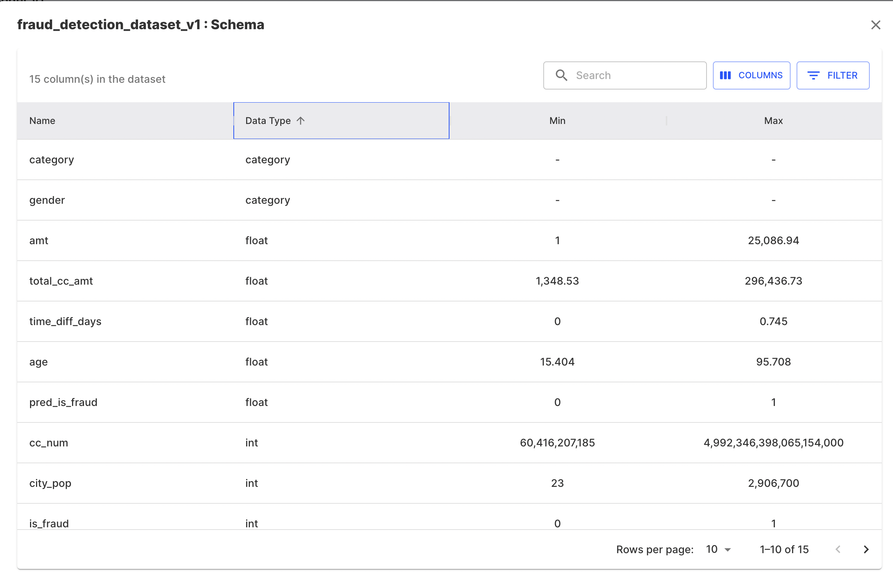

**Step 2 - Access Model Insights**

Once the production events are published, we can monitor a variety of model metrics by leveraging the model's default dashboard. To access the default dashboard, click on the _**Insights**_ button for a model on the homepage or model schema page. This will display a series of data drift, performance, traffic and data integrity time series charts for your model.

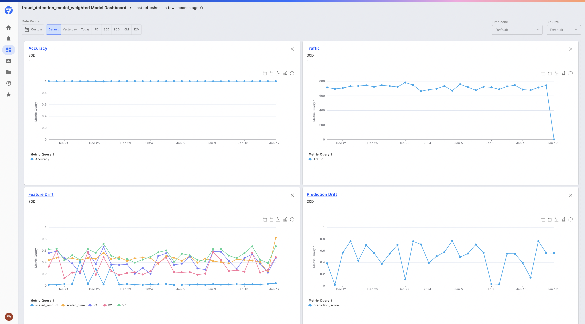

The default dashboard for our fraud detection model

**Step 3 - Monitor Drift**

Once the production events are published, we can monitor drift for the model output using the "Prediction Drift" chart i.e. - _**pred\_is\_fraud**_, which is the probability value of a case being a fraud. Here we can see that the prediction value of _**pred\_is\_fraud**_ increased in mid-November.

Clicking into the Prediction Drift chart

**Step 4 - Monitor Performance Metrics**

Next, to check if the performance has degraded, we can check the performance metrics by creating a new chart (or clicking into the "Accuracy" chart on the default dashboard). Here we can look at ‘Accuracy’ and ‘FPR’ of the model over time. We can see that the accuracy has gone down and FPR has gone up in the same period.

Accuracy and FPR over time

**Step 5 - Monitor Data Integrity**

The performance drop could be due to a change in the quality of the data. To check that we can create a new chart (or click on the ‘Data Integrity’ chart on our default dashboard) to look for Missing Value Violations, Type Violations, Range Violations, etc. We can see the columns ‘category’ suffers range violations. Since this is a ‘categorical’ column, there is likely a new value that the model did not encounter during training.

Range violations for "Category" identified

**Step 6 - Check the impact of the drift**

We can go back to the ‘Data Drift’ chart to measure how much the data integrity issue has impacted the prediction. We can select the bin in which the drift increased. The table below shows the Feature Impact, Feature Drift, and Prediction Drift Impact values for the selected bin. We can see that even though the Feature Impact for ‘Category’ value is less than the ‘Amt’ (Amount) value, because of the drift, its Prediction Drift Impact is more.

Determining which input is driving the output drift

We will now move on to check the difference between the production and baseline data for this bin. For this, we can click on \[Analyze] button. This click will land us on the Analyze tab ready to retrieve inferences on the day selected.

**Step 7 - Root Cause Analysis in the ‘Analyze’ tab**

The analyze tab pre-populated the left side of the tab with the query based on our selection. We can also write custom queries to slice the data for analysis.

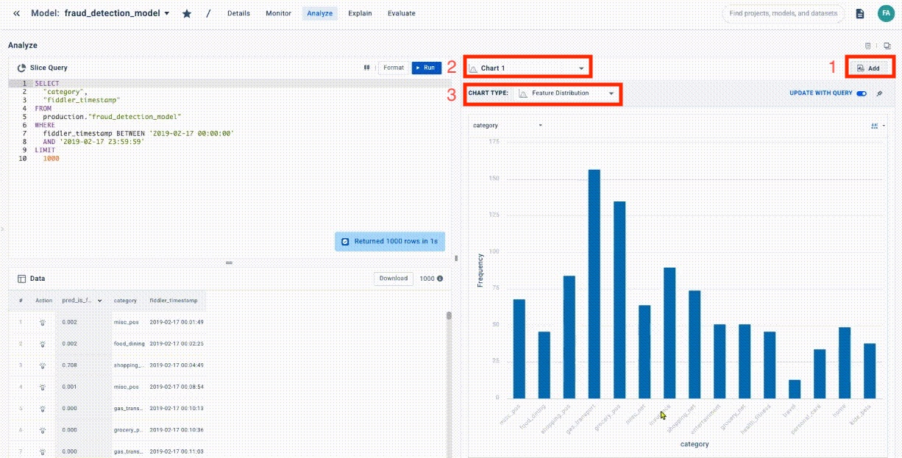

Analyze Tab

Analyze Query

On the right-hand side of the tab we can build charts on the tabular data based on the results of our custom query. For this RCA we will build a ‘Feature Distribution’ chart on the ‘Category’ column to check the distinct values and also measure the percentage of each value. We can see there are 15 distinct values along with their percentages.

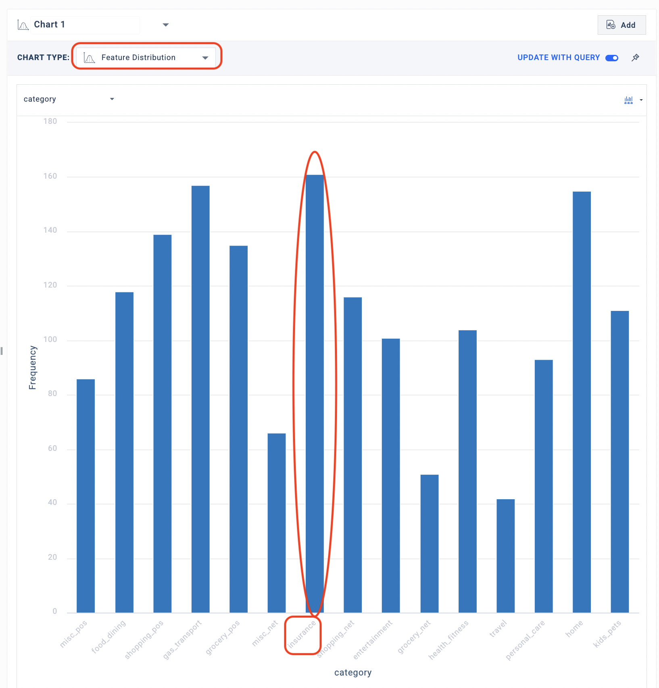

Feature Distribution - Production

Next, we will compare the Feature Distribution chart in production data vs the baseline data to find out about the data integrity violation. We can modify the query to obtain data for baseline data and produce a ‘Feature Distribution’ chart for the same.

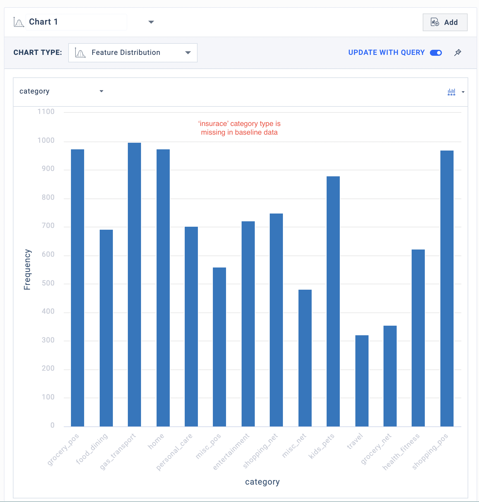

Feature Distribution - Baseline

We can see that the baseline data has just 14 unique values and ‘insurance’ is not present in baseline data. This ‘Category’ value wasn’t present in the training data and crept in production data likely causing performance degradation.\
Next, we can perform a ‘point explanation’ for one such case where the ‘Category’ value was ‘Insurance’ and the prediction was incorrect to measure how much the ‘Category’ column contributed to the prediction by looking at its SHAP value.

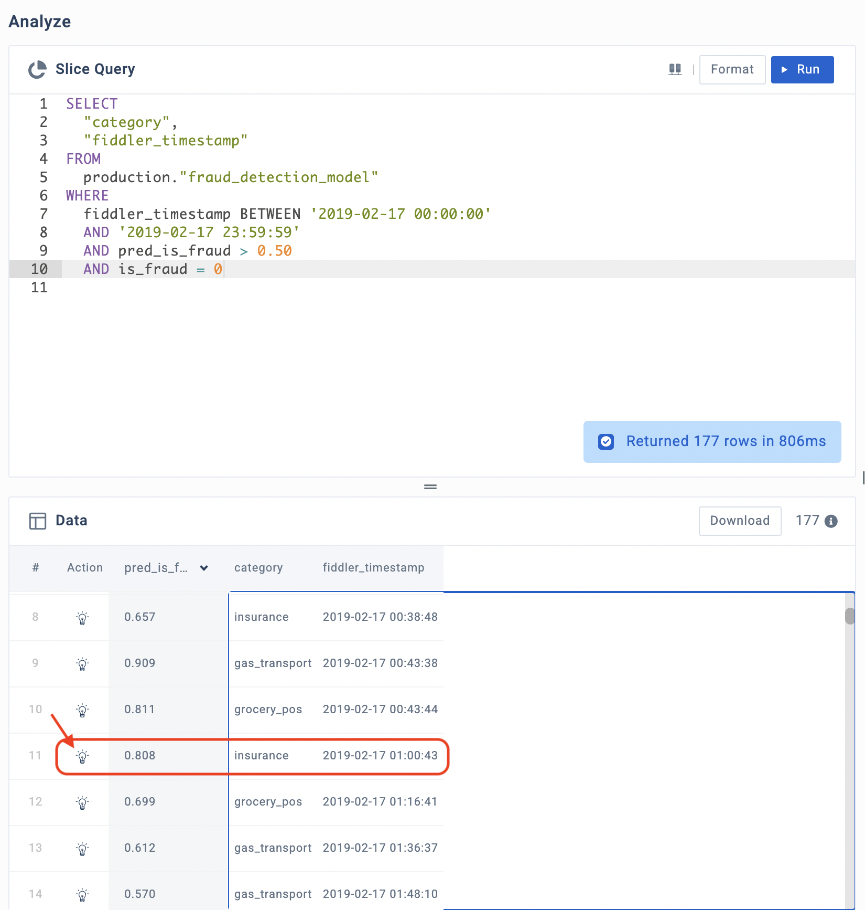

Mislabelled Data Point

We can click on the bulb sign beside the row to produce a point explanation. If we look at example 11, we can see that the output probability value was 0 (predicted as fraud according to the threshold of 0.5) but the actual value was ‘not fraud’.

The bulb icon will take us to the ‘Explain’ tab. Here we can see that the ‘category’ value contributed to the model predicting the case as ‘fraud’.

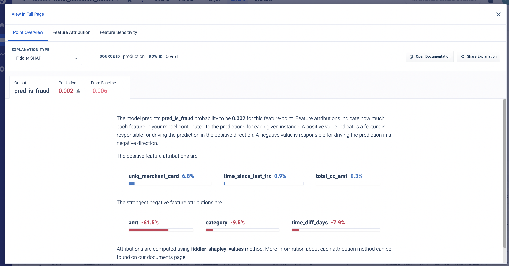

Point Explanation

**Step 7 - Actions**

We discovered that the prediction drift and performance drop were due to the introduction of a new value in the ‘Category’ column. We can take steps so that we could identify this kind of issue in the future before it can result in business impact.

**Setting up Alerts**

In the ‘Alerts’ section of Fiddler, we can set up alerts to notify us of as soon as a certain data issue happens. For example, for the case we discussed, we can set up alerts as shown below to alert us when the range violation increases beyond a certain threshold (e.g.-5%).

An alert rule for detecting additional range violations on our 'category' input

These alerts can further influence the retraining of the ML model, we can retrain the model including the new data so the newly trained model contains the ‘insurance’ category value. This should result in improved performance.

**Data Insights**

Below we can see the confusion matrix for November (before drift starts). We can observe a good performance with Recall at 100% and 0.1% FP

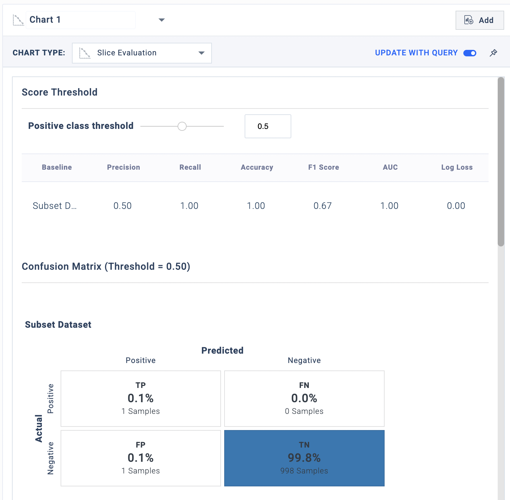

Slice Evaluation - Feb 17

Below we can see the confusion matrix for late November (after drift starts). We can observe a performance drop with Recall at 50% and 9% FP

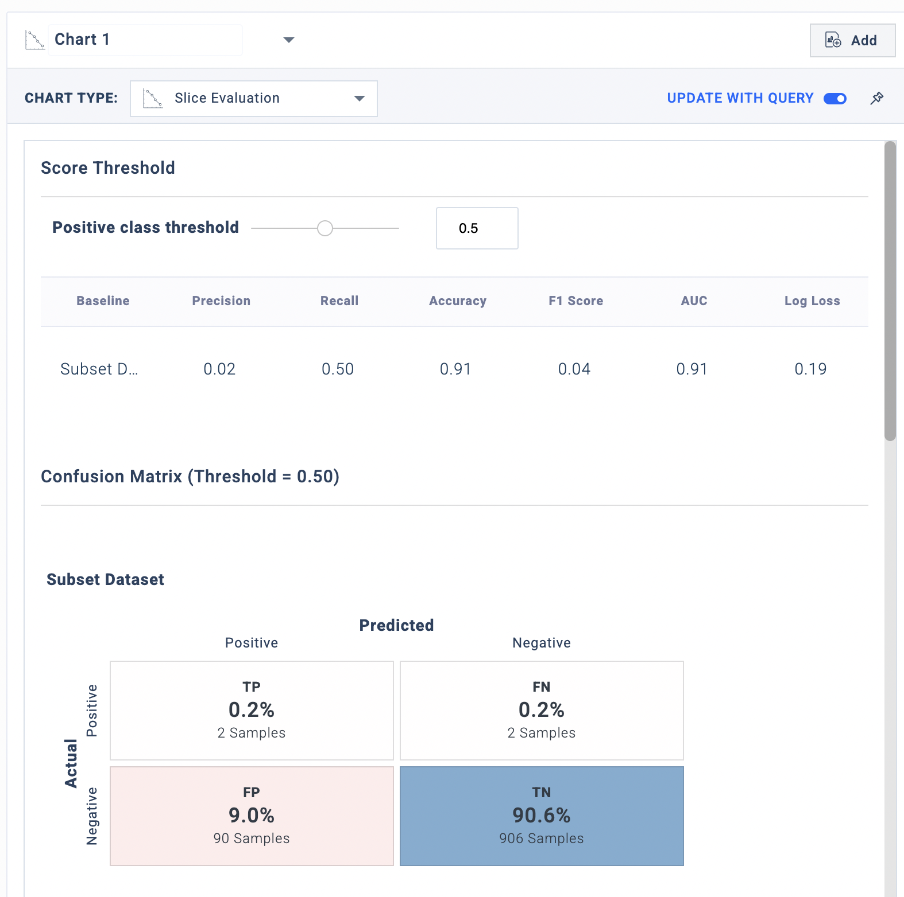

Slice Evaluation - Feb 16

#### Conclusion

Undetected fraud cases can lead to losses for the company and customers, not to mention damage reputation and relationship with customers. The Fiddler AI Observability platform can be used to identify the pitfalls in your ML model and mitigate them before they have an impact on your business.

In this walkthrough, we investigated one such issue with a fraud detection model where a data integrity issue caused the performance of the ML model to drop.

Fiddler can be used to keep the health of your fraud detection model up by:

1. Monitoring the drift of the performance metric
2. Monitoring various performance metrics associated with the model
3. Monitoring data integrity issues that could harm the model performance
4. Investigating the features which have drifted/ compromised and analyzing them to mitigate the issue
5. Performing a root cause analysis to identify the exact cause and fix it
6. Diving into point explanations to identify how much the issue has an impact on a particular data point
7. Setting up alerts to make sure the issue does not happen again

We discovered there was an issue with the ‘Category’ column, wherein a new value was discovered in the production data. This led to the performance drop in the data likely due to the range violation. We suggest two steps to mitigate this issue:

1. Setting up ‘alerts’ to identify similar issues in data integrity
2. Retraining the ML model after including the new data (with the ground truth labels) to teach the model of the new values



