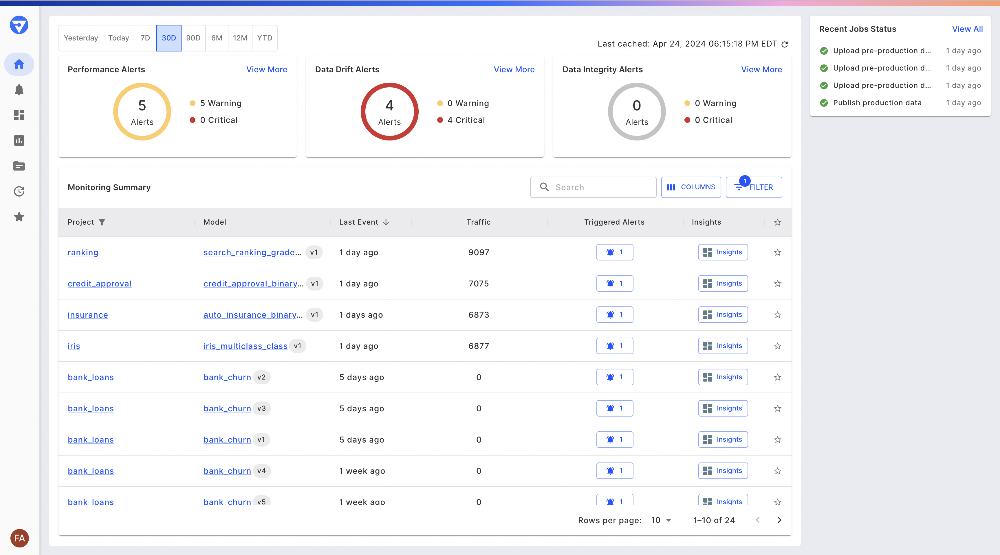
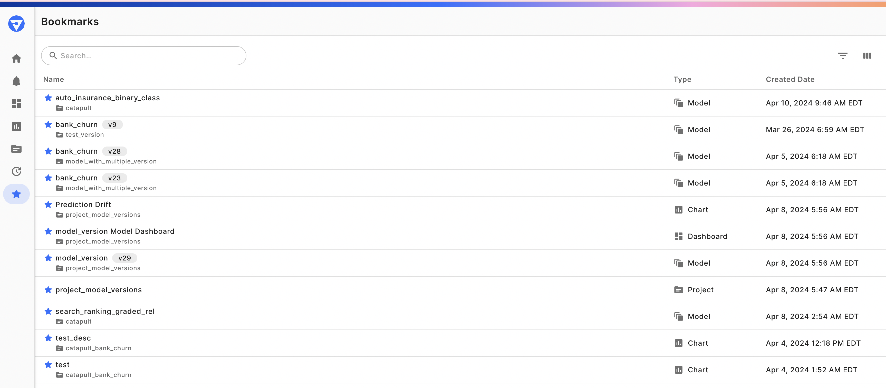
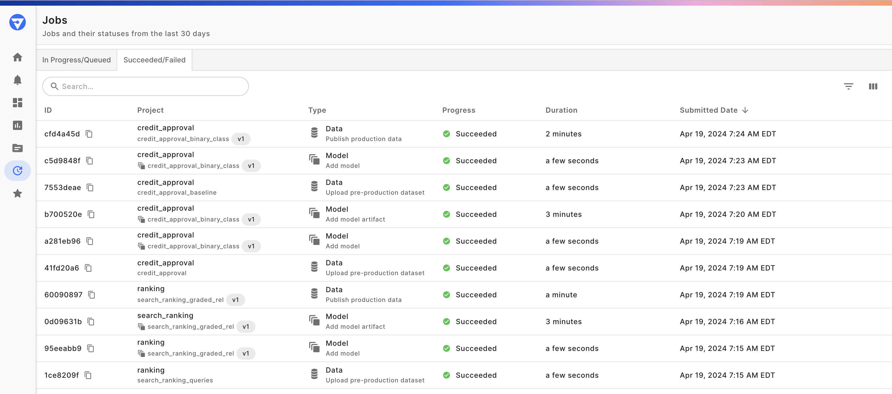
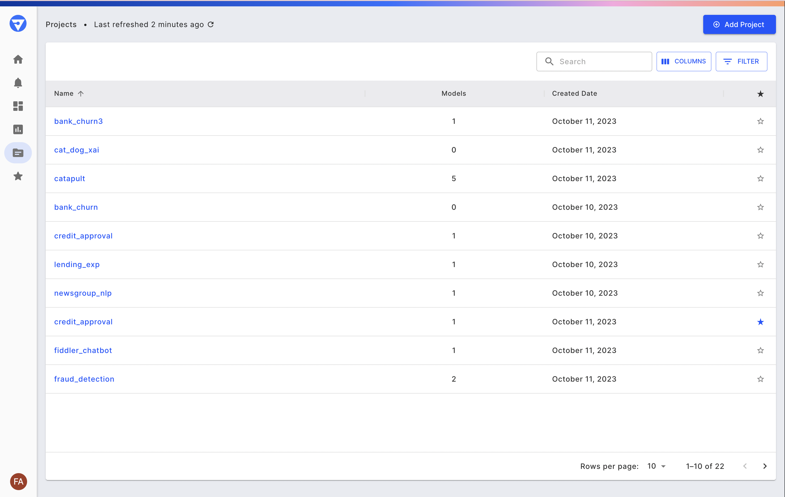
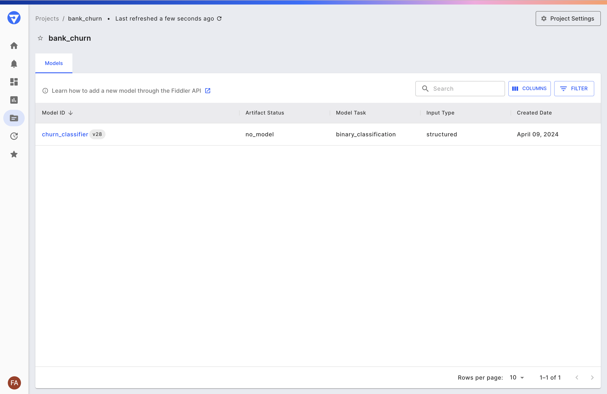
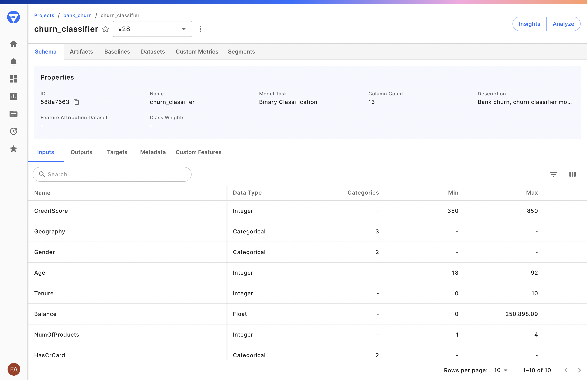

# Product Tour

## Video Demo

Watch the video to learn how Fiddler AI Observability provides data science and MLOps teams with a unified platform to monitor, analyze, explain, and improve machine learning models at scale, and build trust in AI.



## Documented UI Tour

When you log in to Fiddler, you are on the Home page and you can visualize monitoring information for your models across all your projects.

* At the top of the page, you will see donut charts for the number of triggered alerts for [Performance](../UI\_Guide/monitoring-ui/performance.md), [Data Drift](../UI\_Guide/monitoring-ui/data-drift.md), and [Data Integrity](../UI\_Guide/monitoring-ui/data-integrity.md).
* To the right of the donut charts, you will find the Bookmarks as well as a Recent Job Status card that lets you keep track of long-running async jobs and whether they have failed, are in progress, or successfully completed.
* The [Monitoring](../UI\_Guide/monitoring-ui/) summary table displays your models across different [projects](../Client\_Guide/create-a-project-and-model.md#create-a-project) along with information on their traffic, drift, and the number of triggered alerts.

View all of your bookmarked, Projects, Models, Charts, and Dashboards by clicking "View All" on the Bookmarks card on the homepage or navigating directly to Bookmarks via the navigation bar.

Track all of your ongoing and completed model, dataset, and event publish jobs by clicking "View All" on the Jobs card on the homepage or navigating directly to the Jobs via the navigation bar.

On the side navigation bar, below charts, is the [Projects](../Client\_Guide/create-a-project-and-model.md) Tab. You can click on the Projects tab and it lands on a page that lists all your projects contained within Fiddler. See the [Fiddler Samples](product-tour.md#fiddler-samples) section below for more information on these projects. You can create new projects within the UI (by clicking the “Add Project” button) or via the [Fiddler Client](../Python\_Client\_3-x/about-client-3x.md).

**Projects** represent your organization's distinct AI applications or use cases. Within Fiddler, Projects house all the **Models** specific to a given application, and thus serve as a jumping-off point for the majority of Fiddler’s model monitoring and explainability features.

Go ahead and click on the _bank\_churn_ to navigate to the Project Overview page.

Here you can see a list of the models contained within the fraud detection project, as well as a project dashboard to which analyze charts can be pinned. Go ahead and click the “churn\_classifier” model.

From the Model Overview page, you can view details about the model: its metadata (schema), the files in its model directory, and its features, which are sorted by impact (the degree to which each feature influences the model’s prediction score).

You can then navigate to the platform's core monitoring and explainability capabilities. These include:

* _**Monitor**_ — Track and configure alerts on your model’s performance, data drift, data integrity, and overall service metrics. Read the [Monitoring](../UI\_Guide/monitoring-ui/) documentation for more details.
* _**Analyze**_ — Analyze the behavior of your model in aggregate or with respect to specific segments of your population. Read the [Analytics](../UI\_Guide/analytics-ui/) documentation for more details.
* _**Explain**_ — Generate “point” or prediction-level explanations on your training or production data for insight into how each model decision was made. Read the [Explainability](../UI\_Guide/explainability-ui-giude/) documentation for more details.

### Fiddler Samples

Fiddler Samples is a set of datasets and models that are preloaded into Fiddler. They represent different data types, model frameworks, and machine learning techniques. See the table below for more details.

| **Project**   | **Model**                       | **Dataset** | **Model Framework** | **Algorithm**       | **Model Task**             | **Explanation Algos** |
| ------------- | ------------------------------- | ----------- | ------------------- | ------------------- | -------------------------- | --------------------- |
| Bank Churn    | Bank Churn                      | Tabular     | scikit-learn        | Random Forest       | Binary Classification      | Fiddler Shapley       |
| Heart Disease | Heart Disease                   | Tabular     | Tensorflow          |                     | Binary Classification      | Fiddler Shapley, IG   |
| IMDB          | Imdb Rnn                        | Text        | Tensorflow          | BiLSTM              | Binary Classfication       | Fiddler Shapley, IG   |
| Iris          | Iris                            | Tabular     | scikit-learn        | Logistic Regression | Multi-class Classification | Fiddler Shapley       |
| Lending       | Logreg-all                      | Tabular     | scikit-learn        | Logistic Regression | Binary Classification      | Fiddler Shapley       |
|               | Logreg-simple                   | Tabular     | scikit-learn        | Logistic Regression | Binary Classification      | Fiddler Shapley       |
|               | Xgboost-simple-sagemaker        | Tabular     | scikit-learn        | XGboost             | Binary Classification      | Fiddler Shapley       |
| Newsgroup     | Christianity Atheism Classifier | Text        | scikit-learn        | Random Forest       | Binary Classification      | Fiddler Shapley       |
| Wine Quality  | Linear Model Wine Regressor     | Tabular     | scikit-learn        | Elastic Net         | Regression                 | Fiddler Shapley       |
|               | DNN Wine Regressor              | Tabular     | Tensorflow          |                     | Regression                 | Fiddler Shapley       |

See the [README](https://github.com/fiddler-labs/fiddler-examples) on GitHub for more information.



