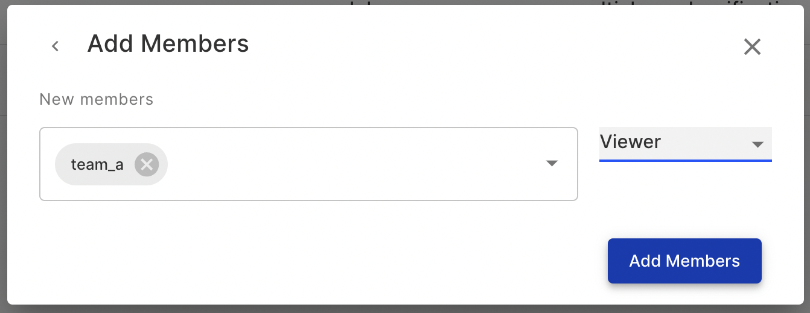

# Authorization and Access Control

Each project supports its own set of permissions for its users. Start by selecting `Project Settings` within a project space. Here you can view which users and teams currently have access to the project or add members and specify their access.

Access Project Settings to set permissions.

Add members or teams with specific access.

For more details refer to [Administration Page](../../product-guide/administration-platform.md) in the Product Guide.



