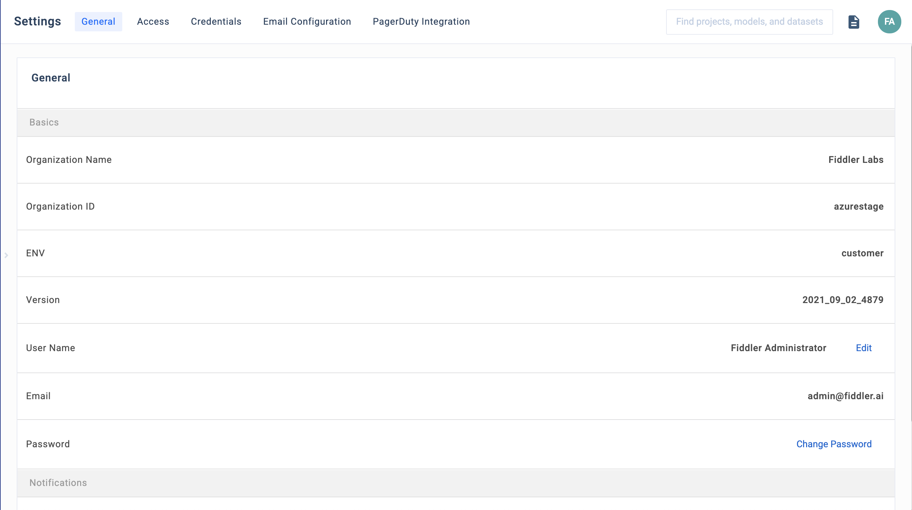
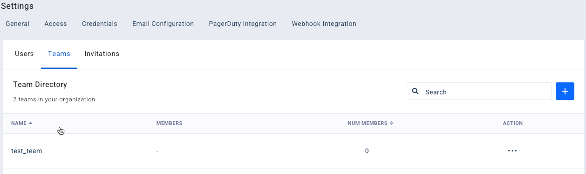
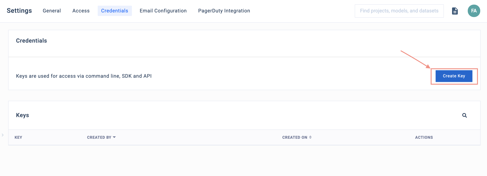

# Application Settings

### Overview

The Settings section captures team setup, permissions, and credentials. You can access the **Settings** page from the user settings on the left navigation bar of the Fiddler UI.

### Key Tabs within Settings

#### General

The **General** tab shows your organization name, your email, and a few other details.

#### Access

The **Access** tab shows the users, teams, and invitations for everyone in the organization.

**Users**

The **Users** sub-tab shows all the users that are members of this organization.

**Teams**

The **Teams** tab shows all the teams that have been defined for this organization.

You can create a team by clicking on the plus (**`+`**) icon on the top-right.

> 🚧 Note
>
> Only Org Admins can create teams. The plus (**`+`**) icon will not be visible unless you have the Org Admin role.

**Invitations**

The **Invitations** tab shows all pending user invitations. Invitations that have been accepted no longer appear.

You can invite a user by clicking on the plus (**`+`**) icon on the top-right.

> 🚧 Note
>
> Only Org Admins can invite users. The plus (**`+`**) icon will not be visible unless you have the Org Admin role.

### Credentials

The **Credentials** tab displays user access keys. These access keys are used by Fiddler Python client for authentication. Each Org Admin or Org Member can create a unique key by clicking on **Create Key**.

### Webhooks

Webhooks enable you to link Fiddler to your own notification and communication services and have them receive Fiddler alerts as they are triggered. We support Slack webhook integration directly as well as a custom webhook that can be used with any webhook-consuming platform.\
You can manage these webhooks in the 'Webhook Integration' tab.

**Configure a New Slack Webhook**

From the "Webhook Integrations" tab, use the + icon on the "Webhook Integration" tab to configure a new webhook.

Follow these steps:

1. Enter a unique webhook name in the **Service Name** textbox
2. Select Slack in the **Provider** dropdown
3. Enter the Slack webhook URL provided by your Slack administrator which will appear similar to this example: [https://hooks.slack.com/services/xxxxxxxxxx](https://hooks.slack.com/services/xxxxxxxxxx)
4. Test the webhook service using the **Test** button
5. Click the **Create** button once the test is successful

Slack documentation on creating webhooks can be reviewed [here](https://api.slack.com/messaging/webhooks).

**Configure a New Custom Webhook**

To configure a webhook for any other platform, follow the same steps listed for the Slack webhook, but instead select **Other** for Provider type and enter the webhook URL provided by the platform's administrator.

1. Enter a unique webhook name in the **Service Name** textbox
2. Select Other in the **Provider** dropdown
3. Enter the webhook URL provided by your platform administrator
4. Test the webhook service using the **Test** button
5. Click the **Create** button once the test is successful

> 🚧 Custom Webhooks
>
> Note that many platforms will require some amount of configuration in order to properly receive and act on the notifications sent by third party software like Fiddler.

#### Edit or Delete a Webhook

You can manage your webhook from the **Webhook Integrations** tab.

1. Select the webhook that you want to edit/delete using the "..." icon towards the right of a webhook integration row.
2. Select the **Delete Webhook** option to delete the webhook

> 🚧 Deleting a Webhook
>
> You will not be able to delete a webhook that is already linked to alerts. To delete the webhook, you will need to modify the alert and then delete the webhook

3. Select the **Edit Webhook** option to edit the webhook
4. Click the **Test** button to test your changes
5. Click the **Save** button once the test is successful



