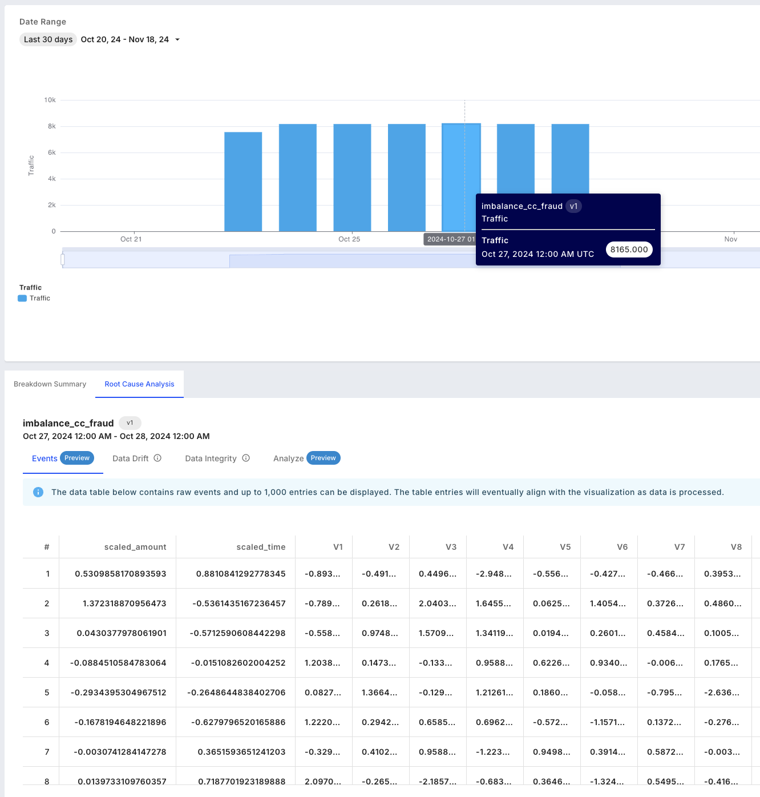

# Analytics

## Interfaces

### Analytics Charts

There are three supported analytics chart types:

1. _**Performance Analytics**_ — Visualize various performance metrics tailored to different task types, such as confusion matrices, prediction scatterplots, and more.
2. _**Feature Analytics**_ — Analyze the behavior and relationships between features, helping to identify patterns and insights within the data, using feature distribution, feature correlation, and correlation matrix charts.
3. _**Metric Card**_ — Display a single numeric representation of a metric, offering a concise overview of performance, data quality, data integrity, or custom metrics on a card.

### Root Cause Analysis

The Root Cause Analysis (RCA) experience consists of four parts, all based on the FQL segment and time range provided in the monitoring chart:

1. _**Events**_ — Browse a sample of 1,000 events.
2. _**Data Drift**_ — View a breakdown of drift for your features, along with prediction drift impact.
3. _**Data Integrity**_ — Review a summary of data integrity violations, including counts across range, type, and missing value issues.
4. _**Analyze**_ — View performance and feature analytics charts.



