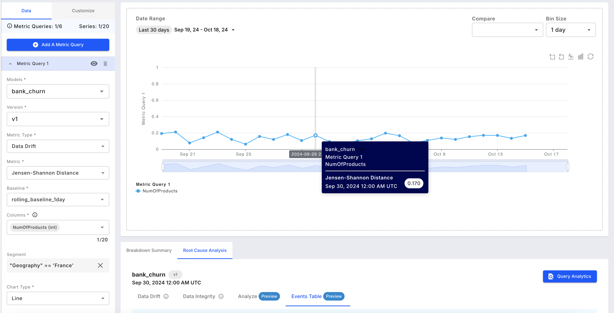
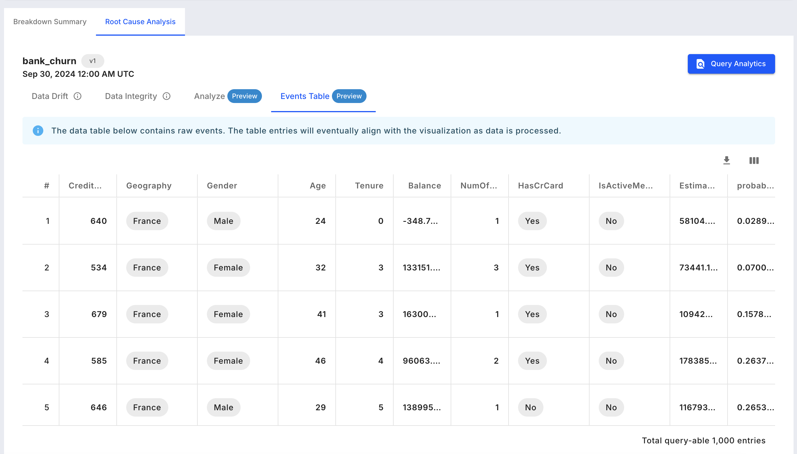
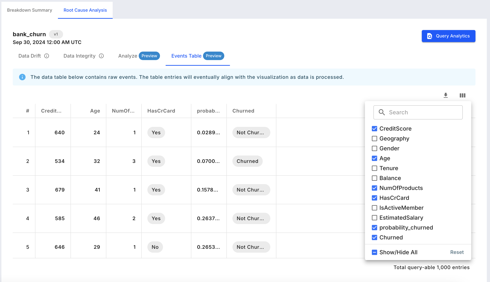
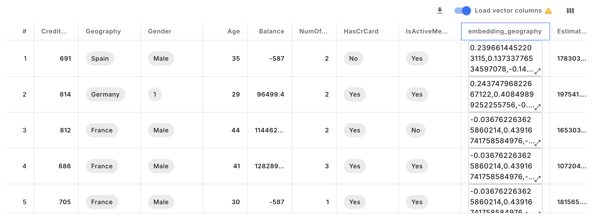
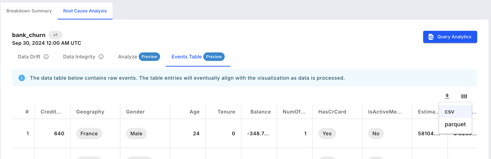

# Events Table in RCA

Allow visualizing events corresponding to a certain bin in a monitoring chart. Note that this view is to provide example rows used for the computation. The maximum number of rows that can viewed is 1000.

## Analyzing a sample of events

* Navigate to the `Charts` tab in your Fiddler AI instance
* Click on the `Add Chart` button on the top right
* In the modal, select a project
* Select **Monitoring**
* Create a Monitoring chart and click on a time range
* This will display the RCA (Root Cause Analysis) tab
* In RCA, select the `Events Table` tab

## Support

This visualization is supported for any model and data type.

## Represented data

The displayed events are production events coming from the selected model and bin, and segment if it was selected in the monitoring chart.

 

## Available Controls

* **Column selection**: On the top right side of the table, select the columns to be displayed. By default all non-vector columns are displayed.

* **Vector columns**: By default the vector columns are not fetched for latency reasons. Toggle on if vectors need to be fetched.

* **Download**: Download the sample events to `CSV` or `PARQUET` format.



