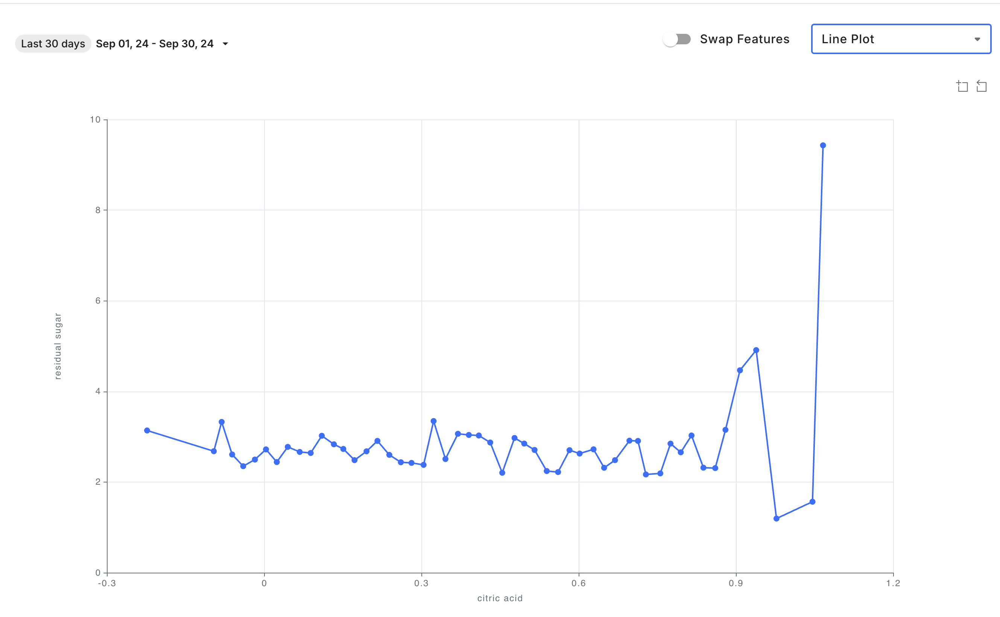
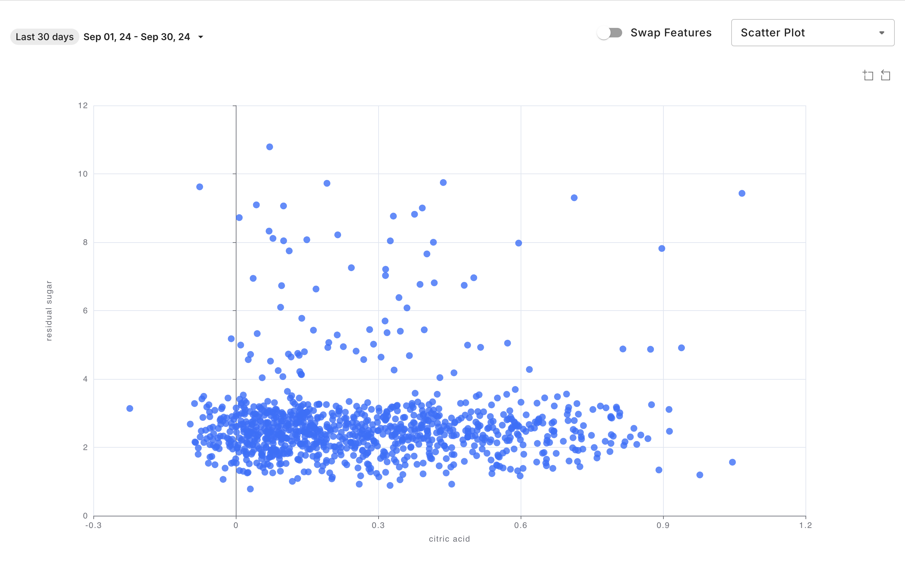
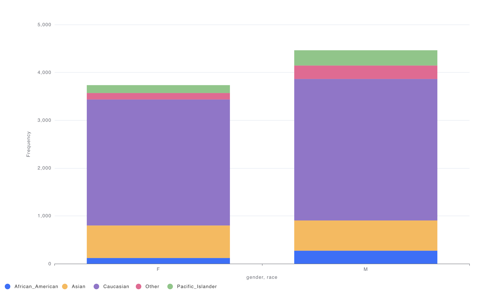
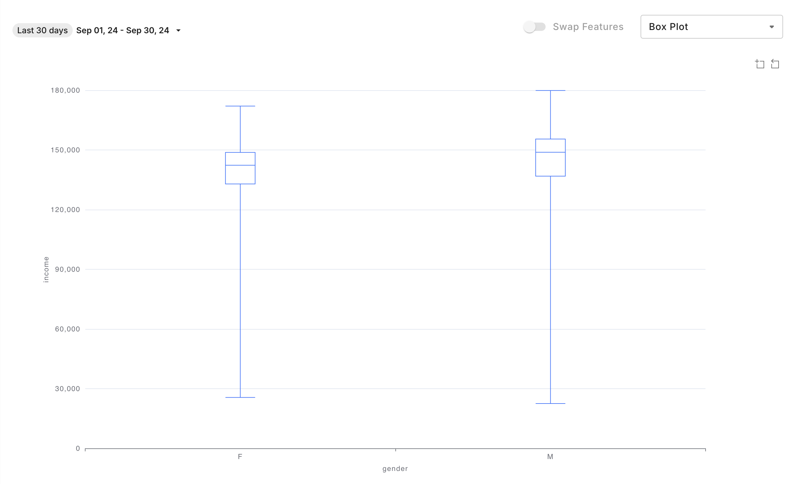
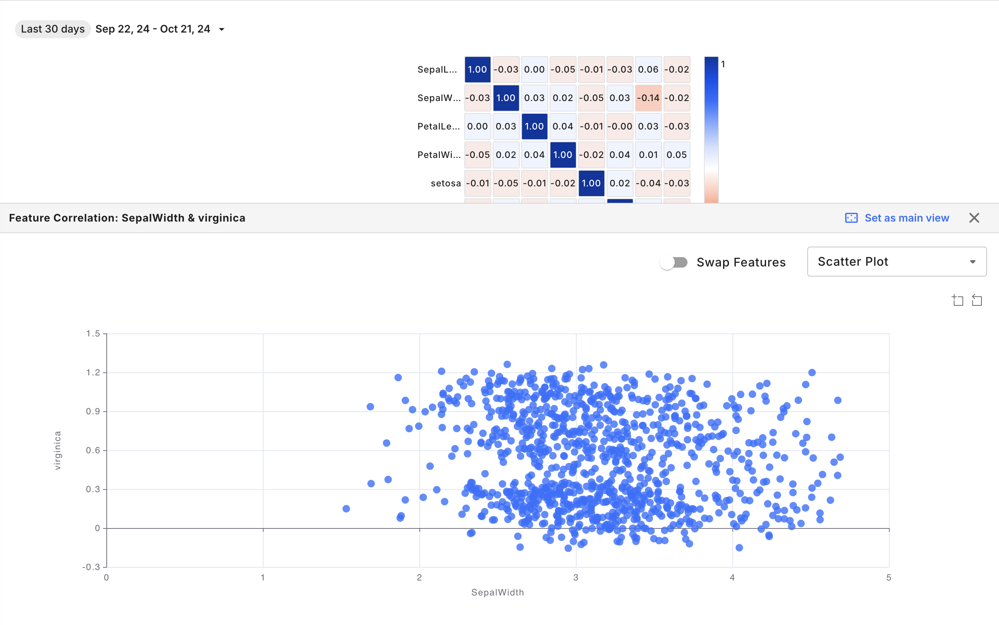

# Feature Analytics Creation

## Creating a Feature Analytics Chart

To create a Feature Analytics chart, follow these steps:

* Navigate to the `Charts` tab in your Fiddler AI instance
* Click on the `Add Chart` button on the top right
* In the modal, select a project
* Select **Feature Analytics**

## Support

Feature analytics is supported for any model task type, but does not support time stamps or columns of type `string` or `vector`.

## Available Right-Side Controls

| Parameter   | Value                                                                                                                                                                                                                                                                                          |
| ----------- | ---------------------------------------------------------------------------------------------------------------------------------------------------------------------------------------------------------------------------------------------------------------------------------------------- |
| Model       | List of models in the project                                                                                                                                                                                                                                                                  |
| Version     | List of versions for the selected model                                                                                                                                                                                                                                                        |
| Environment | `Production` or `Pre-Production`                                                                                                                                                                                                                                                               |
| Dataset     | Displayed only if `Pre-Production` is selected. List of pre-production env uploaded for the model version.                                                                                                                                                                                     |
| Visual      | List of possible visualizations, Feature Distribution or Feature Correlation.                                                                                                                                                                                                                  |
| Segment     | 
- Selecting a saved segment - Defining an applied (on the fly) segment. This applied segment isn’t saved (unless specifically required by the user) and is applied for analysis purposes.
                                                                                            |
| Feature     | 
- Feature Distribution: Select a single column of a supported data type to view the distribution of its values - Feature Correlation: Select two columns to visualize their correlation - Correlation Matrix: Select up to eight columns to visualize their pairwise correlations
 |

## Available In-Chart Controls

| Control              | Value                                                                                                                      |
| -------------------- | -------------------------------------------------------------------------------------------------------------------------- |
| Time range selection | Selecting start time and end time or time label for production data. Default is last 30 days                               |
| Display              | Select how to display the chart, Histogram or Kernel Density Estimate, depending on the data type of the feature selected. |

## Displays for Feature Distribution

### Kernel Density Estimate

For numeric column types, visualize feature distribution as a Kernel Density Estimate chart. 

### Histogram

Categorical and boolean value may only be displayed as Histograms, but other column types may also be displayed as such. 

## Displays for Feature Correlation

### Line Plot

### Scatter Plot

### Stacked Bar Plot

### Box Plot

## Correlation Matrix Interactions

Clicking a cell in the correlation matrix opens the Feature Correlation chart, enabling a more detailed analysis of the relationship between the selected features. 



