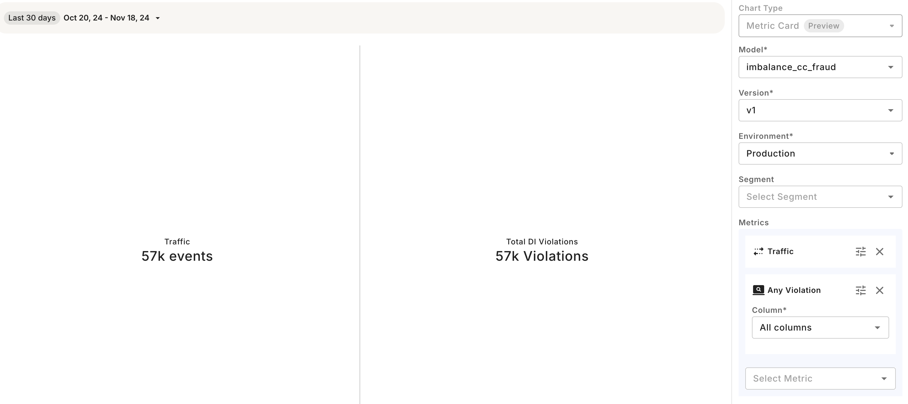

# Metric Card Creation

## Creating a Metric Card Chart

To create a Metric Card, follow these steps:

* Navigate to the `Charts` tab in your Fiddler AI instance
* Click on the `Add Chart` button on the top right
* In the modal, select a project
* Select **Metric Card**

## Support

Metric card is supported for any model task type and for both production and pre-production data. Metric card allows displaying of Custom Metric, Data Drift, Data Integrity, Performance, Traffic, and Statistic metrics.

## Available Right-Side Controls

| Parameter   | Value                                                                                                                                                                                               |
| ----------- | --------------------------------------------------------------------------------------------------------------------------------------------------------------------------------------------------- |
| Model       | List of models in the project                                                                                                                                                                       |
| Version     | List of versions for the selected model                                                                                                                                                             |
| Environment | `Production` or `Pre-Production`                                                                                                                                                                    |
| Dataset     | Displayed only if `Pre-Production` is selected. List of pre-production env uploaded for the model version.                                                                                          |
| Metric      | Selecting a metric across Custom Metrics, Data Drift, Data Integrity, Performance, Traffic, and Statistic to display as an aggregated number. Select up to 4 metrics to display on the chart.       |
| Segment     | 
- Selecting a saved segment - Defining an applied (on the fly) segment. This applied segment isn’t saved (unless specifically required by the user) and is applied for analysis purposes.
 |

## Available In-Chart Controls

| Control                  | Model Task            | Value                                                                                        |
| ------------------------ | --------------------- | -------------------------------------------------------------------------------------------- |
| Time range selection     | All                   | Selecting start time and end time or time label for production data. Default is last 30 days |
| Positive class threshold | Binary classification | For performance metrics, select a threshold to be applied for computation. Default is 0.5    |
| Top-K                    | Ranking               | For performance metrics, select a top-k value to be applied for computation. Default is 20.  |

## Saving the Chart

Once you're satisfied with your metric card Chart, you can save it which allows it to be added to Dashboards and viewed individually from the Charts page.



