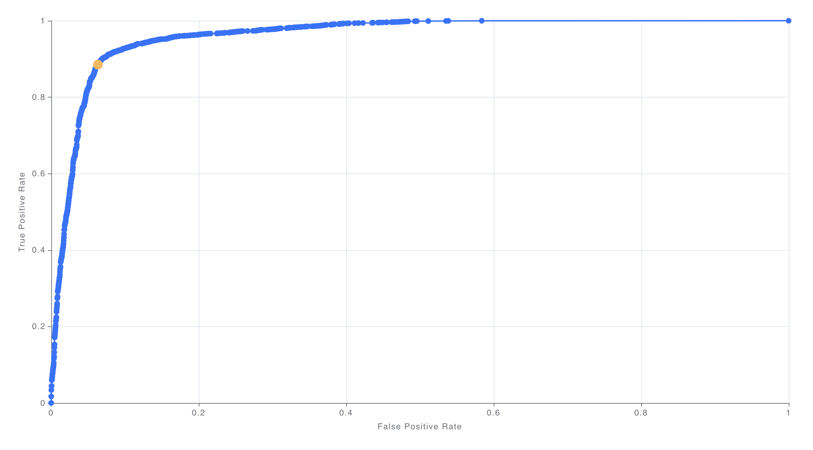
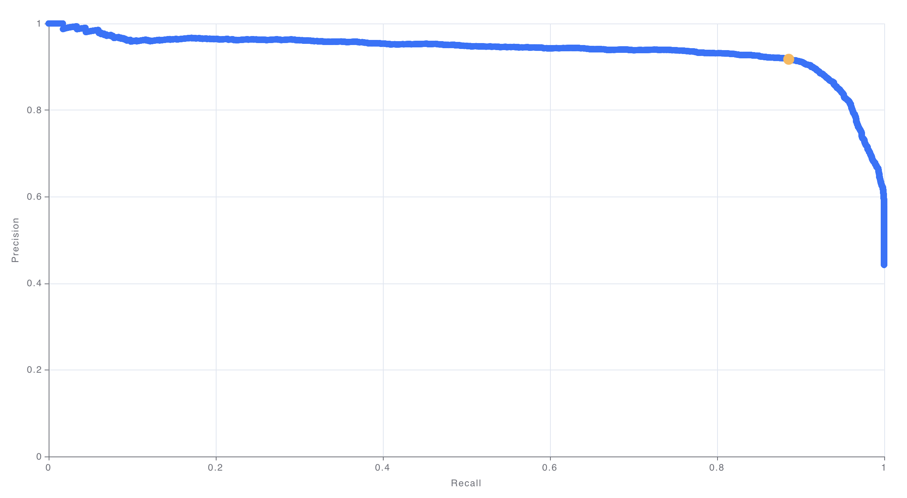
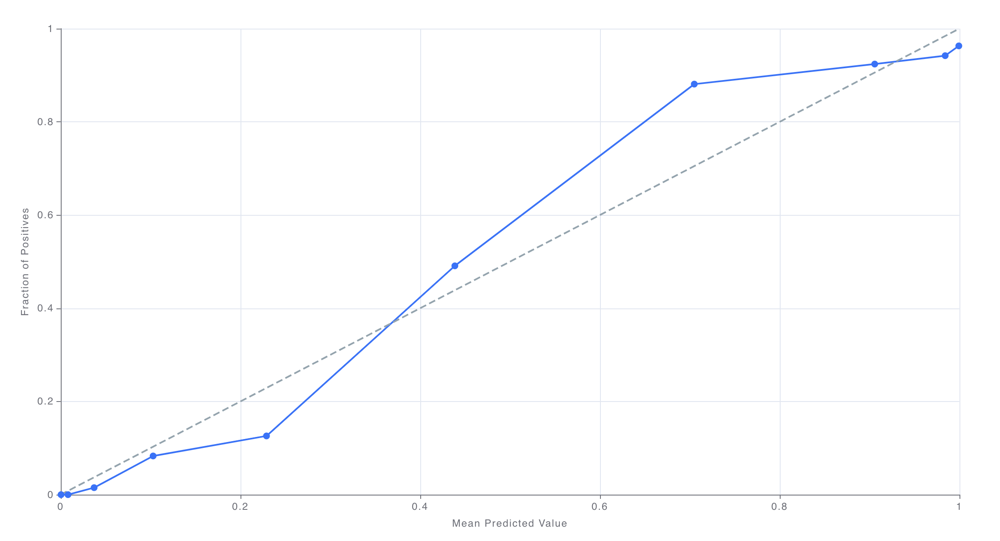
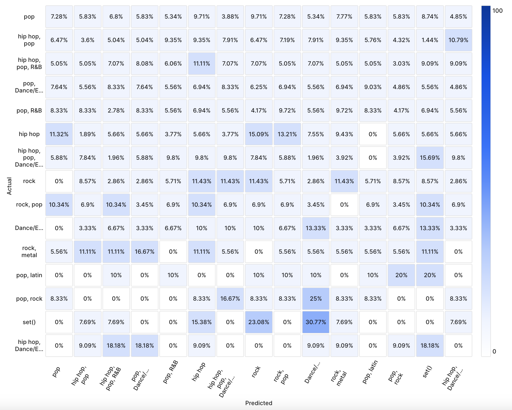
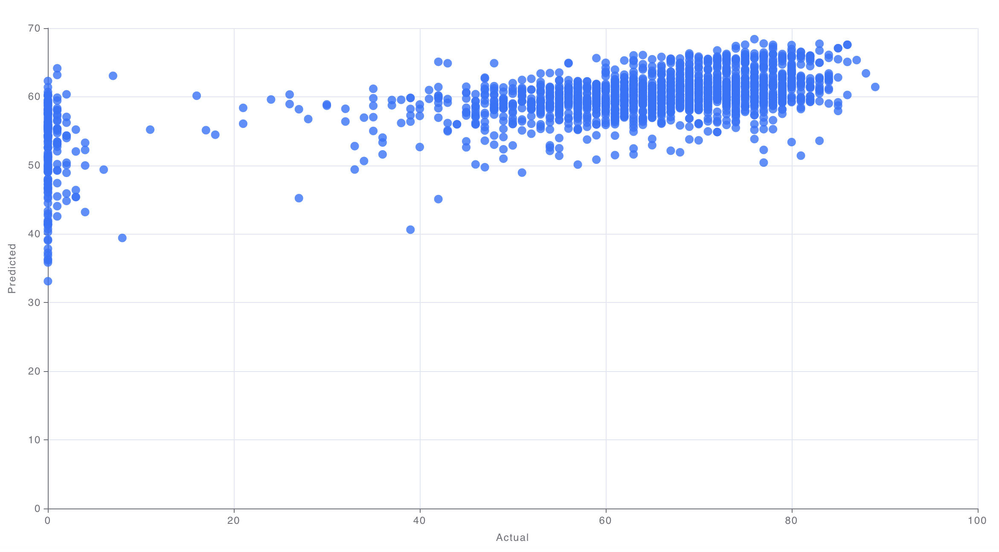
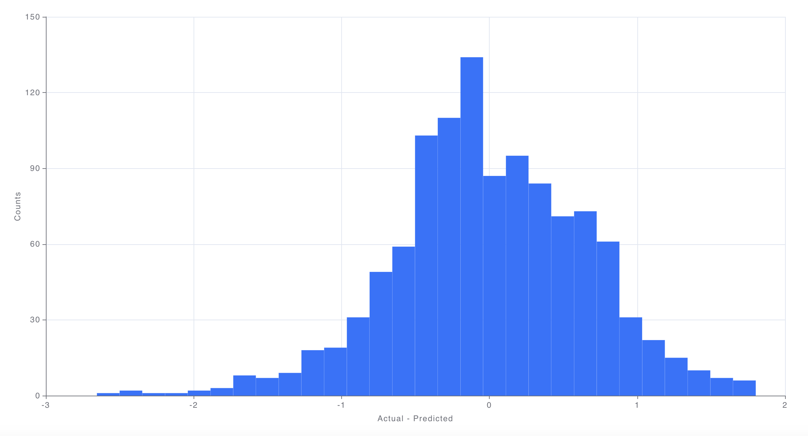

# Performance Charts Visualization

List of possible performance visualization depending on the model task. To see how to create a Performance chart, visit [this page](performance-charts-creation.md).

## Binary Classification

#### Confusion Matrix

A 2x2 table that shows how many predicted and actual values exist for positive and negative classes. Also referred as an error matrix. The percentage is computed per row.

#### Receiver Operating Characteristic (ROC) Curve

A graph showing the performance of a classification model at different classification thresholds. Plots the true positive rate (TPR), also known as recall, against the false positive rate (FPR).

#### Precision-Recall Curve

A graph that plots the precision against the recall for different classification thresholds.

#### Calibration Plot

A graph that tell us how well the model is calibrated. The plot is obtained by dividing the predictions into 10 quantile buckets (0-10th percentile, 10-20th percentile, etc.). The average predicted probability is plotted against the true observed probability for that set of points.

## Multi-class Classification

#### Confusion Matrix

A table that shows how many predicted and actual values exist for different classes. Also referred as an error matrix. The percentage is computed per row (using all classes). In the full view, up to 15 classes can be displayed. In the chart creation mode, up to 12 classes can be displayed. The displayed labels can be controlled in the chart.

## Regression

#### Prediction Scatterplot

Plots the predicted values against the actual values. The more closely the plot hugs the `y=x line`, the better the fit of the model.

#### Error Distribution

A histogram showing the distribution of errors (differences between model predictions and actuals). The closer to 0 the errors are, the better the fit of the model.



