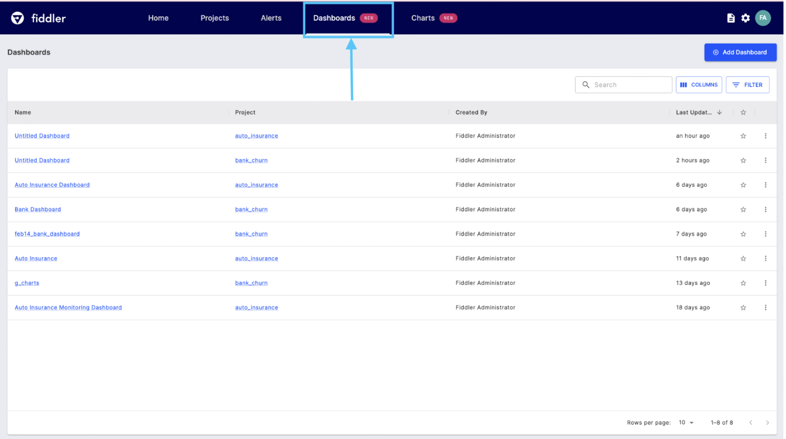
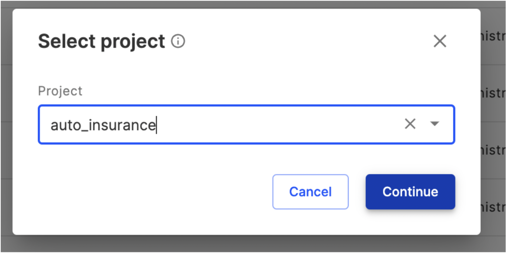
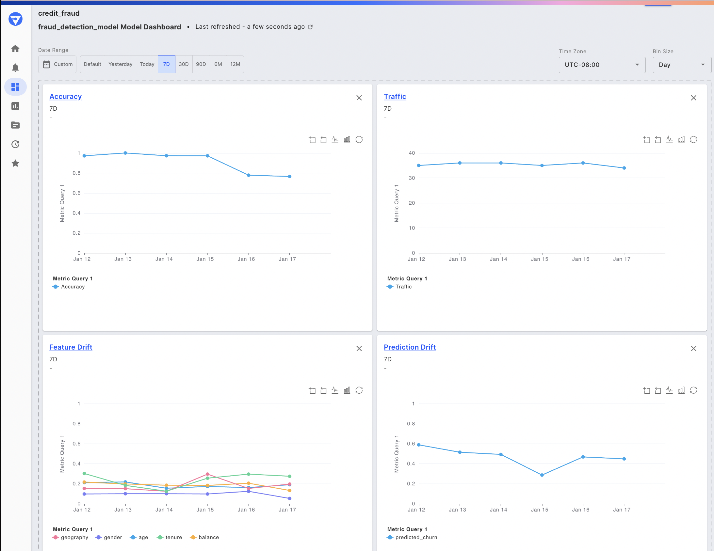
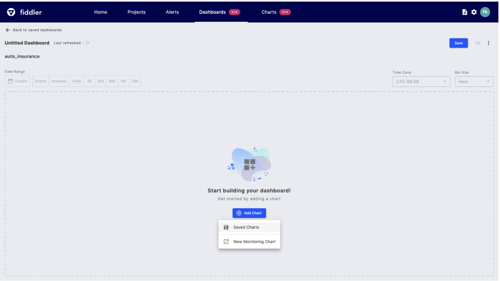
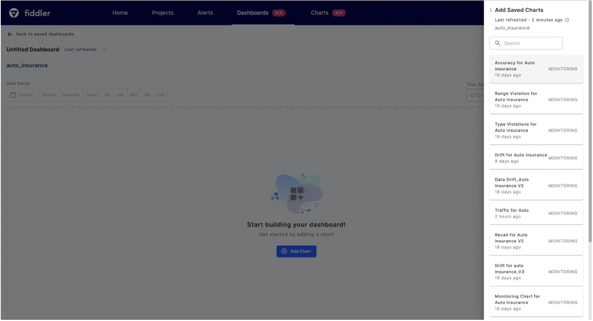
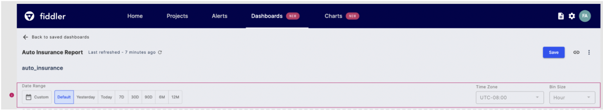
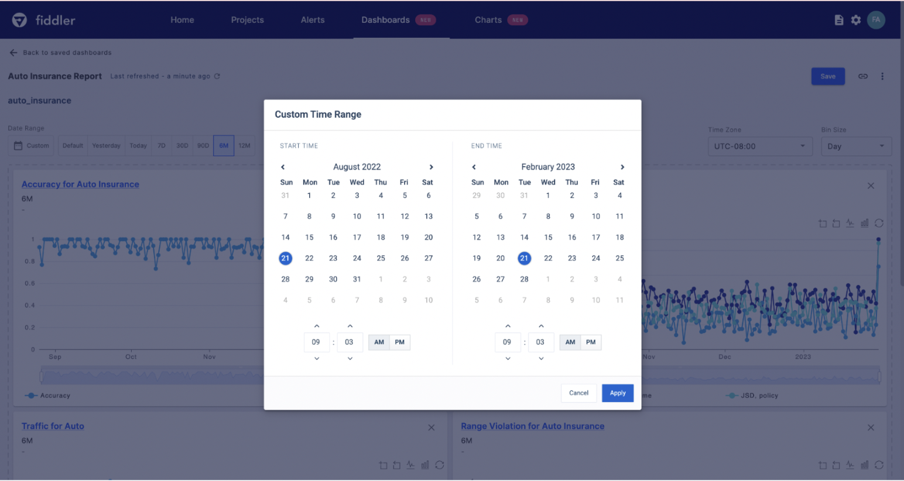
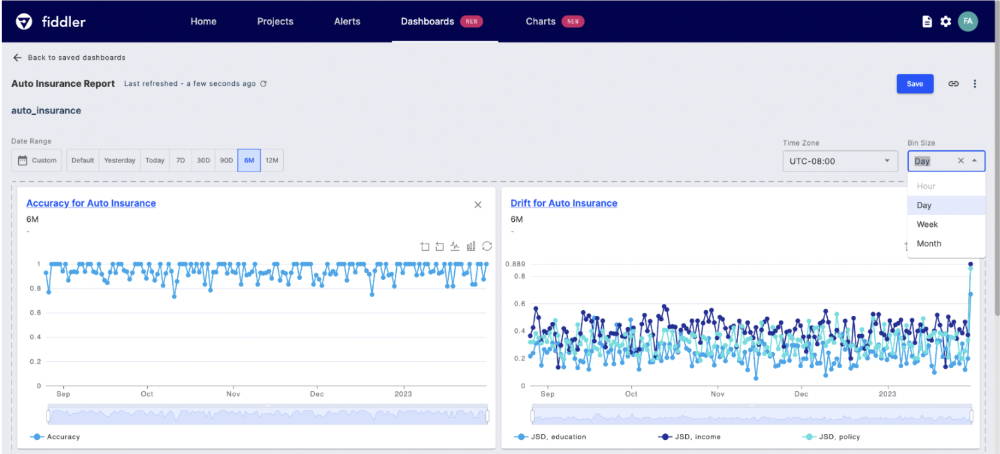
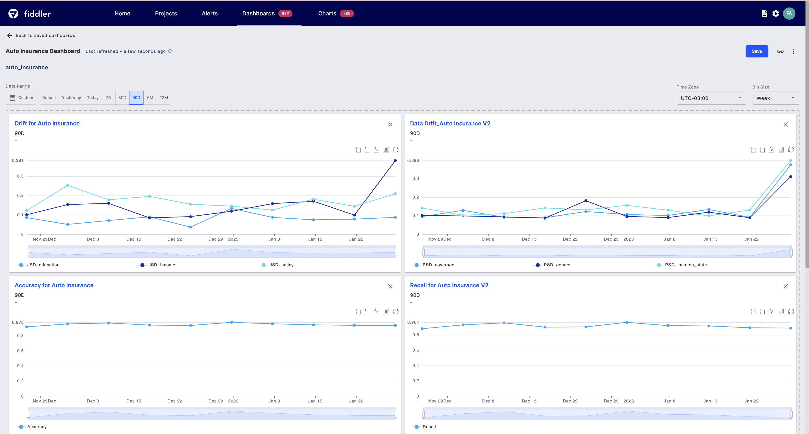

# Dashboards

### Creating Dashboards

To begin using our dashboard feature, navigate to the dashboard page by clicking on "Dashboards" from the top-level navigation bar. On the Dashboards page, you can choose to either select from previously created dashboards or create a new one. This simple process allows you to quickly access your dashboards and begin monitoring your models' performance, data drift, data integrity, and traffic.

When creating a new dashboard, it's important to note that each dashboard is tied to a specific project space. This means that only models and charts associated with that project can be added to the dashboard. To ensure you're working within the correct project space, select the desired project space before entering the dashboard editor page, then click "Continue." This will ensure that you can add relevant charts and models to your dashboard.

#### Auto Generated Dashboards

Fiddler will automatically generated model monitoring dashboards for all models registered to the platform. Depending on the task type, these dashboards will include charts spanning from Performance, Traffic, Drift, and Data Integrity metrics.

Auto-generated model monitoring dashboard

Auto-generated dashboard are automatically set as the default dashboards for each model, and can be accessed via the Insights button on the Homepage or Model Schema pages, or alternatively all dashboards are always accessible in the Dashboards list page. Default dashboards and their charts can easily be modified to display the desired set of [monitoring](../../product-guide/monitoring-platform/monitoring-charts-platform.md) and [embedding](../monitoring-ui/embedding-visualization-chart-creation.md) visualizations to meet any use case.

Accessing the default dashboard from the model schema page via Insights

### Add Monitoring Chart

Once you’ve created a dashboard, you can add previously saved monitoring charts that display these metrics over time, making it easy to track changes and identify patterns.

To create a new monitoring chart for your dashboard, simply select "New Monitoring Chart" from the "Add" dropdown menu. For more information on creating and customizing monitoring charts, check out our [Monitoring Charts UI Guide](../monitoring-ui/monitoring-charts-ui.md).

If you'd like to add an existing chart to your dashboard, select "Saved Charts" to display a full list of monitoring charts that are available in your project space. This makes it easy to quickly access and add the charts you need to your dashboard for monitoring and reporting purposes.

To further customize your dashboard, you can select the saved monitoring charts of interest by clicking on their respective cards. For instance, you might choose to add charts for Accuracy, Drift, Traffic, and Range Violation to your dashboard for a more comprehensive model overview. By adding these charts to your dashboard, you can quickly access important metrics and visualize your model's performance over time, enabling you to identify trends and patterns that might require further investigation.

### Dashboard Filters

There are three main filters that can be applied to all the charts within dashboards, these include date range, time zone, and bin size.

#### Date Range

When the `Default` time range is selected, the data range, time zone, and bin size that each monitoring chart was originally saved with will be applied. This enables you to create a dashboard where each chart shows a unique filter set to highlight what matters to each team. Updating the date range will unlock the time zone and bin size filters. You can select from a number of predefined ranges or choose `Custom` to select a start and end date-time.

#### Bin Size

Bin size controls the frequency at which data is displayed on your monitoring charts. You can select from the following bin sizes: `Hour`, `Day`, `Week`, or `Month`.

> 📘 Note: Hour bin sizes are not supported for time ranges above 90 days.
>
> For example, if we select the `6M` data range, we see that the `Hourly` bin selection is disabled. This is disabled to avoid long computation and dashboard loading times.

#### Saved Model Updates

If you recently created or updated a saved chart and are not seeing the changes either on the dashboard itself or the Saved Charts list, click the refresh button on the main dashboard studio or within the saved charts list to reflect updates.

### Model Comparison

With our dashboard feature, you can also compare multiple models side-by-side, making it easy to see which models are performing the best and which may require additional attention. To create model-to-model comparison dashboards, ensure the models you wish to compare belong to the same project. Create the desired charts for each model and then add them to a single dashboard. By creating a single dashboard that tracks the health of all of your models, you can save time and simplify your AI monitoring efforts. With these dashboards, you can easily share insights with your team, management, or stakeholders, and ensure that everyone is up-to-date on your AI performance.

#### Check [Dashboard Utilities ](dashboard-utilities.md)and [Dashboard Interactions](dashboard-interactions.md) pages for more info on dashboard usage.



