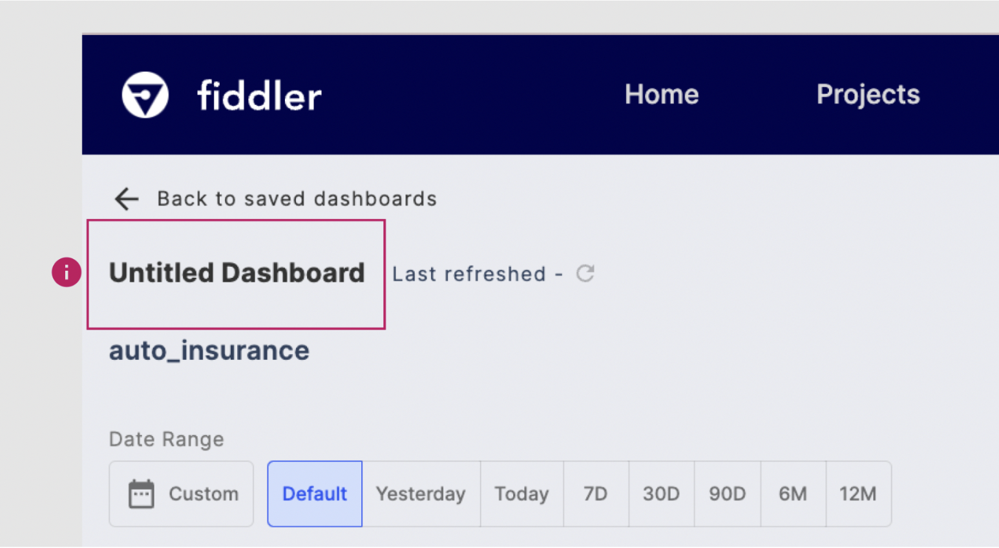
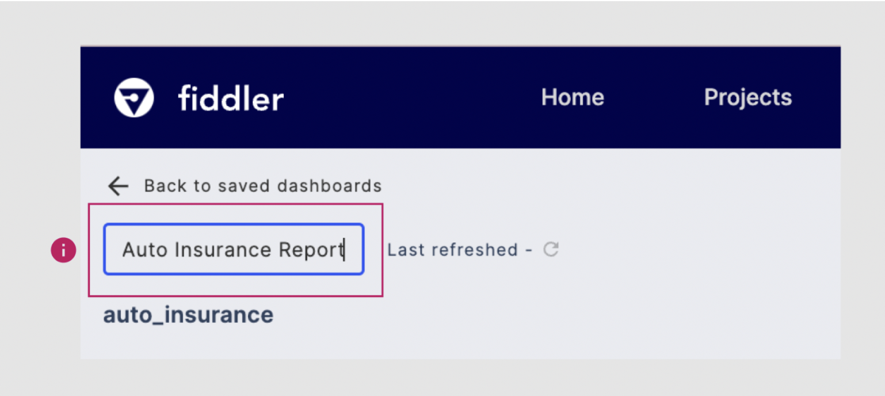
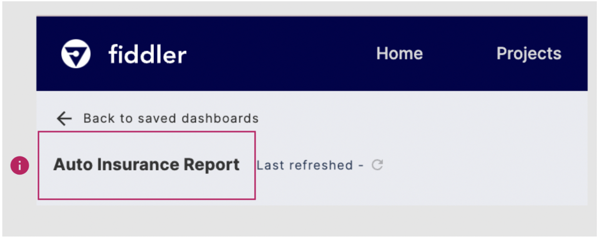
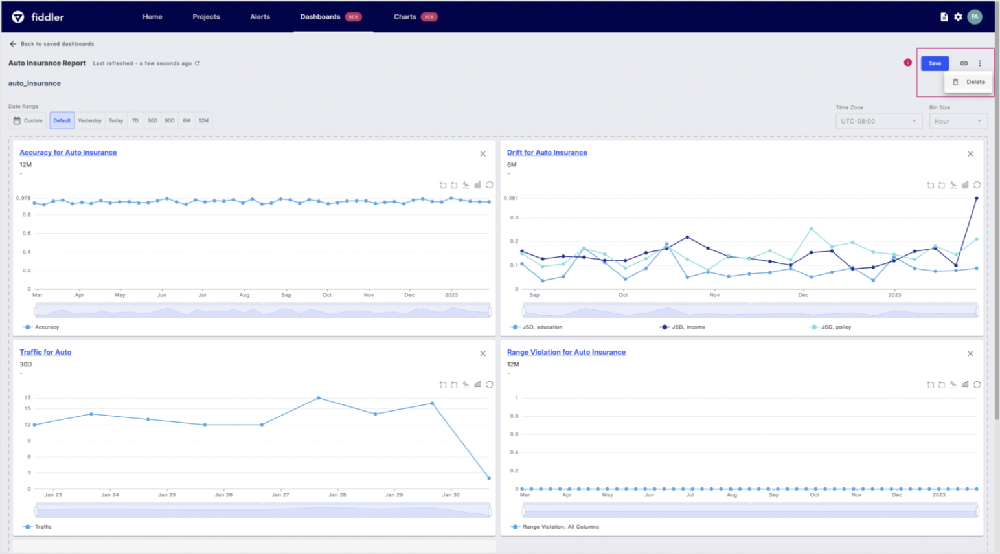
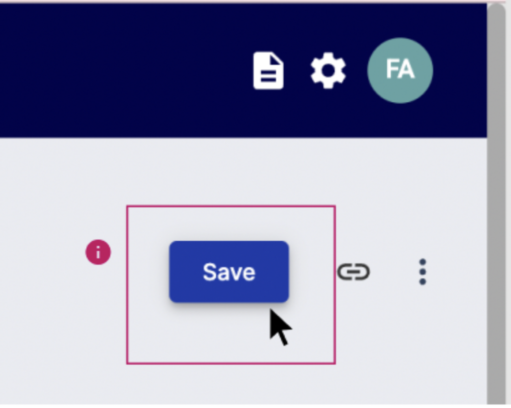
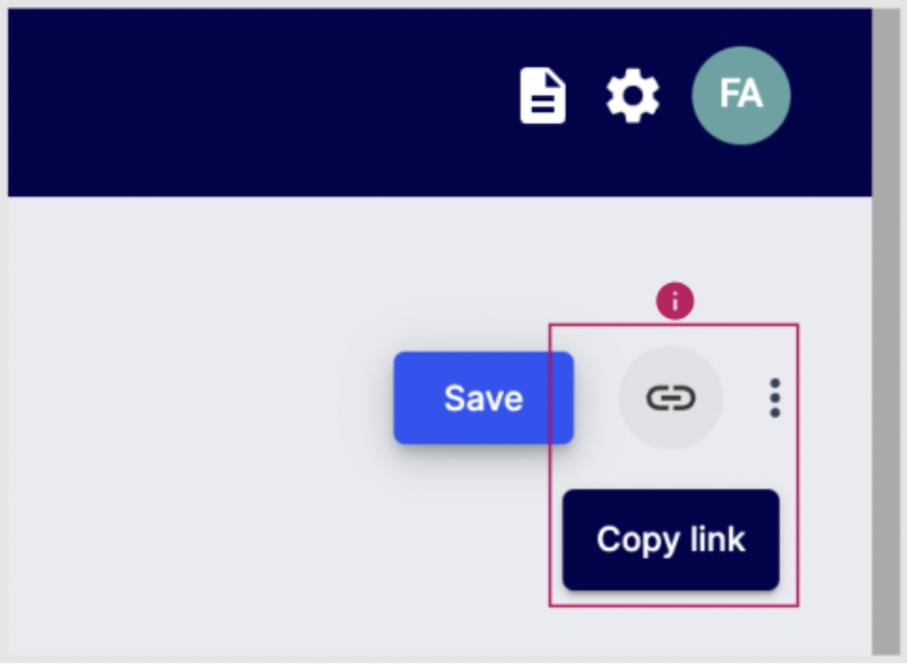
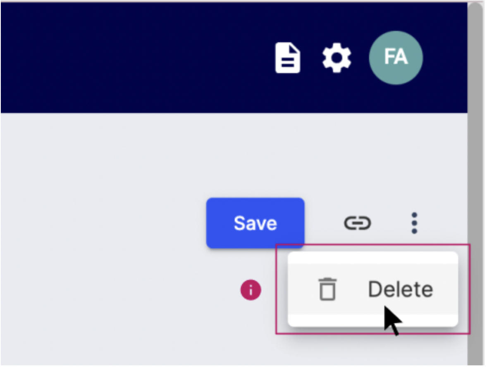

# Dashboard Utilities

## Dashboard Name

To rename your dashboard, simply click on the "Untitled Dashboard" title on the top-left corner of the dashboard studio. This will allow you to give your dashboard a more descriptive name that reflects its purpose and contents, making it easier to find and manage among your other dashboards.

Once you've clicked on the "Untitled Dashboard" title to rename your dashboard, simply type in the desired name and hit "Enter" on your keyboard to save the new name.

 

If you change your mind and want to discard the changes, simply click anywhere on the page outside of the name box. This will cancel the renaming process and leave the dashboard name as it was before.

## Save, Copy Link, and Delete

You can easily manage your dashboard by using the control panel located on the top left of the dashboard studio. This panel allows you to save your dashboard, copy a link to it, or delete it entirely. By using these controls, you can easily share your dashboard with others or remove it from your collection if it is no longer needed.

### Save

It's important to note that dashboards are not automatically saved, so you'll need to manually save your dashboard in order to lock in the current charts and filters. Once you've made the desired changes to your dashboard, simply click the "Save" button to save your progress. This will also enable you to share or delete your dashboard as needed. By saving your dashboard frequently, you can ensure that you never lose important information or data visualizations.

### Copy Link

If you want to share your dashboard with other users on Fiddler, the first step is to ensure that they have access to the project that the dashboard belongs to. Once you've confirmed that they have access, you can easily share the dashboard by copying the dashboard link and sending it to them. This makes it simple to collaborate and share insights with others who are working on the same project or who have an interest in your findings. Note that you can't share a dashboard link until you've saved the dashboard.

### Delete

To delete a dashboard, click the overflow button next to the copy link icon. NOTE: Once a dashboard has been deleted it cannot be recovered.



