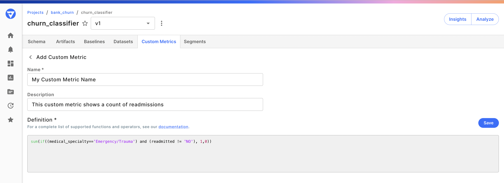
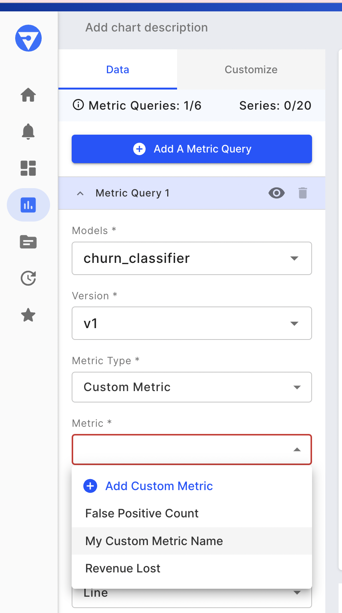
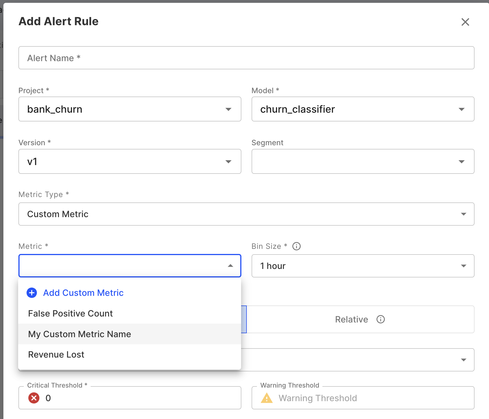
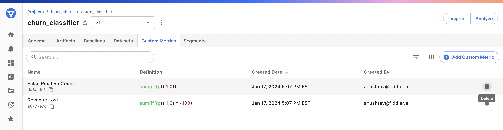

# Custom Metrics

### Overview

Custom metrics offer the flexibility to define metrics that align precisely with your machine learning requirements. Whether it's tracking business KPIs, crafting specialized performance assessments, or computing weighted averages, custom metrics empower you to tailor measurements to your specific needs. Seamlessly integrate these custom metrics throughout the Fiddler platform, leveraging them in dashboards, alerting, and performance tracking.

Craft novel metrics by harnessing a blend of your model's existing dimensions and functions, employing a familiar query language called [Fiddler Query Language (FQL)](../../product-guide/monitoring-platform/fiddler-query-language.md) . This capability enables you to amalgamate features, metadata, predictions, and actual outcomes using a rich array of aggregations, operators, and metric functions, thereby expanding the depth of your analytical insights.

### Adding a Custom Metric

**Note:** To add a Custom Metric using the Python client, see [fdl.CustomMetric](../../Python\_Client\_3-x/api-methods-30.md#create-2)

From the model schema page, you can access the model's custom metrics by clicking the **Custom Metrics** tab at the top of the page. Then click **Add Custom Metric** to add a new Custom Metric. Finally, enter the name, description, and FQL definition for your custom metric and click **Save**.

### Accessing Custom Metrics in Charts and Alerts

After your custom metric is saved, it can be used in your chart and alert definitions.

#### Charts

Set `Metric Type` to `Custom Metric` and select your desired custom metric.

\\

#### Alerts

When creating a new alert rule, set `Metric Type` to `Custom Metric`, and under the `Metric` field select your desired custom metric or author a new metric to use.

\\

### Modifying Custom Metrics

Since alerts can be set on Custom Metrics, making modifications to a metric may introduce inconsistencies in alerts.

> 🚧 Therefore, custom metrics cannot be modified once they are created.

If you'd like to try out a new metric, you can create a new one with a different name and definition.

### Deleting Custom Metrics

To delete a custom metric using the Python client, see [custom\_metric.delete()](../../Python\_Client\_3-x/api-methods-30.md#delete-2). Alternatively, from the custom metrics tab, you can delete a metric by clicking the trash icon next to the metric record.



