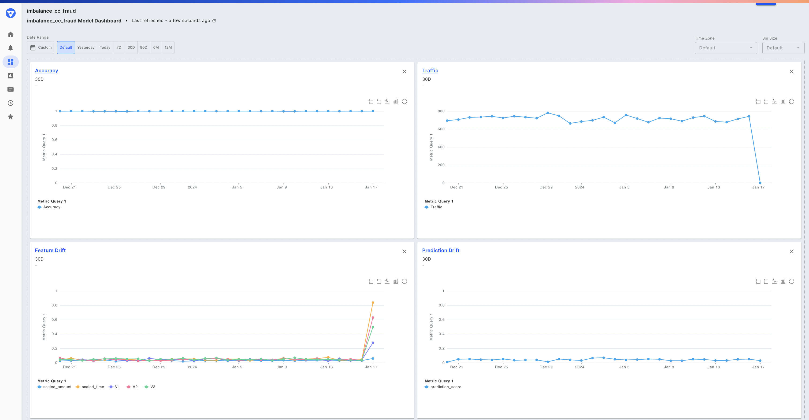
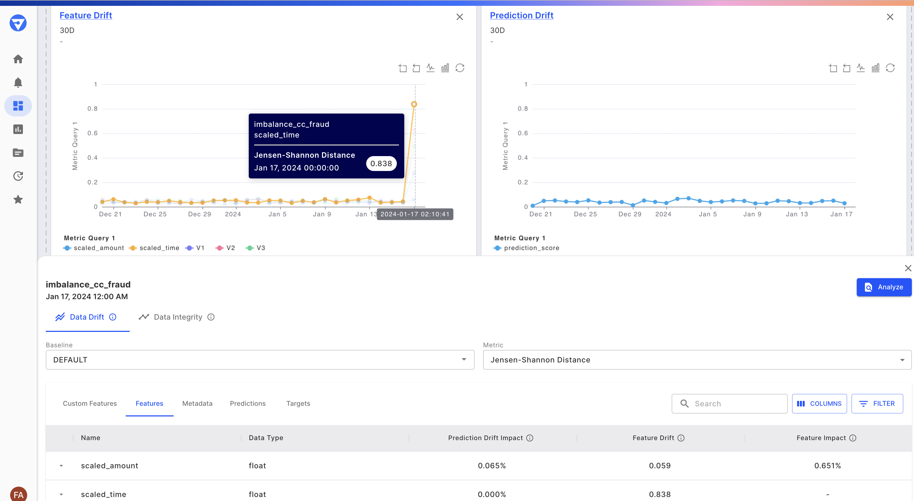
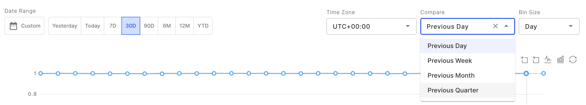
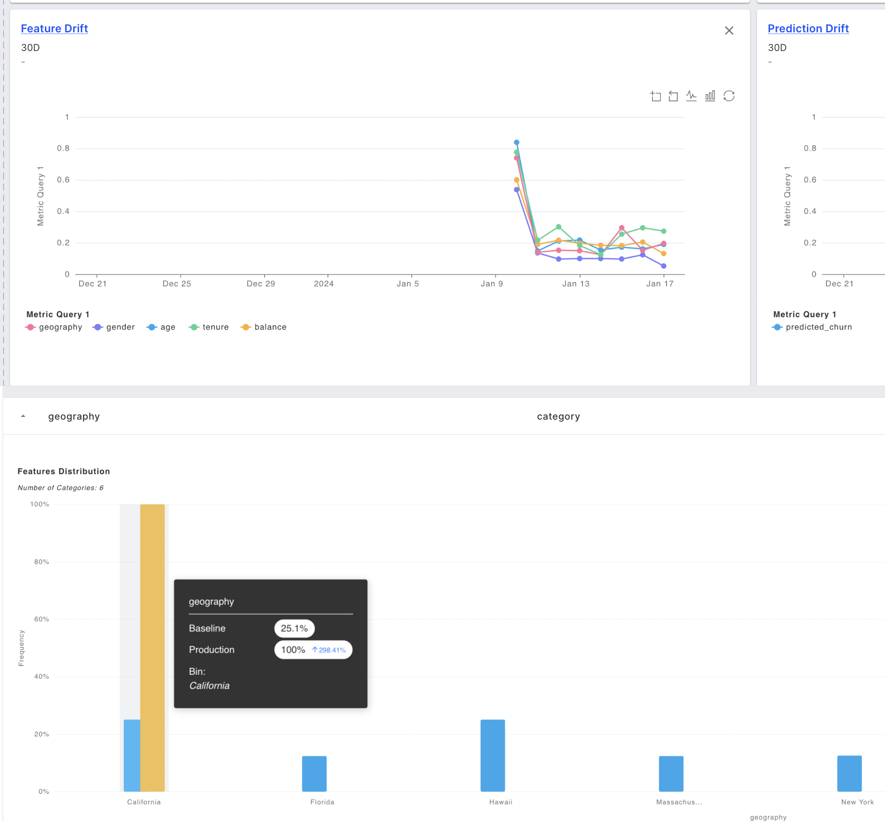

# Data Drift

Model performance can be poor if models trained on a specific dataset encounter different data in production. This is called data drift. In the **Insights** tab for your model, Fiddler gives you a diverse set visuals to explore different metrics.

Leverage the data drift chart to identify what data is drifting, when it’s drifting, and how it’s drifting. This is the first step in identifying possible model performance issues.

You can change the time range using the controls in the upper-left in both charts and dashboards:

### What is being tracked?

* _**Drift Metrics**_
  * **Jensen–Shannon distance (JSD)**
    * A distance metric calculated between the distribution of a field in the baseline dataset and that same distribution for the time period of interest.
    * For more information on JSD, click [here](https://docs.scipy.org/doc/scipy/reference/generated/scipy.spatial.distance.jensenshannon.html).
  * **Population Stability Index (PSI)**
    * A drift metric based on the multinomial classification of a variable into bins or categories. The differences in each bin between the baseline and the time period of interest are then utilized to calculate it as follows:

Here, `B` is the total number of bins, `ActualProp(b)` is the proportion of counts within bin `b` from the target distribution, and `ExpectedProp(b)` is the proportion of counts within bin `b` from the reference distribution. Thus, PSI is a number that ranges from zero to infinity and has a value of zero when the two distributions exactly match.

> 🚧 Note
>
> Since there is a possibility that a particular bin may be empty, PSI can shoot to infinity. To avoid this, PSI calculation in Fiddler is done such that each bin count is incremented with a base\_count=1. Thus, there might be a slight difference in the PSI values obtained from manual calculations.

* _**Average Values**_ – The mean of a field (feature or prediction) over time. This can be thought of as an intuitive drift score.
* _**Drift Analytics**_ – You can drill down into the features responsible for the prediction drift using the table at the bottom.
  * _**Feature Impact**_: The contribution of a feature to the model’s predictions, averaged over the baseline dataset. The contribution is calculated using random ablation feature impact.
  * _**Feature Drift**_: Drift of the feature, calculated using the drift metric of choice.
  * _**Prediction Drift Impact**_: A heuristic calculated using the product of the feature impact and the feature drift. The higher the score, the more this feature is likely to have contributed to the prediction drift.

In the Drift Root Cause Analysis table, you can select a feature to see the feature distribution for both the time period under consideration and the baseline dataset.

### Why is it being tracked?

* Data drift is a great proxy metric for **performance decline**, especially if there is delay in getting labels for production events. (e.g. In a credit lending use case, an actual default may happen after months or years.)
* Monitoring data drift also helps you stay informed about **distributional shifts in the data for features of interest**, which could have business implications even if there is no decline in model performance.

### What do I do next with this information?

* High drift can occur as a result of _data integrity issues_ (bugs in the data pipeline), or as a result of _an actual change in the distribution of data_ due to external factors (e.g. a dip in income due to COVID). The former is more in our control to solve directly. The latter may not be solvable directly, but can serve as an indicator that further investigation (and possible retraining) may be needed.
* You can drill down deeper into the data by examining it in the Analyze tab.

The image below shows how to open the Analyze view for a specific feature and time range identified in the Data Drift page.

This will bring you to the Analyze tab, where you can then use SQL to slice and dice the data. You can then apply visualizations upon these slices to analyze the model’s behavior.



