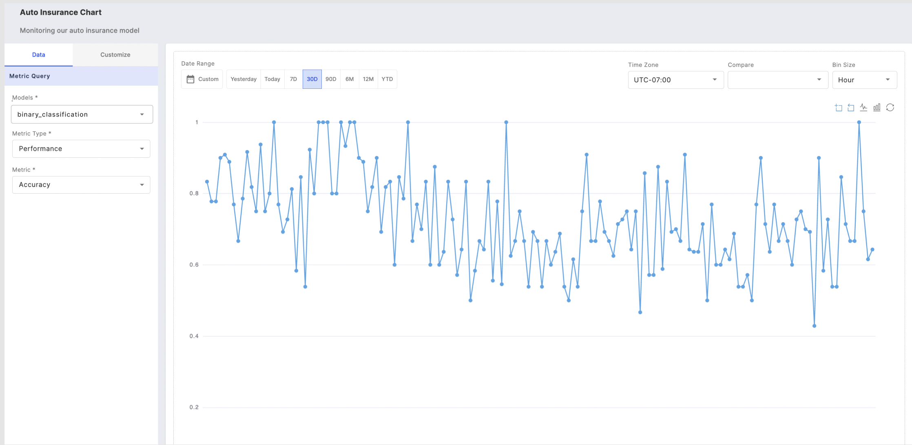
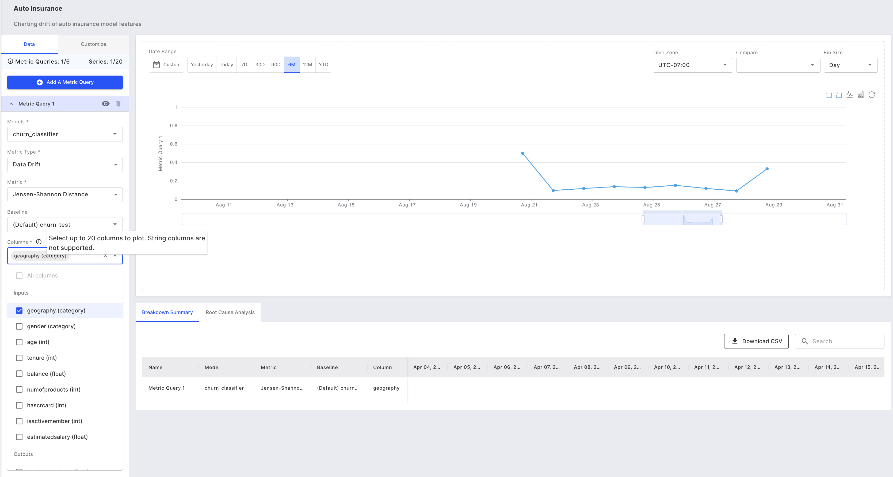
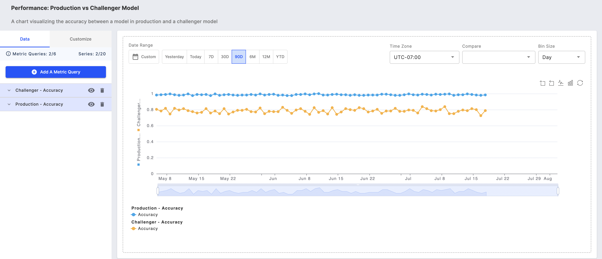
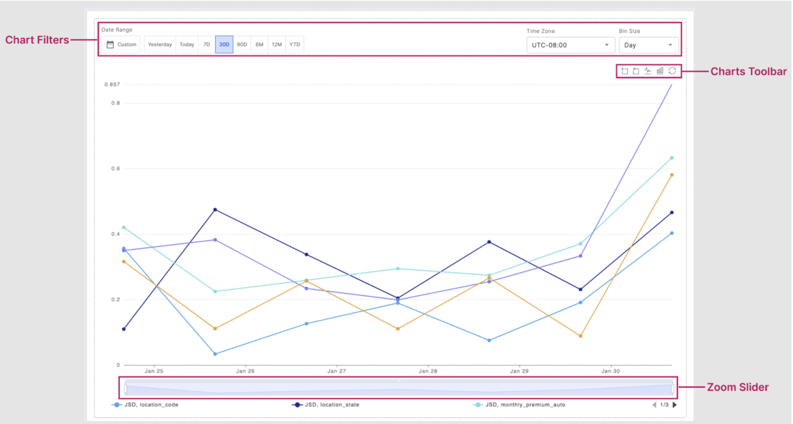
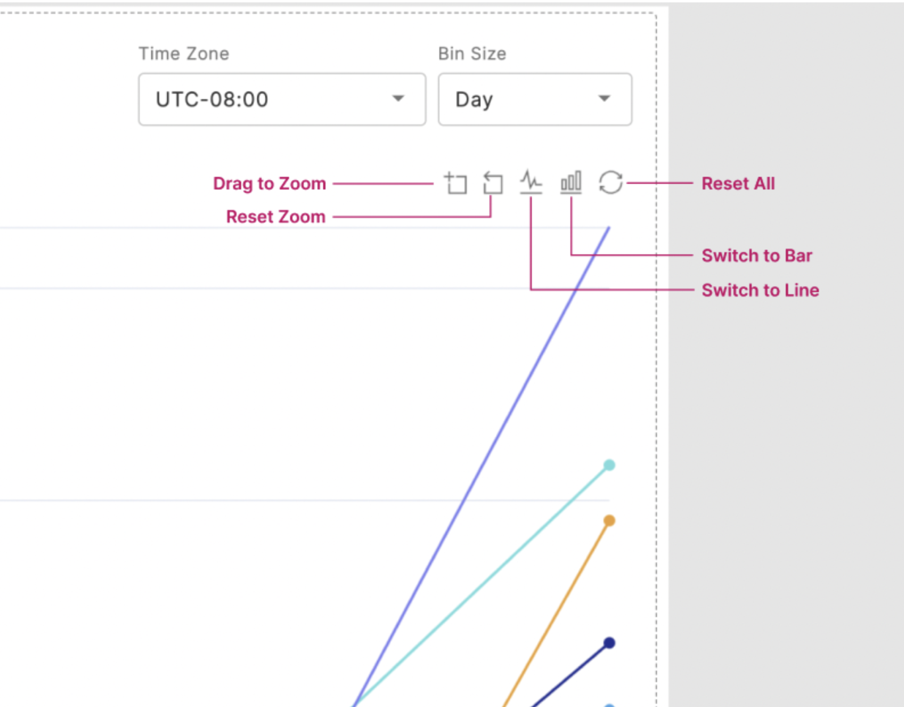
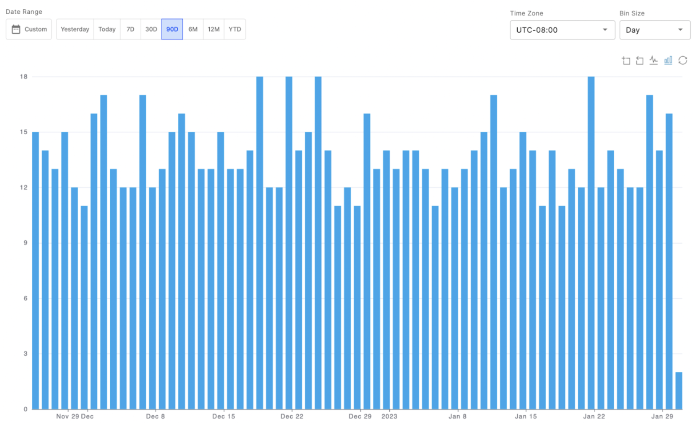
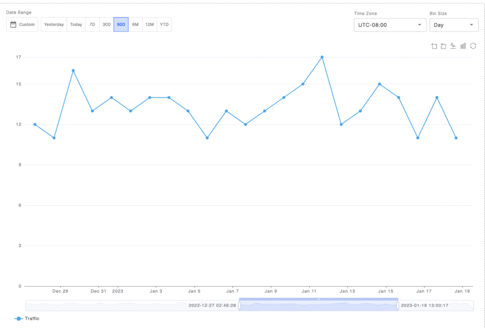
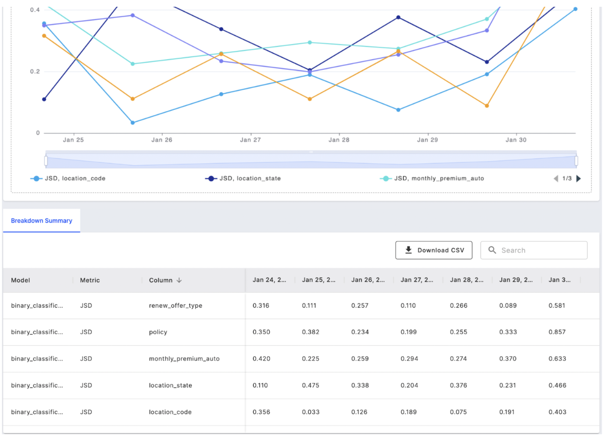
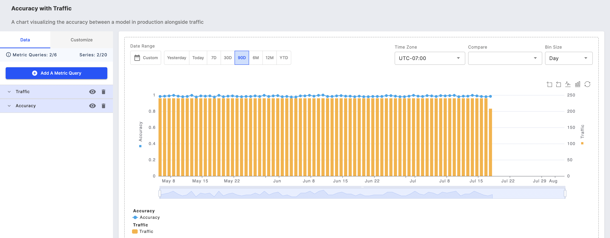

# Monitoring Charts UI

### Getting Started:

To use Fiddler AI’s monitoring charts, navigate to the Charts tab in the top-level navigation bar on the Fiddler AI platform. Choose between opening a previously saved chart or creating a new chart.

### Create a New Monitoring Chart

To create a new monitoring chart, click on the Add Chart button on the Charts page. Search for and select the [project](../../product-guide/product-concepts.md) to create the chart, and press Add Chart.

### Chart Functions

#### Save & Share

Manually save your chart using the Save button on the top right corner of the chart studio. Copy a link to your chart and share it with other [fiddler accounts who have access](../administration-ui/inviting-users.md) to the project where the chart resides.

#### Global Undo & Redo

Easily control the following actions with the undo and redo buttons:

* Metric query selection
* Time range selections
* Time range selections
* Bin size selections

To learn how to undo actions taken using the chart toolbar, see the Toolbar information in the next section.

### Chart Metric Queries & Filters

#### Metric Query

A metric query enables you to define what model to focus on, and which metrics and columns to plot on your monitoring chart. To get started with the metric query, choose a model of choice. Note: only models within the same project as your chart are accessible.

Once a model is selected, choose a metric type from Performance, Data Drift, Data Integrity, or Traffic metrics and relevant metrics. For example, we may choose to chart accuracy for our binary classification model.

#### Charting Multiple Columns

If you choose to chart data drift or data integrity, you can choose to plot up to 20 different columns from the following column categories; inputs, outputs, targets, decisions, metadata, and custom features.

#### Charting Multiple Metrics or Models

Add up to 6 metric queries that allow you to chart different metrics and/or models in a single chart view.

#### Chart Filters & Capabilities

There are three major chart filter capabilities, chart filters, chart toolbar, and zoom slider.\
They work together to enable you to best analyze the slices of data that may be worth investigating.

#### Filters

You can customize your chart view using time range, time zone, and bin size chart filters. The data range can be one of the pre-defined time ranges or a custom range. The bin size selected controls the frequency for which the data is displayed. So selecting Day will show daily data over the date range selected.

#### Toolbar

The charts toolbar is made up of 5 functions:

* Drag to zoom
* Reset zoom
* Toggle to a line chart
* Toggle to a bar chart
* Undo all toolbar actions

> 📘 Note: If the zoom reset or toolbar undo is selected, this will also undo any actions taken with the zoom slider.

**Line & Bar Chart Toggle**

You can switch between visualizing your chart as a line or bar chart using the toolbar icons. Click on the line chart icon on the top right of the chart to switch to the line chart view. Likewise, select the bar chart icon in the toolbar to switch to the bar chart view. However, note that these views are only temporary and any settings you specify using the toolbar will not be saved to the chart.

**Zoom Slider**

You can also use the horizontal zoom bar to zoom, located at the base of the chart. Once you've identified the time range you want to focus on, you can use the zoom bar to drag the range across time. For instance, if you want to analyze your data week-by-week over the past six months, you can use the toolbar or horizontal zoom bar to zoom in on the desired time range and then click and drag the selected range using the base horizontal zoom bar.

#### Breakdown Summary

You can easily visualize your charts' raw data as a table within the fiddler chart studio, or download the content as a CSV for further analysis. If you choose to chart multiple columns, as shown below, you can search for and sort by Model name, Metric name, Column name, or values for a specific date.

### Customize Tab

#### Scale & Range

The Customize tab enables users to adjust the scale and range of the y-axis on their monitoring charts. In the example below, we have adjusted the minimum value of the y-axis for the plotted traffic to make more use of the chart space. For values with large variance, logarithmic scale can be applied to more clearly analyze the chart.

#### Y-axis Assignment

Select the y-axis for your metric queries with enhanced flexibility to customize the scale and range for each axis.



