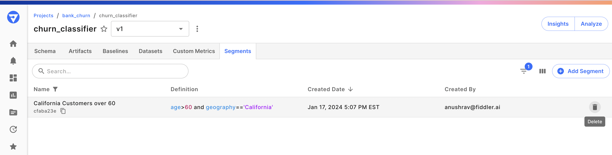

# Segments

### Overview

A segment, sometimes referred to as a cohort or slice, represents a distinct subset of model values crucial for performance analysis and troubleshooting. Model segments can be defined using various model dimensions, such as specific time periods or sets of features. Analyzing segments proves invaluable for understanding or troubleshooting specific cohorts of interest, particularly in tasks like bias detection, where overarching datasets might obscure statistical intricacies.

### Adding a Segment

**Note:** To add a Segment using the Python client, see [fdl.Segment.create()](../../Python\_Client\_3-x/api-methods-30.md#create-5)

From the model schema page within the UI, you can access Segments by clicking the **Segments** tab at the top of the page. Then click **Add Segment** to add a new Segment.

Finally, enter the Name, Description, and Definition for your Segment and click **Save**.

### Accessing Segments in Charts and Alerts

After your Segment is saved, it can be selected from Charts and Alerts.

#### Monitoring Charts

#### Alerts

### Modifying Segments

Since alerts can be set on Segments, making modifications to a Segment may introduce inconsistencies in alerts.

> 🚧 Therefore, **Segments cannot be modified once they are created**.

If you'd like to try out a new Segment, you can create a new one with a different Definition.

### Deleting Segments

To delete a segment using the Python client, see [segment.delete()](../../Python\_Client\_3-x/api-methods-30.md#delete-5). Alternatively, from the segments tab, you can delete a segment by clicking the trash icon next to the segment record.



