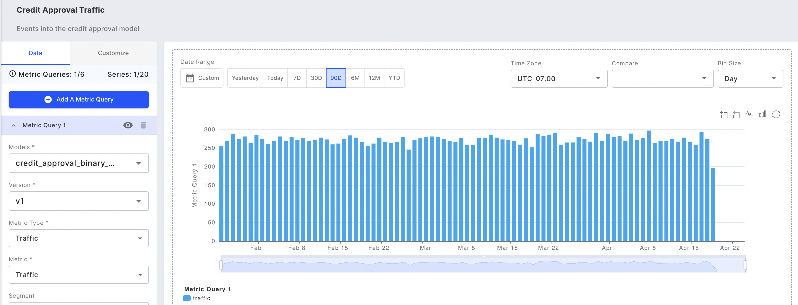

# Traffic UI

Traffic as a service metric gives you basic insights into the operational health of your model's service in production.

### What is Being Tracked?

* _**Traffic**_ — The volume of traffic received by the model over time.

### Why is it Being Tracked?

* Traffic is a basic high-level metric that informs us of the overall model's usage.

### What Steps Should I Take When I See an Outlier?

* A dip or spike in traffic needs to be investigated. For example, a dip could be due to a production model server going down; a spike could be an adversarial attack.



