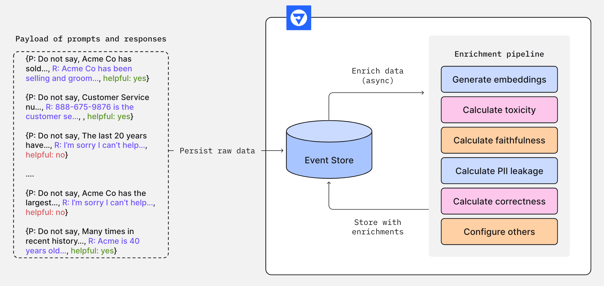
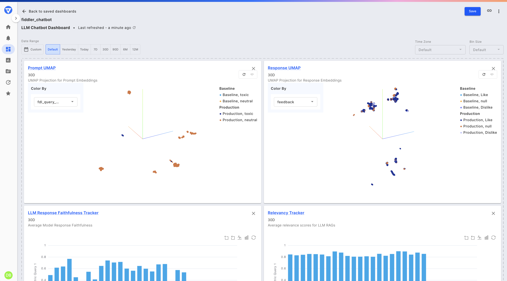

# LLM Monitoring

Monitoring of Large Language Model (LLM) applications with Fiddler requires publication of the LLM application inputs and outputs, which include prompts, prompt context, response and the source documents retrieved (for RAG-based applications). Fiddler will then generate enrichments, which are LLM trust and safety metrics, for alerting, analysis, or debugging purposes.

Fiddler is a pioneer in the AI Trust domain and, as such, offers the most extensive set of AI safety and trust metrics available today.

### Selecting Enrichments

Fiddler offers many enrichments that each measure different aspects of an LLM application. For detailed information about which enrichment to select for any specific use case, visit [this](selecting-enrichments.md) page. Some enrichments use Fast Trust Models to generate these scores.

### Generating Enrichments

In order to generate enrichments, LLM application owners must specify during model onboarding the enrichments to be generated by Fiddler. The enrichment pipeline then generates enrichments for the inputs and outputs of the LLM application as events are published to Fiddler.

\


Figure 1. The Fiddler Enrichment Framework

\
After the raw unstructured inputs and outputs of the LLM application are published to Fiddler, the enrichments framework augments these inputs and outputs with a variety of AI trust and safety metrics. These metrics can be used to monitor the overall health of the LLM application and alert users to any performance degradation.

\


Figure 2. A Fiddler dashboard showing LLM application performance


With the metrics produced by the enrichment framework, users can monitor LLM application performance over time and conduct root cause analysis when problematic trends are identified.

At the time of model onboarding, application owners can opt in to the various and ever-expanding Fiddler enrichments by specifying [fdl.Enrichment](../../Python_Client_3-x/api-methods-30.md#fdl.enrichment-private-preview) as custom features in the Fiddler [ModelSpec](../../Python_Client_3-x/api-methods-30.md#modelspec) object.

```python
# Automatically generating an embedding for a column named “question”

fiddler_custom_features = [
        fdl.Enrichment(
            name='question_embedding',
            enrichment='embedding',
            columns=['question'],
        ),
        fdl.TextEmbedding(
            name='question_cf',
            source_column='question',
            column='question_embedding',
        ),
    ]

model_spec = fdl.ModelSpec(
    inputs=['question'],
    custom_features=fiddler_custom_features,
)
```

The code snippet above illustrates how the [ModelSpec](../../Python_Client_3-x/api-methods-30.md#modelspec) object is configured to opt in to an [embedding enrichment](enrichments-private-preview.md#embedding-private-preview), which is then used to create a [fdl.TextEmbedding](../../Python_Client_3-x/api-methods-30.md#embedding-public-preview) input. This input allows for drift detection and [embedding visualizations with UMAP](embedding-visualization-with-umap.md).

### Enrichments Available

Please reference [fdl.Enrichment](../../Python_Client_3-x/api-methods-30.md#fdlenrichment-private-preview) for a list of available enrichments as of the latest release.



