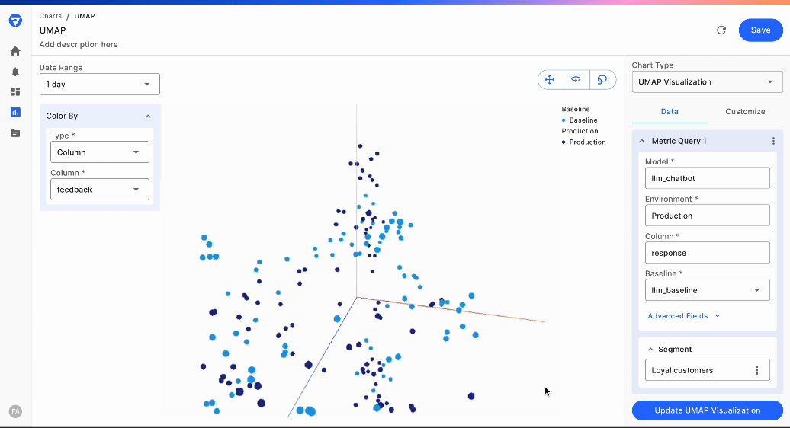

# Embedding Visualizations for LLM Monitoring

\

### Introduction to embedding visualization

Embedding visualization is a powerful technique used to understand and interpret complex relationships in high-dimensional data. Reducing the dimensionality of custom features into a 2D or 3D space makes it easier to identify patterns, clusters, and outliers.

In Fiddler, high-dimensional data like embeddings and vectors are ingested as a [Custom feature](../../Python\_Client\_3-x/api-methods-30.md#customfeaturetype).

Our goal in this document is to show you how you can visualize and interact with these custom features in 3D to do analysis and expose patterns.

### UMAP Technique for embedding visualization

We utilize the [UMAP](https://umap-learn.readthedocs.io/en/latest/) (Uniform Manifold Approximation and Projection) technique for embedding visualizations. UMAP is a dimensionality reduction technique that is particularly good at preserving the local structure of the data, making it ideal for visualizing embeddings. We reduce the high-dimensional embeddings to a 3D space.

UMAP is supported for both Text and Image embeddings in a [Custom feature](../../Python\_Client\_3-x/api-methods-30.md#customfeaturetype) and you can follow this [guide](../../UI\_Guide/monitoring-ui/embedding-visualization-chart-creation.md) on how to apply a UMAP visualization to your application data.

### UMAP understanding for Generative AI applications

UMAP embedding visualizations are extremely helpful in understanding common themes and topics present in the data corpus for generative AI applications. When evaluating prompts and responses, it is paramount to see which concept clusters are emerging and which clusters are exhibiting the most problems. By further coloring these clusters with a variety of LLM and GenAI correctness and safety metrics, users can identify the clusters with the most issues.

<figure><figcaption>
Identifying a cluster of prompts with Jailbreak attempts via UMAP
</figcaption></figure>

> 📘 To create an embedding visualization chart, follow the UI Guide [here](../../UI\_Guide/monitoring-ui/embedding-visualization-chart-creation.md).



