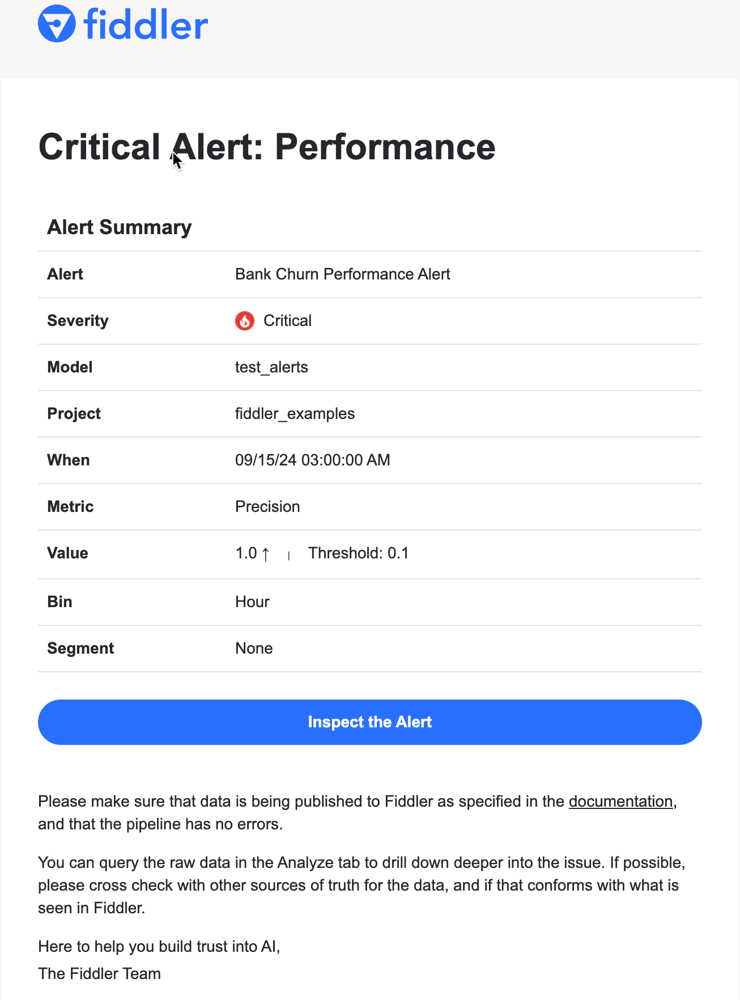

# Alerts

### Overview

Fiddler enables users to set up alert rules to track a model's health and performance over time. Fiddler alerts also enable users to dig into triggered alerts and perform root cause analysis to discover what is causing a model to degrade. Users can set up alerts using both the [Fiddler UI](../../UI\_Guide/monitoring-ui/alerts-with-fiddler-ui.md) and the [Fiddler API Client](../../Client\_Guide/alerts-with-fiddler-client.md).

### Supported Metric Types

You can get alerts for the following metrics:

* [**Traffic**](../../UI\_Guide/monitoring-ui/traffic-ui.md)
  * The volume of traffic received by the model over time informs us of the overall system's health.
* [**Statistics**](statistics.md)
  * Metrics which can be used to monitor basic aggregations over columns.
* [**Data Drift**](../../UI\_Guide/monitoring-ui/data-drift.md) — Predictions and all features
  * Model performance can be poor if models trained on a specific dataset encounter different data in production.
* [**Data Integrity**](../../UI\_Guide/monitoring-ui/data-integrity.md) — All features
  * Three types of violations can occur at model inference: missing feature values, type mismatches (e.g. sending a float input for a categorical feature type) or range mismatches (e.g. sending an unknown US State for a State categorical feature).
* [**Performance**](../../UI\_Guide/monitoring-ui/performance.md)
  * The model performance tells us how well a model performs on its task. A poorly performing model can have significant business implications.

### Alert Configurations

#### Comparison Types

There are two options for alert threshold comparison:

* **Absolute** — Compare the metric to an absolute value
  * Example: if traffic for a given hour is less than a threshold of 1,000, trigger alert.
* **Relative** — Compare the metric to a previous period
  * Example: if traffic is down 10% or more than it was at the same time one week ago, trigger alert.

#### Alert Rule Priority & Severity

* **Priority**: Whether you're setting up an alert rule to keep tabs on a model in a test environment or for production scenarios, Fiddler has you covered. Easily set the Alert Rule Priority to indicate the importance of any given Alert Rule. Users can select from Low, Medium, and High priorities.
* **Severity**: Up to two threshold values can be specified for additional flexibility. A **Critical** severity threshold value is always required when setting up an Alert Rule, and a **Warning** threshold value is optional.

### Why do we need alerts?

* It’s not possible to manually track all metrics 24/7.
* Sensible alerts are your first line of defense, and they are meant to warn about issues in production.

### What should I do when I receive an alert?

* Click on the link _Inspect the Alert_ link in the email to go to the Alerts Context Chart.
* Under the chart is a summary of the observed alert metric and the Root Cause Analysis which provides detailed information about the selected data point in the chart above.
* You can also examine the data in the Analyze tab. You can use SQL to slice and dice the data, and use custom visualization tools and operators to make sense of the model’s behavior within the time range under consideration.

### Sample Alert Email

Here is an example of a triggered Performance alert:

### Integrations

Fiddler supports the following alert notification integrations:

* Email
* Slack
* PagerDuty
* Webhook



