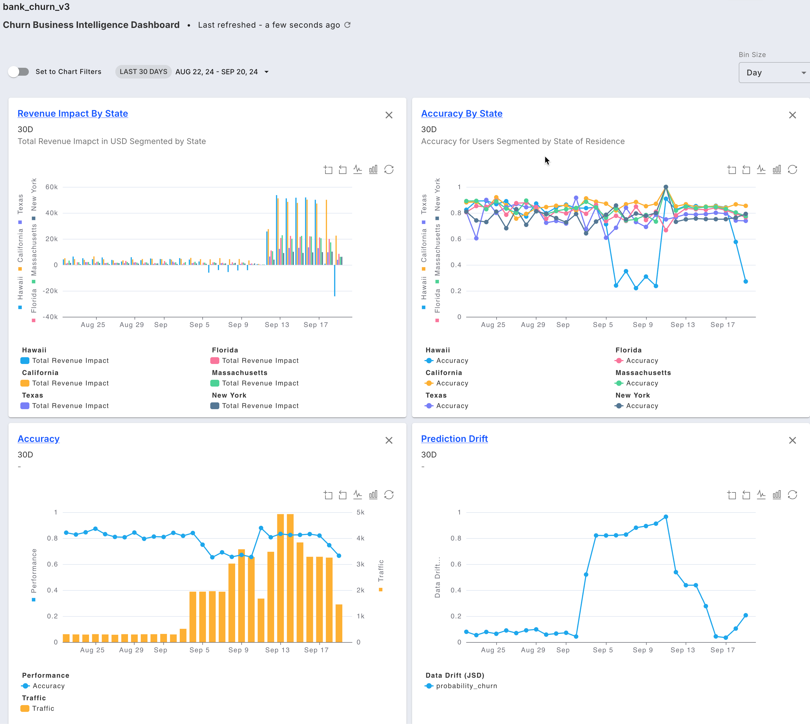

# Dashboards

### Overview

With Fiddler, you can create comprehensive dashboards that bring together all of your monitoring data in one place. This includes monitoring charts for data drift, traffic, data integrity, and performance metrics. Adding monitoring charts to your dashboards lets you create a detailed view of your model's performance. These dashboards can inform your team, management, or stakeholders, and help make data-driven decisions that improve your AI performance. View a list of the [**available metrics for monitoring charts here**](monitoring-charts-platform.md#supported-metric-types).

### Key Features

Dashboards offer a powerful way to analyze the overall health and performance of your models, as well as to compare multiple models.

#### Dashboard Filters

* [Flexible filters](../../UI\_Guide/dashboards-ui/#dashboard-filters) including date range, time zone, and bin size to customize your view

#### Chart Utilities

* [Leverage the chart toolbar ](../../UI\_Guide/dashboards-ui/dashboard-interactions.md#zoom)to zoom into data and toggle between line and bar chart types

#### Automatic & Default Dashboards

* Fiddler automatically creates a [monitoring dashboard](../../UI\_Guide/dashboards-ui/#auto-generated-dashboards) for all your models that can be accessed as Insights throughout the product.

#### [Dashboard Basics](../../UI\_Guide/dashboards-ui/dashboard-utilities.md)

* Perform model-to-model comparison
* Plot drift or data integrity for multiple columns in one view
* Easily save and share your dashboard

Checkout more on the [Dashboards UI Guide](../../UI\_Guide/dashboards-ui/).



