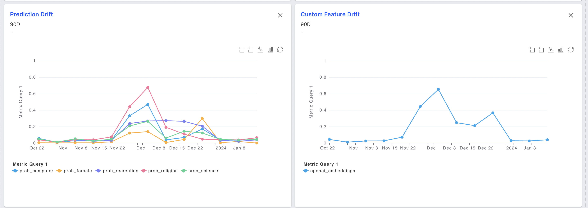

# Data Drift

### Overview

Model performance can be poor if models trained on a specific dataset encounter different data in production. This is called data drift.

Track data drift for inputs, outputs, and custom features

### What is being tracked?

Fiddler supports the following:

* _**Drift Metrics**_
  * **Jensen–Shannon distance (JSD)**
    * A distance metric calculated between the distribution of a field in the baseline dataset and that same distribution for the time period of interest.
    * For more information on JSD, click [here](https://docs.scipy.org/doc/scipy/reference/generated/scipy.spatial.distance.jensenshannon.html).
  * **Population Stability Index (PSI)**
    *   A drift metric based on the multinomial classification of a variable into bins or categories. The differences in each bin between the baseline and the time period of interest are then utilized to calculate it as follows:

        > 🚧 Note
        >
        > There is a possibility that PSI can shoot to infinity. To avoid this, PSI calculation in Fiddler is done such that each bin count is incremented with a base\_count=1. Thus, there might be a slight difference in the PSI values obtained from manual calculations.
* _**Average Values**_ – The mean of a field (feature or prediction) over time. This can be thought of as an intuitive drift score.
* _**Drift Analytics**_ – You can drill down into the features responsible for the prediction drift using the table at the bottom.
  * _**Feature Impact**_: The contribution of a feature to the model’s predictions, averaged over the baseline dataset. The contribution is calculated using random ablation feature impact.
  * _**Feature Drift**_: Drift of the feature, calculated using the drift metric of choice.
  * _**Prediction Drift Impact**_: A heuristic calculated using the product of the feature impact and the feature drift. The higher the score, the more this feature is likely to have contributed to the prediction drift.

### Why is it being tracked?

* Data drift is a great proxy metric for **performance decline**, especially if there is delay in getting labels for production events. (e.g. In a credit lending use case, an actual default may happen after months or years.)
* Monitoring data drift also helps you stay informed about **distributional shifts in the data for features of interest**, which could have business implications even if there is no decline in model performance.



