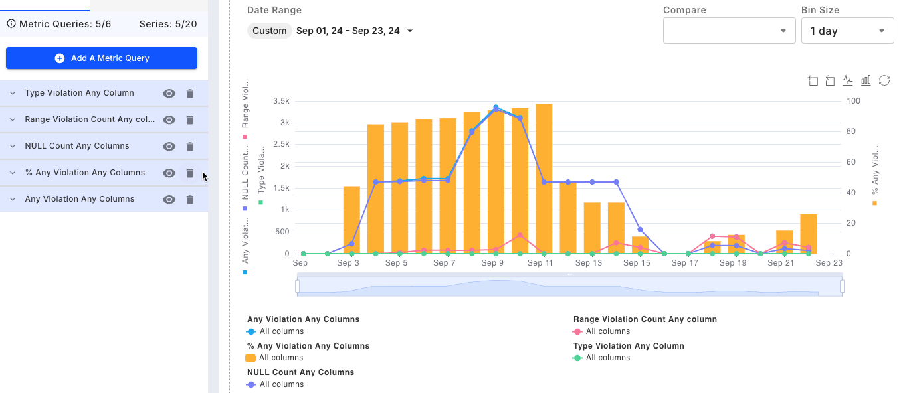

# Data Integrity

### Overview

ML models are increasingly driven by complex feature pipelines and automated workflows that involve dynamic data. Data is transformed from source to model input which can result in data inconsistencies and errors.

There are three types of violations that can occur at model inference: **missing values**, **type mismatches** (e.g. sending a float input for a categorical feature type) or **range violations** (e.g. sending an unknown US State for a State categorical feature).

You can track all these violations in the Data Integrity tab. The time series shown below tracks the violations of data integrity constraints set up for this model.

### What Is Being Tracked?

The time series chart above tracks the violations of data integrity constraints set up for this model. Note that both raw count and percentage are available for data integrity metrics.

* **Any Violation Any Column** — The count of missing value violations over all features for a given period of time.
* **% Any Violation Any Column** — The count of data type mismatch violations over all features for a given period of time.
* **NULL Count Any Column** — The count of range mismatch violations over all features for a given period of time.
* **Range Violation Count Any Column** — An aggregation of all the data integrity violations above for a given period of time.
* **Type Violation Count Any Column** — An aggregation of all the data integrity violations above for a given period of time.

### Why is it being tracked?

* Data integrity issues can cause incorrect data to flow into the model, which can lead to poor model performance and have a negative impact on the business or end-user experience.

### How does it work?

It can be tedious to set up constraints for individual features when they number in the tens or hundreds. To avoid this, you can provide Fiddler with a baseline dataset that's representative of the data you expect your model to infer on in production. This should be sampled from your model's training set, and can be [uploaded to Fiddler using the Fiddler Python client](../../Python\_Client\_3-x/api-methods-30.md#publish).

Fiddler will automatically generate constraints based on the distribution of data in this dataset.

* **Missing values**: If a feature has no missing values, then the data integrity violation will be set up to trigger when any missing values are seen. Similarly, if the feature has 50% of its values missing, then the data integrity violation will be set up to trigger when more than 50% of the values encountered are missing in a specified time range.
* **Type mismatch**: A data integrity violation will be triggered when the type of a feature value differs from what was specified for that feature in the baseline dataset.
* **Range mismatch**:
  * For categorical features, a data integrity violation will be triggered when it sees any value other than the ones specified in the baseline.
  * For continuous variables, the violation will be triggered if the values are outside the range specified in the baseline.
  * For [vector datatype](../../Python\_Client\_3-x/api-methods-30.md#datatype), a range mismatch will be triggered when a dimension mismatch occurs compared to the expected dimension from the baseline.



