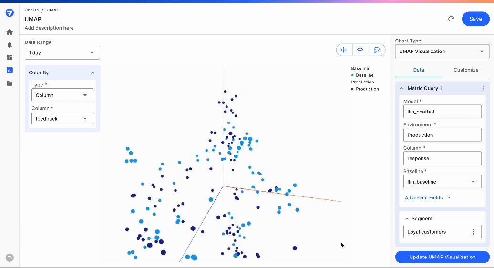

# Embedding Visualization With Umap

### Overview of Embedding Visualizations

Embedding visualization is a powerful technique used to understand and interpret complex relationships in high-dimensional data. Reducing the dimensionality of custom features into a 2D or 3D space makes it easier to identify patterns, clusters, and outliers.

In Fiddler, high-dimensional data like embeddings and vectors are ingested as a [Custom feature](../../Python\_Client\_3-x/api-methods-30.md#customfeature).

Our goal in this document is to visualize these custom features.

### UMAP Technique for Embedding Visualization

We utilize the [UMAP](https://umap-learn.readthedocs.io/en/latest/) (Uniform Manifold Approximation and Projection) technique for embedding visualizations. UMAP is a dimension reduction technique that is particularly good at preserving the local structure of the data, making it ideal for visualizing embeddings. We reduce the high-dimensional embeddings to a 3D space.

UMAP is supported for both Text and Image embeddings in [Custom feature](../../Python\_Client\_3-x/api-methods-30.md#customfeaturetype).

> 📘 To create an embedding visualization chart
>
> Follow the UI Guide on [creating the embedding visualization chart here.](../../UI\_Guide/monitoring-ui/embedding-visualization-chart-creation.md)



