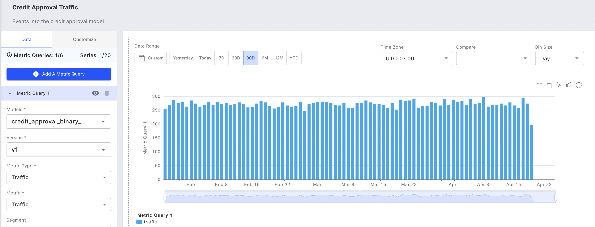

# Monitoring Charts

### Overview

Fiddler AI’s monitoring charts allow you to easily track your models and ensure that they are performing optimally. For any of your models, monitoring charts for data drift, performance, data integrity, or traffic metrics can be displayed using Fiddler Dashboards.

### Supported Metric Types

Monitoring charts enable you to plot one of the following metric types for a given model:

* [**Traffic**](../../UI\_Guide/monitoring-ui/traffic-ui.md)
  * The volume of traffic received by the model over time informs us of the overall system's health.
* [**Statistics**](statistics.md)
  * Metrics which can be used to monitor basic aggregations over columns.
* [**Data Drift**](../../UI\_Guide/monitoring-ui/data-drift.md) — Predictions and all features
  * Model performance can be poor if models trained on a specific dataset encounter different data in production.
* [**Data Integrity**](../../UI\_Guide/monitoring-ui/data-integrity.md) — All features
  * Three types of violations can occur at model inference: missing feature values, type mismatches (e.g. sending a float input for a categorical feature type) or range mismatches (e.g. sending an unknown US State for a State categorical feature).
* [**Performance**](../../UI\_Guide/monitoring-ui/performance.md)
  * The model performance tells us how well a model performs on its task. A poorly performing model can have significant business implications.

### Key Features:

#### Multiple Charting Options

You can [plot up to 20 columns](../../UI\_Guide/monitoring-ui/monitoring-charts-ui.md#chart-metric-queries--filters) and 6 metric queries for a model enabling you to easily perform model-to-model comparisons and plot multiple metrics in a single chart view.

### Embedded Root Cause Analytics

Root cause analysis information covers data drift and data integrity, and performance analytics charts for binary classification, multiclass classification, and regression models.

#### Downloadable CSV Data

You can [easily download a CSV of the raw chart data](../../UI\_Guide/monitoring-ui/monitoring-charts-ui.md#breakdown-summary). This feature allows you to analyze your data further.

#### Advanced Chart Functionality

The monitoring charts feature offers [advanced chart functionalities ](../../UI\_Guide/monitoring-ui/monitoring-charts-ui.md#chart-metric-queries--filters)to provide you with the flexibility to customize your charts and view your data in a way that is most useful to you. Features include:

* Zoom
* Dragging of time ranges
* Toggling between bar and line chart types
* Adjusting the scale between linear and log options
* Adjusting the range of the y-axis

Check out more on the [Monitoring Charts UI Guide](../../UI\_Guide/monitoring-ui/monitoring-charts-ui.md).



