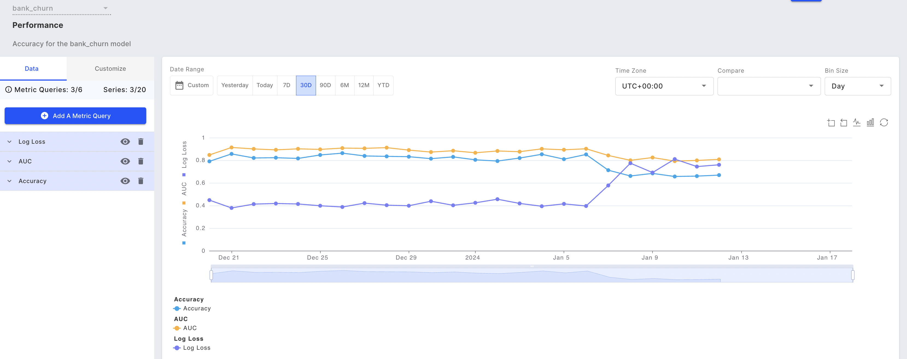

# Performance Tracking

### Overview

The model performance tells us how well a model performs on its task. A poorly performing model can have significant business implications.

### What is being tracked?

_**Performance metrics**_

| Model Task Type       | Metric                                                         | Description                                                                                                                                        |
| --------------------- | -------------------------------------------------------------- | -------------------------------------------------------------------------------------------------------------------------------------------------- |
| Binary Classification | Accuracy                                                       | (TP + TN) / (TP + TN + FP + FN)                                                                                                                    |
| Binary Classification | True Positive Rate/Recall                                      | TP / (TP + FN)                                                                                                                                     |
| Binary Classification | False Positive Rate                                            | FP / (FP + TN)                                                                                                                                     |
| Binary Classification | Precision                                                      | TP / (TP + FP)                                                                                                                                     |
| Binary Classification | F1 Score                                                       | 2 \* ( Precision \* Recall ) / ( Precision + Recall )                                                                                              |
| Binary Classification | AUROC                                                          | Area Under the Receiver Operating Characteristic (ROC) curve, which plots the true positive rate against the false positive rate                   |
| Binary Classification | Binary Cross Entropy                                           | Measures the difference between the predicted probability distribution and the true distribution                                                   |
| Binary Classification | Geometric Mean                                                 | Square Root of ( Precision \* Recall )                                                                                                             |
| Binary Classification | Calibrated Threshold                                           | A threshold that balances precision and recall at a particular operating point                                                                     |
| Binary Classification | Data Count                                                     | The number of events where target and output are both not NULL. _**This will be used as the denominator when calculating accuracy**_.              |
| Binary Classification | Expected Calibration Error                                     | Measures the difference between predicted probabilities and empirical probabilities                                                                |
| Multi Classification  | Accuracy                                                       | (Number of correctly classified samples) / ( Data Count ). Data Count refers to the number of events where the target and output are both not NULL |
| Multi Classification  | Log Loss                                                       | Measures the difference between the predicted probability distribution and the true distribution, in a logarithmic scale                           |
| Regression            | Coefficient of determination (R-squared)                       | Measures the proportion of variance in the dependent variable that is explained by the independent variables                                       |
| Regression            | Mean Squared Error (MSE)                                       | Average of the squared differences between the predicted and true values                                                                           |
| Regression            | Mean Absolute Error (MAE)                                      | Average of the absolute differences between the predicted and true values                                                                          |
| Regression            | Mean Absolute Percentage Error (MAPE)                          | Average of the absolute percentage differences between the predicted and true values                                                               |
| Regression            | Weighted Mean Absolute Percentage Error (WMAPE)                | The weighted average of the absolute percentage differences between the predicted and true values                                                  |
| Ranking               | Mean Average Precision (MAP)—for binary relevance ranking only | Measures the average precision of the relevant items in the top-k results                                                                          |
| Ranking               | Normalized Discounted Cumulative Gain (NDCG)                   | Measures the quality of the ranking of the retrieved items, by discounting the relevance scores of items at lower ranks                            |

### Why is it being tracked?

* Model performance tells us how well a model is doing on its task. A poorly performing model can have significant business implications.
* The volume of decisions made on the basis of the predictions give visibility into the business impact of the model.

### What steps should I take based on this information?

* For changes in model performance—again, the best way to cross-verify the results is by checking the [Data Drift Tab](../../UI\_Guide/monitoring-ui/data-drift.md) ). Once you confirm that the performance issue is not due to the data, you need to assess if the change in performance is due to temporary factors, or due to longer-lasting issues.
* You can check if there are any lightweight changes you can make to help recover performance—for example, you could try modifying the decision threshold.
* Retraining the model with the latest data and redeploying it is usually the solution that yields the best results, although it may be time-consuming and expensive.



