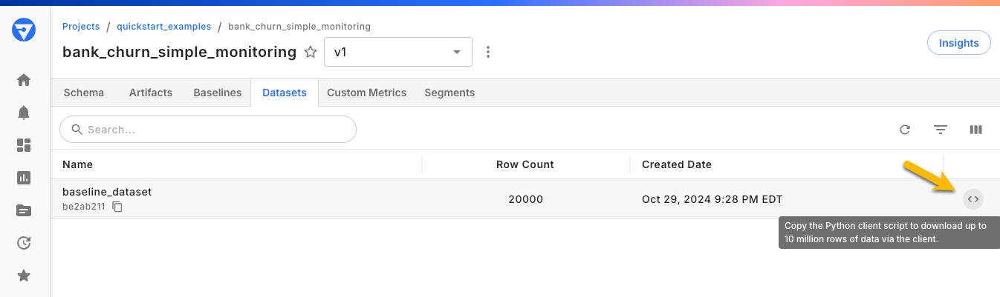

# Release Notes

## Release 24.18 Notes
*December 4, 2024*

### What's New and Improved
* **Native Integration with AWS SageMaker AI**
  * Fiddler is now natively supported within the newly launched Amazon SageMaker partner AI ecosystem. 
  This integration enables enterprises to validate, monitor, analyze, and improve their ML models in production, all within their existing private and secure Amazon SageMaker AI environment. 
  Read the official announcement [here](https://www.fiddler.ai/blog/fiddler-delivers-native-enterprise-grade-ai-observability-to-amazon-sagemaker-ai-customers).
  Note Fiddler Python client version [3.7+](../python-client-history.md#370) is required for this feature.

* **Download Dataset Code in UI**
  * Now you can download your baseline and non-production datasets faster than ever with just a click! 
  Building on the popular feature we introduced for production data in the Root Cause Analysis Events table, we've added ready-to-use Python code snippets right in the interface. 
  Simply copy and paste these snippets to jumpstart your data analysis in your notebooks.
  

* **Python Client Highlights**
  * The latest release of Fiddler's Python client brings two powerful new convenience features to streamline your workflow:
    * Our new [Project.get_or_create()](../Python_Client_3-x/api-methods-30.md#get_or_create) class function simplifies project creation in notebooks. This feature prevents name conflict errors during project creation when your notebook runs multiple times, saving you time and reducing the need for additional exception handling.
    * We've also added [model.remove_column()](../Python_Client_3-x/api-methods-30.md#remove_column), a simpler way to remove columns during model onboarding. This function replaces the multi-step process previously required, making model configuration faster and more intuitive.
  * To enhance reliability, we've implemented a configurable HTTP retry mechanism that you can fine-tune to match your network environment.
  * For more details, please refer to the [Python Client Release notes](../python-client-history.md#370).

### Discontinued
* **The SQL Analyze Page Discontinued**
  * The legacy SQL Analyze page has been removed as of 24.18. The new Analyze experience within monitoring charts Root Cause Analysis now enables data table generation using Fiddler Query Language (FQL) and supports the creation of analytical charts such as confusion matrices, feature distribution charts, and more.

### Client Version
Client version [3.7+](../python-client-history.md#370) is required for the updates and features mentioned in this release.

## Release 24.17 Notes
_By Sabina Cartacio • Nov 12, 2024_

### What's New and Improved
* **Feature Analytics in Root Cause Analysis (Public Preview)**
  * The root cause analysis experience within monitoring charts now allows users to view feature distribution, feature correlation, and correlation matrix.

### Discontinued

* **SQL Methods in the Python Client Discontinued**
  * From Client 3.6 and onwards, `get_slice` and `download_slice` are discontinued. 
  In their stead, use the new [`download_data`](../Python\_Client\_3-x/api-methods-30.md#download\_data) method to download production and non-production data from your Fiddler models. 
  If you have any questions or need any assistance migrating scripts using the deprecated methods, please contact your Fiddler customer success manager.
* Use of or support for **Python 3.8 is discontinued** by Fiddler. 
Note Python 3.8 has been designated [End of Life](https://devguide.python.org/versions/) as of October 7, 2024.

## Release 24.16 Notes
_By Sabina Cartacio • Oct 28, 2024_

### What's New and Improved

* **New Chart Type: Correlation Matrix (Public Preview)**
  * The Correlation Matrix chart enables users to visualize relationships between up to eight columns in a heatmap, making it easy to spot significant patterns. By clicking on any cell representing the relationship between two features, users can open a Feature Correlation chart for that pair, offering more detailed insights into the correlation score.

* **Events Table in Root Cause Analysis (Public Preview)**
  * The root cause analysis experience within monitoring charts now allows users to perform deeper investigations by viewing and downloading up to 1,000 raw events, providing valuable insights for understanding and addressing potential issues.

## Release 24.15 Notes

_By Dustin Basil • Oct 10, 2024_

### What's New and Improved

* **New Chart Type: Metric Card (Public Preview)**
  * We’re excited to introduce the Metric Card chart type, which allows users to display up to four key numerical values in a clear and concise card format. This new visualization enhances data presentation by enabling quick insights into critical metrics, making it easier for decision-makers to spot trends or performance indicators at a glance.
* **New Chart Type: Feature Correlation (Public Preview)**
  * The Feature Correlation chart, part of Feature Analytics charts, enables users to analyze and visualize the relationships between different features within their models. By offering a clear view of correlations, this tool supports more informed model diagnostics and refinement.

## Release 24.14 Notes

_By Dustin Basil • Sep 25, 2024_

### What's New and Improved

* This release focused on system performance, stability, and security enhancements. These improvements ensure a smoother user experience and provide a more robust platform for future developments.

## Release 24.13 Notes

_By Sabina Cartacio • Sep 10, 2024_

### What's New and Improved

* NEW Standalone Feature Distribution Chart (Public Preview)
  * Create feature distribution charts for numerical and categorical data types that can be added to dashboards.
* Embedding Visualization UX Improvements
  * User interface and usability improvements to the UMAP embedding visualization chart.
* Additional database performance improvements.

### Deprecated and Decommissioned

* Fairness was decommissioned in v24.8, and the documentation has now been removed.

## Release 24.12 Notes

_By Rohan Sharma • Aug 29, 2024_

* Surfacing Error Messages for Failed Jobs
  * Error messages for failed jobs are now visible directly on the UI job status page, simplifying the process of diagnosing and resolving issues.
* User Selected Default Dashboards
  * Any dashboard within a project can now be assigned as the default dashboard for a model, with all insights leading directly to the assigned default dashboard.
* Custom Feature Impact Feature Release Notes
  * Introducing Custom Feature Impact: Upload custom feature impact scores for your models, leveraging domain-specific knowledge or external data without requiring the corresponding model artifact.
  * Easy data upload via API endpoint with required parameters: Model UUID, Feature Names, and Impact Scores.
  * View updated feature impact scores in:
    * Model details page
    * Charts page
    * Explain page
  * Flexible update options: Update existing feature impact data by uploading new data for the same model and Seamless integration with existing model artifacts.
* Flexible Model Deployment
  * The `python-38` base image is no longer supported.

## Release 24.11 Notes

_By Sabina Cartacio • Aug 6, 2024_

### Client Version

Client version 3.3+ is required for the updates and features mentioned in this release.

### What's New and Improved:

* Performance Analytics (Preview) Embedded in Monitoring Charts
  * Visualize performance analytics charts as part of the root cause analysis flow for Binary Classification, Multiclass Classification, and Regression models, spanning from confusion matrices, precision recall charts, prediction scatterplots and more.

## Release 24.10 Notes

_By Sabina Cartacio • July 23, 2024_

### Client Version

Client version 3.3+ is required for the updates and features mentioned in this release.

### What's New and Improved:

* Support for applied segments in monitoring charts
  * Create and apply segments dynamically in monitoring charts for exploratory analysis without requiring them to be saved to the model.
* User-Defined Feature Impact
  * The User-Defined Feature Impact enables you to upload custom feature impact for models. This feature addresses several issues reported by our customers, including model artifact size, onboarding complexity, and the need for custom feature impact.
  * Key highlights
    * New method: UploadFeatureImpact
    * Improved Fiddler UI to display uploaded feature impact

## Release 24.9 Note

_By Rohan Sharma • July 12, 2024_

### What's New and Improved

* Enhanced access controls
  * Control access with precision: Manage user access to resources with Role-Based Access Control (RBAC), ensuring the right users have the right permissions.
  * Simplify user management: Assign roles to users and teams to streamline access control and enhance collaboration. \*≠ Protect sensitive resources: Restrict access to sensitive resources, such as models and project settings, with granular permissions.
  * Work efficiently: Focus on your work without worrying about unauthorized access or data breaches.

## Release 24.8 Notes

_By Sabina Cartacio • June 18, 2024_

### Release of Fiddler Platform Version 24.8:

* **Performance Analytics Charts (Public Preview)**
  * Visualize charts to aid in analyzing model performance for Binary Classification, Multiclass Classification, and Regression models.
  * Leverage applied segments in Performance Analytics charts to explore problematic cohorts of data.

## Release 24.7 Notes

_By Parth Domadia • June 4, 2024_

### What's New and Improved

TBD

## Release 24.6 Notes

_By Parth Domadia • May 22, 2024_

### Release of Fiddler Platform Version 24.6:

* Performance improvements
  * Improved the performance of various modules / APIs.
  * Improved observability which can help monitor health and performance of the operations.

### Client Version

* Client version 3.1.2+ is required for the updates and features mentioned in this release.

## Release 24.5 Notes

_By Sabina Cartacio • May 2, 2024_

### Release of Fiddler Platform Version 24.5:

* Support for model versions for streamlined model management

### What's New and Improved:

* **Model Versions**
  * Efficiently manage related models by creating structured versions, facilitating tasks like retraining and comparison analyses.
  * Users can maintain model lineage, efficiently manage updates, flexibly modify schemas, and adjust parameters.
  * **See**: [Model Versions](../product-guide/monitoring-platform/model-versions.md) for more information.
* **Airgapped Enrichments (alpha)**
  * For privacy sensitive use cases, all data getting enriched stays within customer premises.
* **New Deployment Base Images**
  * We have added new deployment base images to support model versioning.
  * See [here](../product-guide/explainability/flexible-model-deployment/).

#### Client Version

Client version 3.1.0+ is required for the updates and features mentioned in this release.

## Release 24.4 Notes

_By Parth Domadia • April 26, 2024_

### Release of Fiddler Platform Version 24.4:

* UMAP UI changes
* SSO integration changes
* New concept: **Environments**
* Fundamental changes to product concepts

### What's New and Improved:

* **UMAP UI**
  * Vertical scrolling instead of horizontal scrolling for data cards
  * "View More" option to open data cards in maximized modal
  * Ability to toggle between data cards in the maximized modal
* **SSO integration changes**
  * Fiddler now integrates with Azure AD SSO, allowing you to leverage existing user roles for access control within Fiddler. This eliminates the need for manual user creation and simplifies user management within your organization. See [Azure AD SSO Support](../Deployment_Guide/single-sign-on-with-azure-ad.md) for details
* **Environments**
  * Each Model now has two environments (Pre-Production and Production) used to house data in different ways.
  * A Model's Pre-Production environment is used to house non-time series data (Datasets).
  * A Model's Production environment is used to house time series data.
  * See [Data and Environments](doc:data-and-environments) for more
* **Product concept changes**
  * Datasets are no longer stored at the Project level. Instead, they're stored at the Model level under the Pre-Production Environment.
  * The Model Details page has been updated with a new design. See more [here](../Overview/product-tour.md#documented-ui-tour).

#### Client Version

Client version 3.0+ is required for the updates and features mentioned in this release.

### Client 3.x Release:

We are launching Client 3.x, this is revamped client 2.x as we move to more object oriented based methods. This means, any pipeline setup in client 2.x would eventually be required to upgrade to the new methods. **Client 2.x will sunset approximately 6 months post this release.** Please take a look at the below resources to help you understand client 3.x and also how you can upgrade your pipelines:

* [API Documentation](../Python\_Client\_3-x/about-client-3x.md)
* [How to upgrade from client 2.x to 3.x](../Python\_Client\_3-x/upgrade-from-2x-to-3x.md)

### Deprecations and Removals:

* All IDs will be UUIDs instead of strings.
* Dataset deletion is not allowed anymore.

For API level changes and updates please check [client history](../python-client-history.md#3x-client-version)
